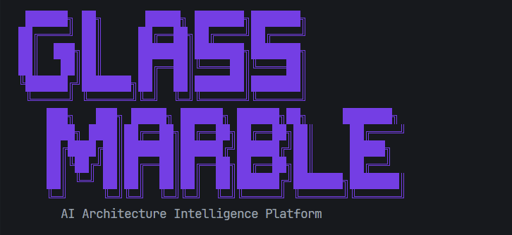
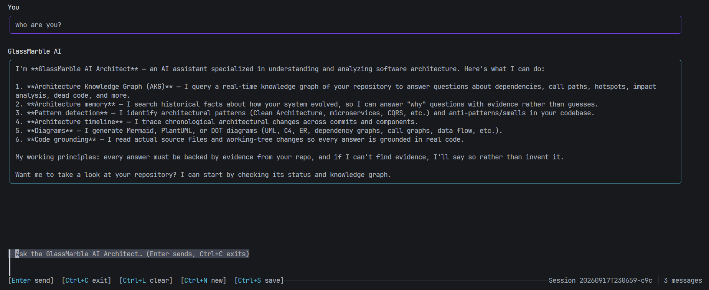

<!--
  SCREENSHOT PLACEHOLDERS — 3 images, add them at the exact paths below and
  everything renders automatically (no further edits needed).

  1. assets/screenshots/hero.png
     What: a terminal running `gmb analyze` followed by `gmb status`,
     showing the summary line and the status panel.
     Where it's used: directly below the badges, top of the README.
     Suggested size: ~1280x800, dark terminal theme, no window chrome
     if you can crop it out.

  2. assets/screenshots/diagram.png
     What: one generated diagram actually rendered — e.g. open a
     `.glassmarble/marbles/*.md` file's Mermaid block in the GitHub
     preview or VS Code's Markdown preview, and screenshot the diagram
     itself (a C4 container or class diagram reads well here).
     Where it's used: "Diagrams" bullet in the "What it does" section.
     Suggested size: ~1000x700, light or dark background, whichever
     renders your diagram most legibly.

  3. assets/screenshots/ai-query.png
     What: a terminal showing `gmb ai "<some real question about a
     codebase>"` and its streamed, grounded answer.
     Where it's used: "Grounded AI" bullet in the "What it does" section.
     Suggested size: ~1280x800, same terminal theme as image 1.

  Until a file exists at a given path, GitHub will show a small broken-
  image icon in its place — replace the file and it resolves on its own.
-->

<p align="center">
  
</p>

<h1 align="center">GlassMarble</h1>

<p align="center">
  A local-first architecture knowledge graph for your codebase — diagrams, dependency and drift analysis, and grounded AI, from one deterministic graph that stays current as the code changes.
</p>

<p align="center">
  <a href="https://github.com/Syamchand123/GlassMarble/actions/workflows/ci.yml"></a>
  <a href="https://github.com/Syamchand123/GlassMarble/releases"></a>
  <a href="https://pkg.go.dev/github.com/Syamchand123/GlassMarble"></a>
  <a href="./LICENSE"></a>
</p>

<p align="center">
  
</p>

---

## Why

Architecture diagrams are drawn once and rot on the next merge. Dependency direction, cycles, and blast radius live in people's heads until they leave the team. GlassMarble parses your repository into a graph — the Architecture Knowledge Graph (AKG) — and derives everything else from it on demand: diagrams, dependency analysis, and AI answers are never more than one `gmb analyze` behind the actual code.

The graph itself is a single file, `.glassmarble/akg.json`: deterministic, sorted, and reviewable in a normal diff — it never leaves your machine unless you export it.

## What it does

**Diagrams.** 31 types across UML, C4, and dependency/analysis views, rendered as Mermaid, PlantUML, or DOT — no server, no viewer plugin required.

**Dependency and drift analysis.** Cycles, layering violations, coupling, and hotspots computed from the graph, with a `drift` gate you can run in CI.

**Grounded AI.** Ask questions about the codebase in plain English; answers come from the graph, not a guess, via any of 11 providers (OpenAI, Anthropic, Gemini, Ollama, and others — bring your own key).

<p align="center">
  
</p>

**Living documentation.** `gmb doc` generates Markdown docs from the graph, with an LLM writing the prose and the graph supplying the facts underneath.

**Impact analysis.** Before a refactor, ask what depends on the thing you're about to change.

Everything above runs against the same graph:

```console
$ gmb analyze
[1/5] Tree-sitter Ingestion       done in 5.2s
[2/5] GAST Normalization          done in 10.4s
[3/5] Topology Aggregation        done in 3.6s
[4/5] Semantic Linking            done in 2.1s
[5/5] Committing graph (1 files)
Analyzed 767 files | 22296 nodes (+0) | 47550 edges (+1) | 0 dangling | 25.8s
Intelligence: 121 components | 2 patterns | 37 smells | 1 cycles

$ gmb visualize c4container --save architecture
$ gmb ai "what depends on the auth package, and would removing it break anything?"
```

(Output above is a real `gmb analyze` run against this repository.)

## Install

```console
# Linux / macOS
curl -fsSL https://raw.githubusercontent.com/Syamchand123/GlassMarble/main/install.sh | sh

# Windows (PowerShell)
irm https://raw.githubusercontent.com/Syamchand123/GlassMarble/main/install.ps1 | iex

# Go toolchain (1.25+)
go install github.com/Syamchand123/GlassMarble@latest
```

Prebuilt binaries for macOS (arm64/amd64), Linux (amd64/arm64), and Windows (amd64/arm64) are on the [releases page](https://github.com/Syamchand123/GlassMarble/releases), signed with Sigstore Cosign and shipped with an SBOM. `gmb` and `glassmarble` are the same binary. Full platform matrix and release verification: [Getting Started](docs/getting-started.md).

## Quickstart

```console
$ gmb init                          # creates .glassmarble/
$ gmb analyze --full                # first run: full scan; later runs are incremental
$ gmb status                        # graph size, health, storage
$ gmb visualize class --save class  # → .glassmarble/marbles/class.md
$ gmb ai configure                  # one-time: point at a provider
$ gmb ai "which services depend on payments?"
```

No code is ever modified — GlassMarble only reads your source and writes to `.glassmarble/`.

## Documentation

| Guide | Covers |
|---|---|
| [Getting Started](docs/getting-started.md) | Install matrix, release verification, first analyze, troubleshooting |
| [CLI Reference](docs/cli.md) | All commands, flags, exit codes |
| [Architecture](docs/architecture.md) | How the graph is built: ingest → normalize → aggregate → link → commit |
| [Diagrams](docs/diagrams.md) | All 31 diagram types, scopes, and output formats |
| [AI Architect](docs/ai.md) | Providers, tool calling, streaming, guardrails |
| [Documentation Engine](docs/doc_engine.md) | `gmb doc` — graph-grounded, LLM-written docs |
| [Configuration](docs/configuration.md) | `config.yaml`, `ai.yaml`, environment variables |
| [MCP Server](docs/mcp.md) | Expose the graph over the Model Context Protocol |
| [Full documentation index](docs/README.md) | Everything else |

## Contributing

```console
$ git clone https://github.com/Syamchand123/GlassMarble.git
$ cd GlassMarble
$ make build   # → ./gmb
$ make test
```

See [CONTRIBUTING.md](CONTRIBUTING.md) for the development setup and release process. Pull requests get an automated comment showing the AKG diff (symbols added/removed) for the change.

## License

[MIT](LICENSE)
