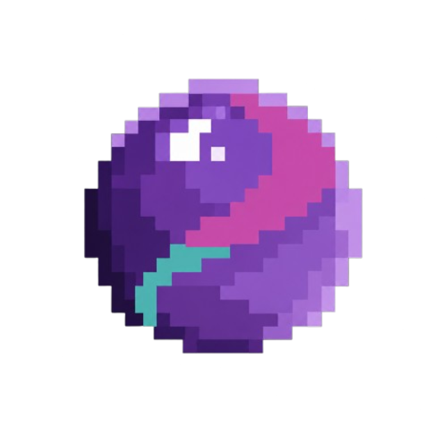
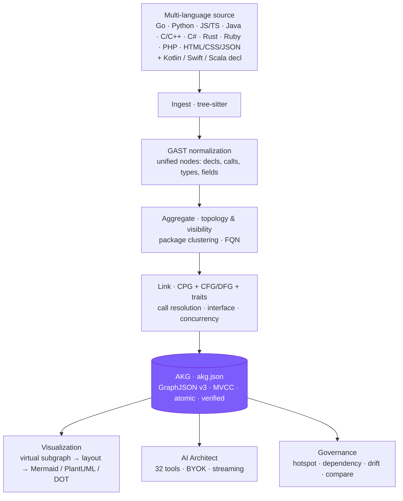

<!--
  GlassMarble — README
  Aesthetic: Restrained + Committed (violet #7c5cfb carries identity, 30% surface)
  Theme: light, airy, terminal-aware — "maintainer opening the repo at noon on a 14-inch MacBook, wanting the map in 10 seconds"
  Bans: no side-stripe, no gradient text, no glass, no hero-metric, no identical card grid
-->

<p align="center">
  <a href="https://github.com/Syamchand123/GlassMarble">
    
  </a>
</p>

<h1 align="center">GlassMarble</h1>

<p align="center">
  <strong>Your codebase has a living map.</strong><br>
  <span>17 languages → one deterministic GraphJSON → 31 living diagrams, governance, and grounded AI.</span>
</p>

<p align="center">
  <a href="https://github.com/Syamchand123/GlassMarble/releases"></a>
  <a href="https://github.com/Syamchand123/GlassMarble/actions/workflows/ci.yml"></a>
  <a href="https://goreportcard.com/report/github.com/Syamchand123/GlassMarble"></a>
  <a href="./LICENSE"></a>
  <a href="https://pkg.go.dev/github.com/Syamchand123/GlassMarble"></a>
</p>

<p align="center">
  <a href="https://github.com/Syamchand123/GlassMarble/stargazers"></a>
  <a href="https://github.com/Syamchand123/GlassMarble/network/members"></a>
  <a href="https://github.com/Syamchand123/GlassMarble/issues"></a>
  <a href="https://github.com/Syamchand123/GlassMarble/pulls"></a>
  
  
</p>

<p align="center">
  <a href="docs/getting-started.md"><strong>Getting Started</strong></a> ·
  <a href="docs/architecture.md">Architecture</a> ·
  <a href="docs/cli.md">CLI</a> ·
  <a href="docs/diagrams.md">Diagrams</a> ·
  <a href="docs/visualization_engine.md">Web UI</a> ·
  <a href="docs/ai.md">AI Architect</a> ·
  <a href="docs/mcp.md">MCP Server</a> ·
  <a href="docs/configuration.md">Config</a> ·
  <a href="docs/README.md">All Docs</a>
</p>

<p align="center">
  <sub>Repo is the source of truth. The graph follows it. • <code>.glassmarble/akg.json</code> is deterministic, diff-friendly, and local.</sub>
</p>

---

### The drift is the default

> Diagrams are drawn at design time and rot on the next merge. New joiners grep for weeks. Reviews miss coupling.

| Pain | What rots | GlassMarble |
|---|---|---|
| Docs drift — Confluence/Miro after one merge | C4 / UML / dependency maps | 31 diagrams from the AKG, regenerated on every `visualize` |
| Tribal knowledge — “Ask Alice which service calls payments” | Ownership | `gmb ai` + `gmb dependency` / `gmb hotspot` from graph data |
| Hidden coupling — `data → api` added unnoticed | Layering, cycles | `gmb drift` + `cycle_budget` + `Instability` |
| Review guesswork — “Will this break X?” | Impact | `gmb visualize impact` + `gmb compare` + PR diff comment |
| History loss — “Why did we split this?” | Rationale | Snapshots + timeline + `FACT` / `EXPLICIT_REASON` / `INFERENCE` claims |

GlassMarble is a **compiler + database + visualizer + agent** that stays current via Git-aware incremental analysis (`git diff HEAD` → delta merge, idempotent).

---

### What you get

<table>
<tr>
<th width="25%">🎨 31 living diagrams</th>
<th width="25%">🛡️ Governance</th>
<th width="25%">🧠 Grounded AI</th>
<th width="25%">⚡ Bounded & safe</th>
</tr>
<tr>
<td>14 UML + 7 C4 + 4 specialized + 6 analysis → <strong>Mermaid / PlantUML / DOT</strong>. <code>gmb visualize list</code> shows all. Scopes: <code>global</code> · <code>folder:</code> · <code>file:</code></td>
<td><code>gmb hotspot</code> · <code>gmb dependency</code> · <code>gmb drift</code> · <code>gmb compare</code> · cycle / coupling / Instability. Snapshots + timeline track <code>SERVICE_ADDED</code> … <code>CYCLE_RESOLVED</code>.</td>
<td>BYOK, 10 providers (OpenAI, Anthropic, Gemini, Ollama…), streaming, 32 tools (<code>akg_*</code> <code>code_*</code> <code>diagram_*</code> <code>memory_*</code>) that read the live AKG. <code>0600</code> keys, never logged.</td>
<td>MVCC + <code>db.lock</code> + <code>tmp→fsync→rename→verify</code>. Self-healing <code>.bak</code>. <code>akg.json</code> ≈1.2KB/node; snapshots auto <code>no-graph</code> at 15k nodes/8MB, <code>snapshot_max_count: 30</code>.</td>
</tr>
</table>

```bash
gmb visualize class --save class              # type hierarchy
gmb visualize c4container --save c4           # services, DBs, queues
gmb visualize callgraph --entry "pkg/svc.go::Service::Handle"
gmb visualize impact --changed-files "auth/login.go,db/store.go"
gmb hotspot --top 10
gmb ai "explain how auth works and where it calls DB"
```

Full catalog + scopes + link levels → [Diagrams](docs/diagrams.md) · All AI tools → [AI Architect](docs/ai.md)

---

### 30 seconds to first diagram

```bash
# Linux / macOS
curl -fsSL https://raw.githubusercontent.com/Syamchand123/GlassMarble/main/install.sh | sh

# Windows (PowerShell 5.1+)
irm https://raw.githubusercontent.com/Syamchand123/GlassMarble/main/install.ps1 | iex

# Go toolchain (1.25+)
go install github.com/Syamchand123/GlassMarble@latest
```

```bash
gmb init                         # → .glassmarble/
gmb analyze --full               # first time = full scan, then incremental
gmb status                       # nodes / edges / health + storage
gmb visualize class --save class # → .glassmarble/marbles/class.md
gmb ai "which services depend on payments?"  # needs gmb ai configure
```

> Full matrix, Cosign/SBOM verification, and troubleshooting → **[Getting Started](docs/getting-started.md)**.

<details>
<summary><strong>Platform matrix</strong> (click to expand)</summary>

| OS | Arch | Archive |
|---|---|---|
| macOS 12+ | arm64 (M1–M4) / amd64 | `gmb_*_darwin_*.tar.gz` |
| Linux glibc/musl | amd64 (x86_64) | `gmb_*_linux_amd64.tar.gz` |
| Linux | arm64 (aarch64) | `gmb_*_linux_arm64.tar.gz` |
| Windows 10/11 | amd64 (x64) | `gmb_*_windows_amd64.zip` |
| Windows 11 | arm64 | `gmb_*_windows_arm64.zip` |

`gmb` and `glassmarble` are the same binary. Checksums + Cosign/SLSA are published per release; installers verify `checksums.txt` automatically.

</details>

---

### How it works — 60 seconds



`Ingest → Normalize → Aggregate → Link → Commit` — file-by-file map and algorithms → [Architecture](docs/architecture.md). GraphJSON schema + storage contract (<100MB @ 500k LOC) → [AKG Format](docs/akg_format.md).

---

### Best practices — from production

1. **Analyze in CI, not just locally** — add `gmb analyze --json && gmb doctor` to PRs; the AKG diff comment posts via [akg-pr-comment.yml](.github/workflows/akg-pr-comment.yml).
2. **Stay incremental** — default is `git diff HEAD`; use `--full` only after `doctor` warnings or bumping `max_file_bytes`.
3. **Hook it** — `gmb hooks install` adds a `post-commit` hook; `gmb watch --interval 5s` for live polling.
4. **Govern with `drift:`** — define `drift.layers` + `forbidden_deps` + `cycle_budget: 0` in `.glassmarble/config.yaml` and gate PRs on `gmb drift` ([Configuration](docs/configuration.md)).
5. **Prune, don’t grow** — `gmb housekeeping` shows `state + snapshots + memory + intelligence`; large repos auto `no-graph` (15k nodes / 8MB) and `gmb housekeeping --prune-snapshots --keep 10` reclaims disk.
6. **Ground the AI** — run `gmb analyze` before `gmb ai`; prefer `GLASSMARBLE_*_API_KEY` env vars over `--key`; use `--max-cost` / `--max-total-tokens` in CI.
7. **Version the graph** — `akg.json` is sorted and `git diff`-friendly. Review it, `gmb export --format neo4j` for Neo4j/Bloom, or `gmb compare` two exports.

---

### Industry standards & interoperability

| Area | Standard |
|---|---|
| **Diagrams** | UML 2.5 + C4 (Context/Container/Component/Code/Landscape/Dynamic/Deployment) + ER/dataflow/mindmap/flowchart + analysis — outputs are **Mermaid**, **PlantUML**, **DOT** for GitHub/VS Code/JetBrains |
| **Graph** | Nodes/edges carry `id`, `kind`, `file_spec`, `line_number`, `confidence`, `is_cycle`, `properties` — lossless. `gmb export --format neo4j` → `GMNode:<Kind>` Cypher → [Neo4j](docs/neo4j.md) · [Relationship Types](docs/relationship_types.md) |
| **Provenance** | Every claim is `FACT` / `EXPLICIT_REASON` / `INFERENCE` / `SPECULATION` — no reasons invented |
| **Supply chain** | CGO static (musl), **Sigstore Cosign** + **SBOM (Syft/SPDX)** + **SLSA** — see [Verifying Releases](docs/getting-started.md#3-verify-a-release-optional-sigstore) |
| **Languages** | 14 full tree-sitter + 3 decl-only (Kotlin/Swift/Scala) — see [Supported Languages](docs/supported_languages.txt) |

---

### Documentation

| Guide | For |
|---|---|
| [Getting Started](docs/getting-started.md) | Matrix, verification, first `analyze`, troubleshooting |
| [Architecture](docs/architecture.md) | Pipeline, modules, algorithms, storage & transactions |
| [CLI Overview](docs/cli.md) | 29 commands in 6 groups, flags, exit codes |
| [CLI Master Reference](docs/commands_master_reference.md) | Every flag, example, JSON field (source of truth) |
| [Diagrams](docs/diagrams.md) | 31 types, scopes, gallery, projection rules |
| [Visualization Engine & Web UI](docs/visualization_engine.md) | Interactive Web UI (`gmb ui`), 31 notations, layout engines, canvas |
| [AKG Format](docs/akg_format.md) | GraphJSON v3, storage contract |
| [Configuration](docs/configuration.md) | `config.yaml` / `ai.yaml`, env vars, `intelligence/` `fusion/` `learning/` `aging` |
| [Architecture Intelligence](docs/architecture_intelligence.md) | Events, claims, corrections, PR-01..PR-07 |
| [AI Architect](docs/ai.md) | Providers, 32 tools, streaming, sessions, guardrails |
| [MCP Server Protocol](docs/mcp.md) | Model Context Protocol server (`gmb mcp`), Stdio/HTTP/SSE, 30+ tools |
| [Supported Languages](docs/supported_languages.txt) | 17 languages + extensions |
| [Docs Index](docs/README.md) | Visual map of all guides |

---

### FAQ

**Does it modify code?** No — read-only. Tree-sitter parses, only `.glassmarble/` is written.

**How big is `.glassmarble/`?** [Storage Contract](docs/akg_format.md#5-size-guard--storage-contract): this repo (~13k nodes) is ~30MB bounded; at 500k LOC keep <100MB with `snapshot_no_graph` (auto) + `snapshot_max_count: 30`.

**Monorepo / large repo?** Yes — incremental `git diff HEAD`, `--workers auto`, `--max-json-mb` gate. >15k nodes auto `no-graph`.

**Needs Git?** No, but Git gives incremental + `hooks` + PR diff. Without Git, `--full` scans every file.

**Difference from c4-plantuml / pyreverse / SourceGraph?** Single-language or single-diagram or server-required. GlassMarble is **17 langs, 31 notations, local-first, graph-grounded** — same AKG powers all.

---

### When to use — and when not to

**Great for:** onboarding, PR reviews (`compare`, diff comment), architecture reviews (`hotspot`, `drift`), living docs (`visualize` in CI → commit `marbles/`), grounded Q&A.

**Not for:** runtime profiling, dynamic tracing, or style linting — static only (`confidence <1.0` for heuristics).

---

### Contributing

```bash
git clone https://github.com/Syamchand123/GlassMarble.git
cd GlassMarble
make build   # → ./gmb
make test    # unit + determinism + bloat gates
make vet
```

See [CONTRIBUTING.md](CONTRIBUTING.md) for dev setup and release process. PRs post an **AKG diff comment** with added/removed symbols.

<p align="center">
  <a href="CONTRIBUTING.md"><strong>→ Contributing Guide</strong></a> ·
  <a href="https://github.com/Syamchand123/GlassMarble/issues/new">Report an issue</a> ·
  <a href="https://github.com/Syamchand123/GlassMarble/discussions">Discussions</a>
</p>

---

### License

MIT — see [LICENSE](LICENSE).

<p align="center">
  <sub>Built with Go 1.25 · Tree-sitter · Charm (Bubble Tea, Lip Gloss, Huh, Fang) · Mermaid/PlantUML/DOT — by <a href="https://github.com/Syamchand123">Syamchand</a> and contributors.</sub>
</p>
