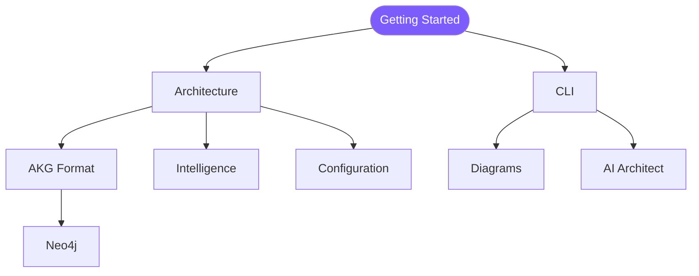

# GlassMarble Docs — Index

> Everything GlassMarble, one hop away. Start with **Getting Started**, then dive by concern.

## Start here

| Doc | When you need it |
|---|---|
| [Getting Started](getting-started.md) | Install, verify (Cosign), `init` → `analyze` → first diagram |
| [Architecture](architecture.md) | Pipeline, modules, algorithms, storage & MVCC |

## Reference

| Doc | What it holds |
|---|---|
| [CLI Overview](cli.md) | 28 commands in 6 groups, flags, exit codes (master → [commands_master_reference.md](commands_master_reference.md)) |
| [Diagrams](diagrams.md) | 31 types across UML/C4/Specialized/Analysis + gallery + scope/link-level |
| [AKG Format](akg_format.md) | GraphJSON v3 schema, storage contract (<100MB), scaling |
| [Configuration](configuration.md) | `config.yaml` / `ai.yaml`, env vars, `intelligence/` `fusion/` `learning/` `aging`/`drift` |
| [Architecture Intelligence](architecture_intelligence.md) | Events, claims, corrections, patterns PR-01..07, snapshots |
| [AI Architect](ai.md) | Providers, 32 tools, streaming, sessions, guardrails |
| [Supported Languages](supported_languages.txt) | 17 languages, extensions, decl-only notes |
| [Relationship Types](relationship_types.md) | Predicate taxonomy (STRUCTURAL/BEHAVIORAL/DYNAMIC/SECURITY) |
| [Neo4j](neo4j.md) | `gmb export --format neo4j` → Cypher recipes |
| [GlassMarble Product Description](GlassMarble_ProductDescription.md) | Product narrative & positioning |
| [CLI Master Reference](commands_master_reference.md) | Every flag & example (1234 lines, source of truth) |

## Quick links from README

`README` is the **front door** (badges → 30-sec start → links). All heavy detail lives here — see [Getting Started](getting-started.md) for the full install matrix and verification.

## Conventions

- Mermaid code fences render natively on GitHub.
- All `gmb` examples use `--dir` for repo path; global flags (`--color`, `--max-json-mb`) work on every command.
- Config precedence: `flag > GLASSMARBLE_* env > .glassmarble/config.yaml > ~/.glassmarble > defaults`.
