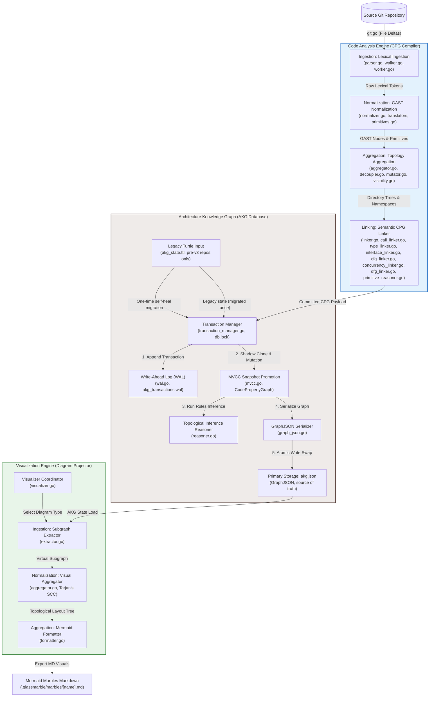

# GlassMarble: Master Architecture & Implementation Manual

Welcome to the master technical documentation for **GlassMarble**, a self-evolving Architecture Knowledge Graph (AKG) compiler and visualization platform. This manual details the design, codebase layout, algorithms, E2E flows, validation models, and architectural boundaries of the system.

---

## 1. Executive Summary & Product Vision

Modern software systems suffer from **documentation drift**: architecture diagrams, deployment topologies, and dependency maps are created during design phases and quickly become obsolete as codebase implementations evolve. 

**GlassMarble** resolves this drift by treating the codebase as the single source of truth. It compiles source files across multiple languages (Go, Python, JS, C, C++, C#, Java, Ruby, PHP, Swift, HTML, CSS, JSON) into a queried semantic graph known as the **Code Property Graph (CPG)**, commits it to a unified W3C RDF-star graph database (the **Architecture Knowledge Graph**, or **AKG**), and projects it into 21 high-fidelity visual notations (14 UML diagrams + 7 C4 model topologies) using Mermaid.js.

```
┌─────────────────────────────────┐
│       Multi-Language Code       │
└────────────────┬────────────────┘
                 │ (Ingestion-2: Tree-sitter Ingestion & GAST normalization)
                 ▼
┌─────────────────────────────────┐
│     Code Property Graph (CPG)    │
└────────────────┬────────────────┘
                 │ (Aggregation-4: Topology & Semantic Binding)
                 ▼
┌─────────────────────────────────┐
│  Architecture Knowledge Graph   │ (Committed as W3C RDF-star / Turtle)
└────────────────┬────────────────┘
                 │ (SPARQL-like Virtual Subgraph Extraction)
                 ▼
┌─────────────────────────────────┐
│      Visualization Engine       │ (Collapses namespaces & detects loops)
└────────────────┬────────────────┘
                 │ (Renders standard UML Class, Sequence, Timing, C4)
                 ▼
┌─────────────────────────────────┐
│       Mermaid.js Markup         │ (Outputs to .glassmarble/marbles/[name].md)
└─────────────────────────────────┘
```

---

## 2. Core Concepts & Architectural Blueprint

### A. The Code Property Graph (CPG)
A unified representation that combines:
1.  **Abstract Syntax Tree (AST)**: Syntactical elements, interfaces, types, parameters, fields, and expressions.
2.  **Control Flow Graph (CFG)**: Chronological execution sequences, conditional branches, loops, and exits.
3.  **Data Flow Graph (DFG)**: Variable declarations, parameters, assignments, and structural values propagation.
4.  **Call Graph**: Static call linkages, polymorphic interface bindings, and concurrency threads.

### B. The Architecture Knowledge Graph (AKG)
The CPG is stored inside the database directory (`.glassmarble/`) as a semantic graph mapping nodes and relationships. To represent precise physical locations (e.g. that a call happened at line 42), the graph uses **W3C RDF-star (RDF\*)** notation. Standard RDF only maps binary triples (`subject predicate object`). RDF-star allows **nested statement assertions** (metadata of metadata):

```turtle
# Direct call edge
<< <http://glassmarble.org/node/auth/login.go::Authenticator::Authenticate> gm:calls <http://glassmarble.org/node/db/database.go::DBStore::GetUser> >> gm:lineNumber 18 .
```

### C. GAST (Generic Abstract Syntax Tree)
To decouple the compiler from language syntaxes, all Tree-sitter Concrete Syntax Tree (CST) nodes are coerced into a **Generic AST (GAST)**. A `GASTNode` represents declarations, calls, scopes, and fields uniformly across all 13 languages.

---

## 3. Detailed File-by-File Codebase Directory

Every sub-directory and code file in `G:\GlassMarble\internal` plays an isolated, modular role in the pipeline:

### 📂 `internal/akg/` (The Database & Transaction Layer)
Manages serialization, transactions, thread locks, and recovery of the W3C Turtle graph.

*   [`mvcc.go`](file:///G:/GlassMarble/internal/akg/mvcc.go):
    *   Implements Multi-Version Concurrency Control (MVCC) isolation.
    *   Defines `CodePropertyGraph` (holds nodes, edges, file indexes, macro rules, and validation errors) and `MVCCGraphContainer` (handles atomic snapshot swaps and thread-safe read locks).
*   [`wal.go`](file:///G:/GlassMarble/internal/akg/wal.go):
    *   Implements Write-Ahead Logging (WAL) for durability.
    *   Logs transaction status (`STARTED`, `COMMITTED`, `ABORTED`) to `.glassmarble/akg_transactions.wal` in append mode, executing `Sync()` to flush writes before DB mutations.
*   [`reasoner.go`](file:///G:/GlassMarble/internal/akg/reasoner.go):
    *   Topological Macro-Inference rules engine.
    *   Traverses functional call graphs (up to depth 5) using DFS to infer high-level architectural rules (Web-to-Storage traffic, Security Gates, Async background tasks) and tags them as node properties.
*   [`ontology.ttl`](file:///G:/GlassMarble/internal/akg/ontology.ttl):
    *   Contains the semantic schema definitions, RDF prefixes, class structures, and predicate properties axioms for the Architecture Knowledge Graph.
*   [`transaction_manager.go`](file:///G:/GlassMarble/internal/akg/transaction_manager.go):
    *   Coordinates transaction commits, file write locks (`db.lock`), WAL logs, and fallback self-healing Turtle reconstructions.
*   [`turtle_serializer.go`](file:///G:/GlassMarble/internal/akg/turtle_serializer.go):
    *   Serializes memory snapshot graphs into standard W3C RDF-star Turtle strings.
*   [`transaction_manager_test.go`](file:///G:/GlassMarble/internal/akg/transaction_manager_test.go):
    *   Unit tests checking transaction locks, recovery states, and self-healing Turtle reconstruction.

### 📂 `internal/code_analysis_engine/` (The Ingestion & Normalization Layer)
Translates codebase repositories into semantic CPG structures.

*   [`integration_test.go`](file:///G:/GlassMarble/internal/code_analysis_engine/integration_test.go):
    *   Orchestrates integration tests running Ingestion through 4 end-to-end to verify language parsing and semantic link bindings.

*   `ingest/` (Lexical & Structural AST Ingestion)
    *   [`engine.go`](file:///G:/GlassMarble/internal/code_analysis_engine/ingest/engine.go): Initializes and controls multi-threaded execution pools for file ingestion.
    *   [`worker.go`](file:///G:/GlassMarble/internal/code_analysis_engine/ingest/worker.go): Runs background parser workers that fetch files from queues and traverse CSTs.
    *   [`git.go`](file:///G:/GlassMarble/internal/code_analysis_engine/ingest/git.go): Resolves local directories change lists and filters out unchanged files from ingestion scans.
    *   [`languages.go`](file:///G:/GlassMarble/internal/code_analysis_engine/ingest/languages.go): Registers grammar identifiers, extensions lists, declarations, imports, and call tokens for the 13 supported languages.
    *   [`lookup.go`](file:///G:/GlassMarble/internal/code_analysis_engine/ingest/lookup.go): Resolves directory symbols namespaces.
    *   [`parser.go`](file:///G:/GlassMarble/internal/code_analysis_engine/ingest/parser.go): Interfaces with tree-sitter bindings, processes nodes, and extracts raw lexical tokens.
    *   [`walker.go`](file:///G:/GlassMarble/internal/code_analysis_engine/ingest/walker.go): Traverses tree-sitter AST nodes recursively to normalize parent-child indexing.
    *   [`type.go`](file:///G:/GlassMarble/internal/code_analysis_engine/ingest/type.go): Defines structures for `IngestionResult` and `RawToken`.
    *   [`engine_test.go`](file:///G:/GlassMarble/internal/code_analysis_engine/ingest/engine_test.go): Unit tests verifying parser walker outputs.

*   `ingest/` (GAST Translation & Language Coercion)
    *   [`normalizer.go`](file:///G:/GlassMarble/internal/code_analysis_engine/normalize/normalizer.go): Normalizes raw tokens to GAST, maps calls, receiver types, and parses imports/exports.
    *   [`translator.go`](file:///G:/GlassMarble/internal/code_analysis_engine/normalize/translator.go): Dispatches the correct language-specific translation module.
    *   [`primitives.go`](file:///G:/GlassMarble/internal/code_analysis_engine/normalize/primitives.go): Scans code syntax regex patterns to flag nodes with primitive I/O behaviors (`DATABASE`, `NETWORK_IO`, `DISK_IO`).
    *   [`type.go`](file:///G:/GlassMarble/internal/code_analysis_engine/normalize/type.go): Declares GASTNode types.
    *   **Translators**:
        *   [`go_translator.go`](file:///G:/GlassMarble/internal/code_analysis_engine/normalize/go_translator.go): GAST coercer for Go language, parses structs and receiver types.
        *   [`python_translator.go`](file:///G:/GlassMarble/internal/code_analysis_engine/normalize/python_translator.go): Python GAST coercer.
        *   [`javascript_translator.go`](file:///G:/GlassMarble/internal/code_analysis_engine/normalize/javascript_translator.go) & [`typescript_translator.go`](file:///G:/GlassMarble/internal/code_analysis_engine/normalize/typescript_translator.go): JS/TS coercers.
        *   [`c_translator.go`](file:///G:/GlassMarble/internal/code_analysis_engine/normalize/c_translator.go), [`cpp_translator.go`](file:///G:/GlassMarble/internal/code_analysis_engine/normalize/cpp_translator.go), [`csharp_translator.go`](file:///G:/GlassMarble/internal/code_analysis_engine/normalize/csharp_translator.go), [`css_translator.go`](file:///G:/GlassMarble/internal/code_analysis_engine/normalize/css_translator.go), [`html_translator.go`](file:///G:/GlassMarble/internal/code_analysis_engine/normalize/html_translator.go), [`java_translator.go`](file:///G:/GlassMarble/internal/code_analysis_engine/normalize/java_translator.go), [`json_translator.go`](file:///G:/GlassMarble/internal/code_analysis_engine/normalize/json_translator.go), [`php_translator.go`](file:///G:/GlassMarble/internal/code_analysis_engine/normalize/php_translator.go), [`ruby_translator.go`](file:///G:/GlassMarble/internal/code_analysis_engine/normalize/ruby_translator.go), [`generic_translator.go`](file:///G:/GlassMarble/internal/code_analysis_engine/normalize/generic_translator.go): GAST coercers for C, C++, C#, CSS, HTML, Java, JSON, PHP, and Ruby.
    *   [`normalizer_test.go`](file:///G:/GlassMarble/internal/code_analysis_engine/normalize/normalizer_test.go): Coercion and primitive propagation tests.

*   `ingest/` (Topology Mapping & Indexing)
    *   [`aggregator.go`](file:///G:/GlassMarble/internal/code_analysis_engine/aggregate/aggregator.go): Structures individual files into boundary packages, clusters relative directories, and sets up definitions mapping index.
    *   [`decoupler.go`](file:///G:/GlassMarble/internal/code_analysis_engine/aggregate/decoupler.go): Cleans up file system path separators, strips Windows drive prefixes, and extracts directory chains.
    *   [`mutator.go`](file:///G:/GlassMarble/internal/code_analysis_engine/aggregate/mutator.go): Grafts file nodes onto the folder directory tree structure and prunes dead files recursively.
    *   [`visibility.go`](file:///G:/GlassMarble/internal/code_analysis_engine/aggregate/visibility.go): Traverses folder namespaces to compute and tag public/private export bindings and FQN keys.
    *   [`type.go`](file:///G:/GlassMarble/internal/code_analysis_engine/aggregate/type.go): Workspace directory layouts, CallQueue and DefinitionIndex maps.
    *   [`aggregator_test.go`](file:///G:/GlassMarble/internal/code_analysis_engine/aggregate/aggregator_test.go): Namespace clustering and directory tree tests.

*   `ingest/` (Semantic Graph Linker)
    *   [`linker.go`](file:///G:/GlassMarble/internal/code_analysis_engine/link/linker.go): Coordinates all linker phases.
    *   [`builder.go`](file:///G:/GlassMarble/internal/code_analysis_engine/link/builder.go): Reconstructs CPG nodes, formats FQNs, and stamps location metadata.
    *   [`call_linker.go`](file:///G:/GlassMarble/internal/code_analysis_engine/link/call_linker.go): Links calls to target method nodes using case-insensitive receiver matching and selector-path deconstruction.
    *   [`type_linker.go`](file:///G:/GlassMarble/internal/code_analysis_engine/link/type_linker.go): Maps field composition mappings and data types propagation.
    *   [`interface_linker.go`](file:///G:/GlassMarble/internal/code_analysis_engine/link/interface_linker.go): Links structural interface duck-typing implementations (like Go structs matching interfaces).
    *   [`cfg_linker.go`](file:///G:/GlassMarble/internal/code_analysis_engine/link/cfg_linker.go): Registers internal function branching (if, for, loops, switch) as CFG sub-nodes and connects execution paths.
    *   [`concurrency_linker.go`](file:///G:/GlassMarble/internal/code_analysis_engine/link/concurrency_linker.go): Scans for asynchronous execution forks and flags concurrency thread boundaries (`EdgeSpawnsConcurrent`).
    *   [`dfg_linker.go`](file:///G:/GlassMarble/internal/code_analysis_engine/link/dfg_linker.go): Builds variable assignment flow paths and extracts data flow networks.
    *   [`primitive_reasoner.go`](file:///G:/GlassMarble/internal/code_analysis_engine/link/primitive_reasoner.go): Propagates resource traits (e.g. `DATABASE`, `NETWORK_IO`) from low-level calls to caller functions.
    *   [`type.go`](file:///G:/GlassMarble/internal/code_analysis_engine/link/type.go): CPG nodes, edges, relationships, and linking schemas.
    *   [`linker_test.go`](file:///G:/GlassMarble/internal/code_analysis_engine/link/linker_test.go): Duck-typing, variables, and CPG binding tests.

### 📂 `internal/git/` (Incremental Analysis)
*   [`git.go`](file:///G:/GlassMarble/internal/git/git.go): Calls external Git CLI commands to fetch logs, extract delta modifications files list, and track head commits.
*   [`git_test.go`](file:///G:/GlassMarble/internal/git/git_test.go): Unit tests for the Git CLI helper wrappers.

### 📂 `internal/visualization_engine/` (The Diagram Renderer)
Generates standard visual diagram markup by executing queries against the `.ttl` graph.

*   [`visualizer.go`](file:///G:/GlassMarble/internal/visualization_engine/visualizer.go): Coordinates the visualizer phases (subgraph extraction, layout aggregation, and Mermaid formatting).
*   [`types.go`](file:///G:/GlassMarble/internal/visualization_engine/types.go): Simple pointer mapping visualizer constants redirecting to leaf `types` package to avoid cycle import loops.
*   [`visualizer_test.go`](file:///G:/GlassMarble/internal/visualization_engine/visualizer_test.go): Validates Mermaid markup diagrams outputs against schema.
*   `ingest/` (SPARQL-like Subgraph Filtering)
    *   [`extractor.go`](file:///G:/GlassMarble/internal/visualization_engine/extract/extractor.go): Extracts virtual subgraphs from Turtle matching UML and C4 scopes.
*   `ingest/` (Visual Folder Aggregation & Cycle Tracking)
    *   [`aggregator.go`](file:///G:/GlassMarble/internal/visualization_engine/layout/aggregator.go): Collapses edges, nests subgraphs into directories, and runs Tarjan's SCC cycle tracking.
*   `ingest/` (Mermaid Formatting)
    *   [`formatter.go`](file:///G:/GlassMarble/internal/visualization_engine/render/formatter.go): Emits formatted syntax files matching Mermaid's visual specs, fixing syntax errors.
*   `types/` (Visualizer Schemas & Registries)
    *   [`types.go`](file:///G:/GlassMarble/internal/visualization_engine/types/types.go): Declares all UML and C4 diagram registries and virtual layout structures.

---

## 4. Algorithmic Detail & Technical Highlights

### A. Nested Selector Call Resolution (Method Call Linker)
In modern codebases, method calls are rarely simple identifiers (e.g., `GetUser(id)`). They are often chained or invoked via fields, such as `a.Store.GetUser(id)` or `self.email_client.send_notification(...)`. 

1.  **AST Split**: The Tree-sitter parser extracts these expressions as a single call token, but the normalizer collects the method name prefixed with field selectors (e.g., `MethodName = "Store.GetUser"`, `ReceiverName = "a"`).
2.  **Resolution Logic**: Inside [`call_linker.go`](file:///G:/GlassMarble/internal/code_analysis_engine/link/call_linker.go#L62), the method name is deconstructed:
    *   The leaf segment is extracted as the true method target (`"GetUser"`).
    *   The intermediate selector segments are prepended onto the receiver string (`"a.Store"`).
3.  **Heuristic Type Matcher**:
    *   The receiver is normalized (case-insensitively). Suffixes like `_client`, `_service`, and `_store` are stripped.
    *   The target type is matched (e.g., `"a.Store"` matches `DBStore` because `"dbstore"` contains the segment `"store"`). This bridges the gap between dynamic variable names and static type names.

### B. Cycle Detection using Tarjan's SCC Algorithm
To highlight critical architectural code issues, the visual aggregator running on collapsed edges executes **Tarjan's Strongly Connected Components (SCC)** algorithm:
1.  Nodes are traversed using depth-first search (DFS).
2.  For each node, a low-link value tracking parent paths is maintained on the DFS call stack.
3.  If a node's low-link value equals its DFS index, an SCC boundary is closed. If this boundary contains more than 1 node, it indicates a circular dependency.
4.  The visualizer sets `IsCycle = true` on the edge, styling the connection with custom cycles annotations (`[CYCLE]`).

### C. Visual Formatter Sanitization & Quote Isolation
Mermaid.js diagrams fail if node names contain characters like colons `:`, dashes `-`, or periods `.`, or if labels contain parentheses `()`.
1.  **ID Sanitization**: All node identifiers are processed via `sanitizeName` which replaces all colons, periods, slashes, and dashes with underscores (`_`).
2.  **Double Quote Wrapping**: Labels and subgraph titles (e.g., `subgraph src ["src"]` or `src_auth_go_Login["Login (Executable)"]`) are wrapped in double quotes to allow parentheses and spaces without causing parser errors.

---

## 5. End-to-End Execution Flow

When an end-user runs a command like `glassmarble visualize class --dir ./project --save "class_diagram"`, the system processes the request as follows:

```
                    ┌──────────────────────┐
                    │ visualize command    │
                    └──────────┬───────────┘
                               │
                               ▼
                    ┌──────────────────────┐
                    │ Ingestion Inits      │
                    └──────────┬───────────┘
                               │ (Acquires db.lock; checks JSON cache)
                               ▼
             ┌─────────────────┴─────────────────┐
             ▼                                   ▼
   ┌───────────────────┐               ┌──────────────────────┐
   │ akg.json Present  │               │ No akg.json; legacy  │
   │                   │               │ TTL present          │
   └─────────┬─────────┘               └──────────┬───────────┘
             │ (Fast load)                        │ (One-time migration)
             │                                    │ parses akg_state.ttl
             │                                    │ writes akg.json; TTL → .bak
             ▼                                   ▼
   ┌───────────────────────────────────────────────┐
   │ Graph Database Loaded in Memory               │
   └───────────────────────┬───────────────────────┘
                           │
                           ▼
   ┌───────────────────────────────────────────────┐
   │ extractClassSubgraph (Filters TypeDecl/calls)  │
   └───────────────────────┬───────────────────────┘
                           │
                           ▼
   ┌───────────────────────────────────────────────┐
   │ BuildLayoutTree (Collapses edges, runs SCC)   │
   └───────────────────────┬───────────────────────┘
                           │
                           ▼
   ┌───────────────────────────────────────────────┐
   │ renderClassDiagram (Translates path to class) │
   └───────────────────────┬───────────────────────┘
                           │
                           ▼
   ┌───────────────────────────────────────────────┐
   │ Save Markdown to marbles/class_diagram.md     │
   └───────────────────────────────────────────────┘
```

---

## 6. How We Tested GlassMarble

### A. Unit & Integration Test Suites
Every phase has direct unit tests inside the workspace:
*   **Database Concurrency & Locking**: Verified in `internal/akg/transaction_manager_test.go`. Asserts concurrent lock acquisition failures.
*   **Self-Healing Migration Loader**: Verified in `transaction_manager_test.go` — a missing `akg.json` with a legacy `akg_state.ttl` present restores the graph from Turtle and archives the TTL as `.bak`; a corrupt `akg.json` fails loudly instead of being silently rebuilt (see `doctor_test.go`).
*   **Parser & Translators**: Verified in `internal/code_analysis_engine/normalize/normalizer_test.go` and `link/linker_test.go`.

### B. End-to-End Real Codebase Integration Test
We validated the system using a real polyglot codebase containing 11 files across Go, Python, and JavaScript:
1.  **Codebase Ingestion**: Executed `go run scratch/run_ingestion.go`. It parsed all 12 source files, normalized the ASTs, and generated the CPG graph.
2.  **Transaction Commit**: The graph was committed to `.glassmarble/akg.json`.
3.  **Visualization Generation**: We ran:
    `.\glassmarble.exe visualize class --dir .\scratch\real_e2e_db --unused --save "real_class_marble"`
    It generated the class diagram markdown block correctly mapping call hierarchies to class relationships.

---

## 7. Architectural Limitations & Issues

While GlassMarble is robust, the current architecture has a few limitations:

### A. Heuristic Type Resolution vs Full Compilers
*   **The Issue**: The engine relies on name heuristics and signature matching to connect variable method calls (like `email_client.send_notification()`) to class definitions (`EmailService`). It does not run a full compiler symbol type inference.
*   **The Limit**: If two different classes declare methods with identical names (e.g. `Client.Save()` and `Database.Save()`), and a call site is `var.Save()`, the engine might add call edges to **both** targets if it cannot distinguish their variable types.

### B. Single-Process Locking Constraints
*   **The Issue**: The transaction manager locks writes via `.glassmarble/db.lock`.
*   **The Limit**: This only works for concurrent processes running on the **same physical filesystem**. In distributed multi-agent systems, file locks do not scale, requiring a distributed consensus lock or central API graph server.

### C. Multi-File Type Propagation Gaps
*   **The Issue**: Type declarations embedded across nested interfaces (like Go embeds) are parsed as fields, but their child methods are not automatically propagated up as inherits mappings unless explicitly annotated in GAST.
*   **The Limit**: This can result in class diagrams occasionally listing embedded structs as standard composition relationships rather than true inheritance structures.

---

## 8. Deep-Dive: G:\GlassMarble\internal\akg Database Internals

The `G:\GlassMarble\internal\akg` package is the core database storage and transaction engine of GlassMarble. It provides strict concurrency control, serialization of Code Property Graph (CPG) structures into standard W3C RDF-star, and self-healing recovery mechanisms.

### A. Storage Architecture & Directory Structures
When GlassMarble ingests a codebase, it creates a `.glassmarble/` database directory at the root of the project. This folder contains these key files:

1.  **`akg.json`**: The single source of truth. It contains the entire architecture graph serialized as GraphJSON — deterministic, sorted nodes/edges, lossless for edge metadata (confidence, self-loops, parallel edges).
2.  **`akg_state.ttl.bak`**: Present only after a one-time self-heal migration of a pre-v3 repository; the legacy Turtle state is archived, never deleted.
3.  **`db.lock`**: A temporary file token used as an exclusive lock.

### B. Concurrency Control & Write-Lock Mechanics
To prevent database corruption during parallel runs (for example, if a developer starts ingestion while a background process is writing updates), the system uses an atomic, file-based locking strategy inside [`transaction_manager.go`](file:///G:/GlassMarble/internal/akg/transaction_manager.go):

*   **Exclusive Lock Acquisition**: The manager calls:
    ```go
    os.OpenFile(lockFilePath, os.O_CREATE|os.O_EXCL|os.O_WRONLY, 0666)
    ```
    On Windows/Linux, the `os.O_EXCL` flag guarantees that the file creation is atomic. If the lock file already exists, the operating system blocks the call and returns an error. GlassMarble immediately aborts the write operation, indicating that another transaction is in progress.
*   **Write-Ahead & Atomic File Swapping**: Rather than editing `akg.json` directly (which would leave it in a corrupted state if the program crashed midway), the transaction manager writes content to temporary files (e.g., `akg.json.tmp-*`). Once the write succeeds, it performs an atomic swap:
    ```go
    os.Rename(tempPath, finalPath)
    ```
    This ensures that the database transition is fully transactional (all-or-nothing).
*   **Lock Release**: In a `defer` block, the transaction manager deletes `db.lock` to release access.

### C. Legacy Self-Healing Migration
If `akg.json` is missing but a legacy `akg_state.ttl` exists, the transaction manager runs a **one-time self-heal migration**:

1.  **Turtle Parser Activation**: It opens the legacy Turtle file `akg_state.ttl` and reads it line-by-line using a scanner.
2.  **Triple Reconstruction**: It parses standard RDF triples (`subject predicate object`) and maps them back to node elements (like `gm:TypeDecl`, `gm:Executable`) and edge properties (like `gm:calls`, `gm:inheritsFrom`).
3.  **RDF-Star Nested Extraction**: It detects nested assertions to reconstruct line numbers and call metadata:
    ```
    << <subject> <predicate> <object> >> <metaPredicate> <metaValue>
    ```
4.  **Re-indexing & Persistence**: Once the graph structure is fully built in memory, it writes it as a fresh `akg.json` and archives the TTL as `akg_state.ttl.bak` (never deleted). From then on, `akg.json` is the only state file.

A corrupt `akg.json` fails loudly at startup instead of being silently overwritten; `gmb doctor` reports the corruption so the state can be rebuilt with `gmb analyze --full`.

### D. RDF-Star Turtle Serialization (`turtle_serializer.go`)
The [`turtle_serializer.go`](file:///G:/GlassMarble/internal/akg/turtle_serializer.go) file converts the internal CPG Go structs into Turtle text. It is retained for the legacy TTL migration reader and `gmb export --format turtle`; the canonical store is GraphJSON (see `graph_json.go`):

*   **Namespace Mappings**: Automatically binds URIs like `<http://glassmarble.org/node/...>` to keep graphs clean and structured.
*   **Type Coercion**: Maps GAST nodes and predicates to standard ontology types (e.g. `link.EdgeCalls` is mapped to `gm:calls`).
*   **String Escaping**: Sanitizes code segments, string literals, and comments using backslash escaping rules to ensure valid Turtle syntax.

---

## 9. GlassMarble System Architecture Diagram

The diagram below provides a complete visual representation of the GlassMarble system architecture, illustrating the flow of data from source code files, through the multi-phase analysis pipeline, into the transaction-managed GraphJSON state store, and finally through the visualization engine to emit Mermaid diagrams.



---

## 10. AI Engine (`internal/ai_engine/` + `cmd/ai.go`)

The AI engine is a Bring-Your-Own-Key (BYOK) agentic interface on top of the
existing pipeline. It is a **read-only client** of `internal/akg`,
`internal/code_analysis_engine`, and `internal/visualization_engine`: it
queries the AKG snapshot and calls `EngineCoordinator.ProjectDiagram` /
`ComputeGraphSummary` through their public APIs, never modifying them. See
[`docs/ai.md`](ai.md) for the user guide.

### 10.1 Architecture

```
cmd/ai.go                      # gmb ai + chat/configure/models/doctor/sessions
internal/ai_engine/
├── engine.go                  # facade: New (adapter wiring), Ask, AskAgent, Doctor
├── aiconfig/                  # BYOK config: flags > env > project yaml > global yaml > defaults
├── provider/                  # Provider interface + registry
│   ├── openai_compat.go       #   OpenAI-compatible chat completions + SSE streaming
│   ├── anthropic.go           #   native Claude + SSE events
│   ├── gemini.go              #   native Gemini + SSE
│   ├── sse.go                 #   SSE scanner (bufio, CRLF-safe, keep-alives)
│   └── pricing.go             #   model list prices, PricingFor, EstimateCost
├── agent/                     # agentic tool-calling loop
│   ├── loop.go                #   turn loop, streaming events, token/cost guardrails
│   ├── system_prompt.go       #   AI-Architect persona + repository context header
│   └── dispatcher.go          #   validates args, executes tools, caps result sizes
├── tools/                     # unified Tool type + JSON-Schema converters
│   ├── system_tools.go        #   system_status, system_diagram_types, save_artifact
│   ├── akg_tools.go           #   18 AKG query tools (cycles, PageRank, impact...)
│   ├── code_tools.go          #   code_read_file, code_list_dir, code_diff, ...
│   └── diagram_tools.go       #   diagram_generate (all 31 types), diagram_summary
├── akgbridge/                 # lazy cached AKG snapshot (mtime-validated)
└── session/                   # persistent chat sessions (.glassmarble/ai/sessions/)
```

### 10.2 Provider layer

One interface, three adapters:

*   `openai_compat` — OpenAI, DeepSeek, Mistral, GLM, NVIDIA NIM, OpenRouter,
    Groq, Ollama, and arbitrary `custom` endpoints speaking the
    chat-completions wire format.
*   `anthropic` — native Claude message format.
*   `gemini` — native Gemini generateContent format.

Tool schemas are defined once in a unified JSON-Schema form and converted per
adapter. The registry (`provider/registry.go`) holds name → adapter mapping,
default base URLs, known models, and the key environment variable. Keys are
never logged and error messages redact them.

### 10.3 Streaming

`Request.OnStream` enables token streaming:

*   **OpenAI-compatible**: `"stream": true` payload; SSE `data:` chunks;
    tool-call fragments are reassembled by index; usage is taken from the
    final chunk. Non-SSE bodies fall back to a one-shot JSON parse.
*   **Anthropic**: SSE events — `message_start` carries input tokens,
    `content_block_delta` carries `text_delta` / `input_json_delta`,
    `message_delta` carries output tokens.
*   **Gemini**: `:streamGenerateContent?alt=sse`; every chunk is a full
    response; usage is present only on the final chunk.

The agent forwards deltas via `OnStream` and emits `Event{Type: "stream"}`
events; the CLI buffers deltas per turn, clears the buffer on tool rounds (the
model's tool-round preamble is discarded), and flushes once on the `answer`
event. `Config.Stream` gates whether deltas reach the CLI at all (`--no-stream`
forces buffered mode). The `--save <file>` flag routes the final answer to an
artifact file (`.glassmarble/marbles/` for diagram markup, `.glassmarble/ai/`
for prose) and prints a path receipt instead of echoing the answer — the
CLI-side counterpart of the `save_artifact` tool and `diagram_generate
save=true`.

### 10.4 Agent loop and guardrails

The loop (max `max_turns` tool rounds, default 15) builds the message list
from the system prompt + repository context header + history + user query,
sends it with the tool schemas, dispatches requested tool calls against the
live AKG snapshot, and repeats until the model answers without tools.

Token and cost guardrails (`MaxTotalTokens`, `MaxCostUSD`):

*   A **pre-flight** check estimates the next request's prompt tokens
    (~4 chars/token) and stops before sending if a cap would be exceeded.
*   A **post-hoc** check runs after every completion on the authoritative
    provider-reported usage. Because the completion is already spent, a second
    tool completion can execute before the overrun is visible, but its tool
    round does not run and no third request is sent.
*   Cost is enforced only for priced models (`provider.PricingFor`); unknown
    models skip the cap. Vendor-prefixed IDs resolve via the last path
    segment. Stop reasons surface as `turn_limit` / `token_budget` /
    `cost_budget` on `Result.StoppedReason` and as CLI `Note:` lines.

### 10.5 Sessions

`gmb ai chat` persists multi-turn transcripts as 0600 JSON files under
`.glassmarble/ai/sessions/<id>.json` (`NewID` = timestamp + random suffix),
resumes the latest session on the next run, and trims long histories
(`max_session_messages`) on user-turn boundaries — tool rounds are never
split and the trailing answer is never dropped. Session IDs are validated
against a strict pattern to keep file access traversal-safe.

### 10.6 Testing

The AI engine is covered by fake-server E2E tests (`httptest` doubles
replaying scripted JSON/SSE bodies), golden wire-format assertions (request
bodies are recorded and inspected: `stream: true` payloads, tool schemas,
session history continuity), agent-loop scripted tool-call sequences, guardrail
tests (token/cost budgets, unpriced-model skip, pre-flight stop), pricing
table tests, SSE scanner tests, session round-trip/trim/delete tests, and CLI
tests for streaming output, `--no-stream`, `gmb ai sessions`/`--delete`, and
chat-session persistence across invocations.


### 10.7 Memory envelope

GlassMarble's memory behavior is deliberately bounded so that a repository
scan can never silently exhaust the host. The working set has four parts:

1.  **CLI analysis graph** � the in-memory `CodePropertyGraph` (nodes, edges,
    indexes) held during `gmb analyze` and by read commands (`status`,
    `inspect`, `tree`, `visualize`, `ai`).
2.  **State file** � `.glassmarble/akg.json`, the single source of
    truth on disk (atomic writes + post-write verification + zero-dangling
    guard).
3.  **WAL** � `.glassmarble/wal/`, the crash-recovery log.
4.  **Visualization cache** � the parsed-graph `SubgraphCache` used by
    diagram rendering.

**Explicit budgets (all enforced in code):**

*   `--max-ttl-mb N` (global flag, default 0 = unlimited): loading or
    committing an AKG state file larger than N MiB is **refused** with an
    actionable error. This is the primary guard against pulling an oversized
    artifact into RAM.
*   `SubgraphCache` is **byte-bounded** (64 MiB LRU budget, entries also
    keyed by scope) � diagram commands cannot balloon memory across repeated
    renders.
*   The macro-inference `macroCache` is capped at 10,000 entries and reset
    per transaction.
*   `--max-nodes N` / `--abort-on-limit` on `gmb analyze` bound the linker
    output size (warn or hard-stop).
*   The WAL is truncated after every successful load/recovery and rotated at
    100 MB (keeping the last two segments), so recovery memory is bounded by
    the in-flight transaction � replay streams entries instead of loading
    the whole log.
*   `gmb housekeeping --prune --older-than N` removes stale saved diagrams
    (`.glassmarble/marbles/`) and AI sessions (`.glassmarble/ai/sessions/`);
    it never touches the AKG state file.
*   **Lazy Query-based reads** (AUDIT Issue 4 Phase 4A-2): `gmb status` and
    `gmb inspect` never restore the graph — they stream the TTL through the
    single canonical parser (node blocks one at a time, edge triples counted
    without materializing the edge set). `gmb visualize --scope file:path`
    parses only the scoped file's triples. The AI agent renders diagrams from
    its in-memory AKG snapshot via the same from-graph pipeline instead of
    re-parsing the TTL. Two restore-only figures are intentionally absent
    from lazy `gmb status`: the macro-rule count (derived data recomputed on
    load, never persisted) and the post-write verification stamp (a TTL with
    zero dangling edges is reported as verified, which is the same test the
    restore path applies).

**Expected footprint by repository scale** (measured on this repository:
173 Go files ? 2,308 nodes / 5,479 edges / 3.5 MB TTL):

| Scale | Nodes | TTL size | Approx. peak RSS |
| --- | --- | --- | --- |
| Small | < 1,000 | < 0.5 MB | 30�80 MB |
| Medium (this repo) | ~2,500 | ~3.5 MB | 100�200 MB |
| Large | 10,000�50,000 | 10�50 MB | 0.5�2 GB |
| Very large | > 50,000 | > 50 MB | 2 GB+ � set `--max-ttl-mb`, prefer `--link-level=architecture` |

The analysis QA line (`gmb analyze`) and `gmb status` print the TTL/WAL
sizes alongside node/edge counts so drift toward the envelope stays visible.
