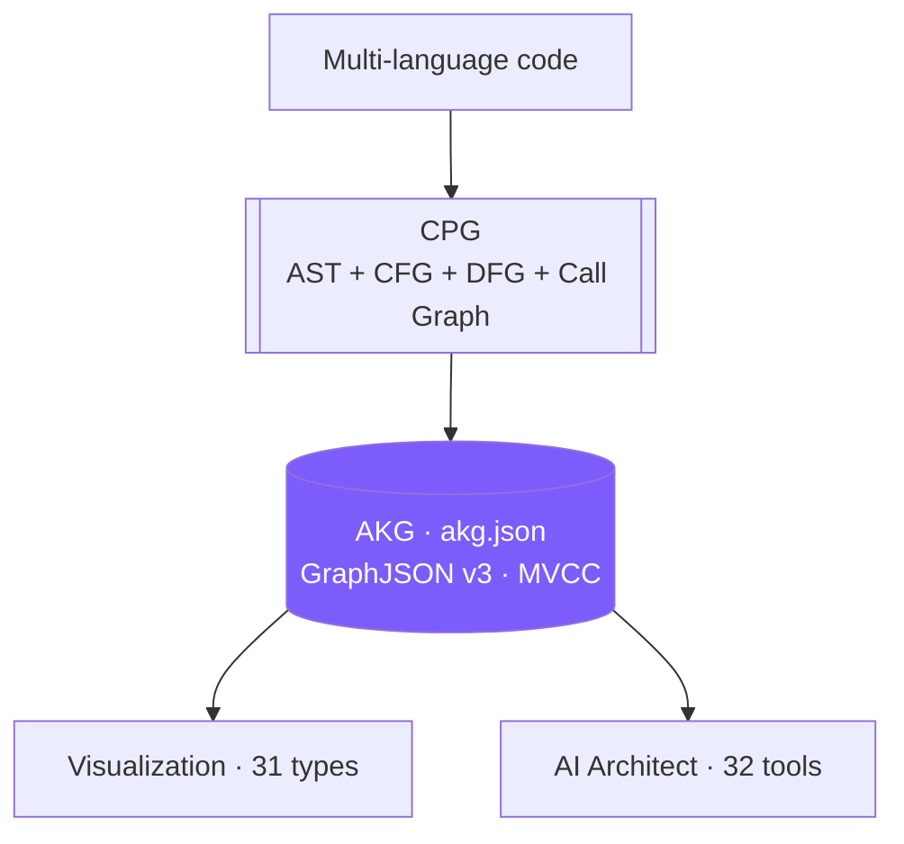

# GlassMarble: Master Architecture & Implementation Manual

<p align="center">
  <br>
  <em>Self-evolving AKG — from code to diagrams to answers.</em>
</p>

> **One sentence:** 17 languages → CPG → AKG (`akg.json`) → 31 living diagrams. The repo is the source of truth.

## Contents

- [1. Executive Summary](#1-executive-summary--product-vision)
- [2. Core Concepts](#2-core-concepts--architectural-blueprint)
- [3. Codebase Map](#3-detailed-file-by-file-codebase-directory)
- [4. Algorithms](#4-algorithms--system-design)
- [5. Flows](#5-end-to-end-runtime-flow)
- [6. Testing](#6-testing-strategy)
- [7. Limitations](#7-current-limitations--known-boundaries)
- [8. AKG Internals](#8-akg-internals)
- [9. System Diagram](#9-system-diagram-high-level)
- [10. AI Engine](#10-ai-engine-architecture)



Welcome to the master technical documentation for **GlassMarble**, a self-evolving Architecture Knowledge Graph (AKG) compiler and visualization platform. This manual details the design, codebase layout, algorithms, E2E flows, validation models, and architectural boundaries of the system.

---

## 1. Executive Summary & Product Vision
Modern software systems suffer from **documentation drift**: architecture diagrams, deployment topologies, and dependency maps are created during design phases and quickly become obsolete as codebase implementations evolve.

**GlassMarble** resolves this drift by treating the codebase as the single source of truth. It compiles source files across 17 languages (14 with native tree-sitter grammars — Go, Python, JS, TS, C, C++, C#, Java, Ruby, PHP, Rust, HTML, CSS, JSON — plus declaration-only support for Kotlin, Swift, and Scala) into a queried semantic graph known as the **Code Property Graph (CPG)**, commits it to a portable GraphJSON database (the **Architecture Knowledge Graph**, or **AKG**) under `.glassmarble/akg.json`, and projects it into 31 visual notations (14 UML + 7 C4 + 4 specialized + 6 analysis) using Mermaid, PlantUML, or DOT.

```
┌─────────────────────────────────┐
│       Multi-Language Code       │
└────────────────┬────────────────┘
                 │ (Ingestion: Tree-sitter Ingestion & GAST normalization)
                 ▼
┌─────────────────────────────────┐
│     Code Property Graph (CPG)    │
└────────────────┬────────────────┘
                 │ (Aggregation & Linking: Topology & Semantic Binding)
                 ▼
┌─────────────────────────────────┐
│  Architecture Knowledge Graph   │ (Committed as GraphJSON, schema v3)
└────────────────┬────────────────┘
                 │ (Query-based Virtual Subgraph Extraction)
                 ▼
┌─────────────────────────────────┐
│      Visualization Engine       │ (Collapses namespaces & detects loops)
└────────────────┬────────────────┘
                 │ (Renders UML, C4, specialized, and analysis diagrams)
                 ▼
┌─────────────────────────────────┐
│   Mermaid / PlantUML / DOT      │ (Outputs to .glassmarble/marbles/[name].md)
└─────────────────────────────────┘
```

---

## 2. Core Concepts & Architectural Blueprint

### A. The Code Property Graph (CPG)
A unified representation that combines:
1.  **Abstract Syntax Tree (AST)**: Syntactical elements, interfaces, types, parameters, fields, and expressions.
2.  **Control Flow Graph (CFG)**: Chronological execution sequences, conditional branches, loops, and exits.
3.  **Data Flow Graph (DFG)**: Variable declarations, parameters, assignments, and structural values propagation.
4.  **Call Graph**: Static call linkages, polymorphic interface bindings, and concurrency threads.

### B. The Architecture Knowledge Graph (AKG)
The CPG is stored inside the database directory (`.glassmarble/`) as `akg.json` — a deterministic, diff-friendly **GraphJSON** document (schema v3). Nodes and edges are sorted on serialization, and edge metadata (exact source line, confidence, cycle flags) is preserved losslessly:

```json
{
  "schema_version": 3,
  "commit_hash": "f438841a7ac27c9c910881070f65fd9fd2c90a72",
  "version": 5,
  "entrypoints": ["cmd.ai.init", "cmd.analyze.init"],
  "nodes": [
    { "id": "auth/login.go::Authenticator::Authenticate", "kind": "FUNCTION",
      "name": "Authenticate", "primitive": "NETWORK_IO",
      "file_spec": { "path": "auth/login.go", "line_start": 18, "line_end": 45 } }
  ],
  "edges": [
    { "source_id": "auth/login.go::Authenticator::Authenticate",
      "target_id": "db/database.go::DBStore::GetUser",
      "type": "CALLS", "line_number": 22, "confidence": 1.0 }
  ]
}
```

See `docs/akg_format.md` for the full schema, node kinds, and predicate vocabulary.

### C. GAST (Generic Abstract Syntax Tree)
To decouple the compiler from language syntaxes, all Tree-sitter Concrete Syntax Tree (CST) nodes are coerced into a **Generic AST (GAST)**. A `GASTNode` represents declarations, calls, scopes, and fields uniformly across all 17 registered languages.

---

## 3. Detailed File-by-File Codebase Directory

Every sub-directory and code file in `G:\GlassMarble\internal` plays an isolated, modular role in the pipeline:

### 📂 `internal/akg/` (The Database & Transaction Layer)
Manages serialization, transactions, thread locks, and recovery of the GraphJSON state.

*   [`mvcc.go`](file:///G:/GlassMarble/internal/akg/mvcc.go):
    *   Implements Multi-Version Concurrency Control (MVCC) isolation.
    *   Defines `CodePropertyGraph` (holds nodes, edges, file indexes, macro rules, and validation errors) and `MVCCGraphContainer` (handles atomic snapshot swaps and thread-safe read locks).
*   [`transaction_manager.go`](file:///G:/GlassMarble/internal/akg/transaction_manager.go):
    *   Coordinates transaction commits, the `db.lock` write lock, atomic temp+rename state writes, post-write verification, and the `--max-json-mb` state-size budget.
*   [`graph_json.go`](file:///G:/GlassMarble/internal/akg/graph_json.go):
    *   Serializes memory snapshot graphs into canonical GraphJSON (sorted, deterministic, lossless).
*   [`schema_v3.go`](file:///G:/GlassMarble/internal/akg/schema_v3.go):
    *   Schema v3 shape, version migration, and stale-kind folding (K-06).
*   [`migrate.go`](file:///G:/GlassMarble/internal/akg/migrate.go):
    *   `AutoMigrateOnLoad`: migrates schema v1/v2 databases to v3, backing up the original as `akg.json.v<version>.bak`; the legacy `akg_state.ttl` self-heal path is handled in `loadFromDisk` behind a one-time fallback flag.
*   [`vocabulary.go`](file:///G:/GlassMarble/internal/akg/vocabulary.go):
    *   Maps `RelationshipType` constants to `gm:` predicate strings (e.g. `CALLS` → `gm:calls`).
*   [`reasoner.go`](file:///G:/GlassMarble/internal/akg/reasoner.go):
    *   Topological Macro-Inference rules engine.
    *   Traverses functional call graphs (up to depth 5) using DFS to infer high-level architectural rules (Web-to-Storage traffic, Security Gates, Async background tasks) and tags them as node properties.
*   [`incremental.go`](file:///G:/GlassMarble/internal/akg/incremental.go):
    *   Delta-transaction support: `ExecuteDeltaTransaction` merges a delta CPG into the base graph.
*   [`doctor.go`](file:///G:/GlassMarble/internal/akg/doctor.go):
    *   `RunDoctor`: parse-back integrity, duplicate node IDs, dangling references; reports schema/graph version, commit hash, node/edge counts.
*   [`neo4j_export.go`](file:///G:/GlassMarble/internal/akg/neo4j_export.go):
    *   `ExportNeo4jCypher`: deterministic Cypher script (`GMNode:<Kind>` labels, `MATCH ... CREATE` edges).
*   Plus `query.go`, `graph_diff.go`, `lazy.go`, `mvcc_lazy.go`, `content.go`, `quality.go`, `cowmap.go`, and `commit.go`.

### 📂 `internal/code_analysis_engine/` (The Ingestion & Normalization Layer)
Translates codebase repositories into semantic CPG structures. Four phases: `ingest/` → `normalize/` → `aggregate/` → `link/`.

*   `ingest/` (Lexical & Structural AST Ingestion)
    *   [`engine.go`](file:///G:/GlassMarble/internal/code_analysis_engine/ingest/engine.go): Initializes and controls multi-threaded execution pools for file ingestion.
    *   [`worker.go`](file:///G:/GlassMarble/internal/code_analysis_engine/ingest/worker.go): Runs background parser workers that fetch files from queues and traverse CSTs.
    *   [`git.go`](file:///G:/GlassMarble/internal/code_analysis_engine/ingest/git.go): Resolves git change lists and filters unchanged files from ingestion scans.
    *   [`languages.go`](file:///G:/GlassMarble/internal/code_analysis_engine/ingest/languages.go): Registers grammar identifiers, extensions lists, declarations, imports, and call tokens for the 17 supported languages (14 with grammars).
    *   [`parser.go`](file:///G:/GlassMarble/internal/code_analysis_engine/ingest/parser.go): Interfaces with tree-sitter bindings, processes nodes, and extracts raw lexical tokens.
    *   [`walker.go`](file:///G:/GlassMarble/internal/code_analysis_engine/ingest/walker.go): Traverses tree-sitter AST nodes recursively to normalize parent-child indexing.
    *   [`rich_token.go`](file:///G:/GlassMarble/internal/code_analysis_engine/ingest/rich_token.go): Structurally-flagged tokens (`IsFieldDecl`, `IsMethodSpec`, `IsEmbedded`) powering GAST v2 field modeling.

*   `normalize/` (GAST Translation & Language Coercion)
    *   [`normalizer.go`](file:///G:/GlassMarble/internal/code_analysis_engine/normalize/normalizer.go): Normalizes raw tokens to GAST, maps calls, receiver types, and parses imports/exports.
    *   [`json_translator.go`](file:///G:/GlassMarble/internal/code_analysis_engine/normalize/json_translator.go): Translates GAST to the canonical JSON intermediate representation.
    *   Language translators: `go_translator.go`, `python_translator.go`, `javascript_translator.go`, `typescript_translator.go`, `c_translator.go`, `cpp_translator.go`, `csharp_translator.go`, `css_translator.go`, `html_translator.go`, `java_translator.go`, `json_translator.go`, `php_translator.go`, `ruby_translator.go`, `generic_translator.go`.

*   `aggregate/` (Topology Mapping & Indexing)
    *   [`aggregator.go`](file:///G:/GlassMarble/internal/code_analysis_engine/aggregate/aggregator.go): Structures individual files into boundary packages, clusters relative directories, and sets up the definitions mapping index.
    *   [`visibility.go`](file:///G:/GlassMarble/internal/code_analysis_engine/aggregate/visibility.go): Traverses folder namespaces to compute and tag public/private export bindings and FQN keys.

*   `link/` (Semantic Graph Linker)
    *   [`linker.go`](file:///G:/GlassMarble/internal/code_analysis_engine/link/linker.go): Coordinates all linker phases.
    *   [`builder.go`](file:///G:/GlassMarble/internal/code_analysis_engine/link/builder.go): Reconstructs CPG nodes, formats FQNs, and stamps location metadata.
    *   [`call_linker.go`](file:///G:/GlassMarble/internal/code_analysis_engine/link/call_linker.go): Links calls to target method nodes using case-insensitive receiver matching and selector-path deconstruction.
    *   [`type_linker.go`](file:///G:/GlassMarble/internal/code_analysis_engine/link/type_linker.go): Maps field composition mappings and data type propagation.
    *   [`interface_linker.go`](file:///G:/GlassMarble/internal/code_analysis_engine/link/interface_linker.go): Links structural interface duck-typing implementations (like Go structs matching interfaces).
    *   [`cfg_linker.go`](file:///G:/GlassMarble/internal/code_analysis_engine/link/cfg_linker.go): Registers internal function branching (if, for, loops, switch) as CFG sub-nodes and connects execution paths.
    *   [`concurrency_linker.go`](file:///G:/GlassMarble/internal/code_analysis_engine/link/concurrency_linker.go): Scans for asynchronous execution forks and flags concurrency thread boundaries (`EdgeSpawnsConcurrent`).
    *   [`dfg_linker.go`](file:///G:/GlassMarble/internal/code_analysis_engine/link/dfg_linker.go): Builds variable assignment flow paths and extracts data flow networks.
    *   [`primitive_reasoner.go`](file:///G:/GlassMarble/internal/code_analysis_engine/link/primitive_reasoner.go): Propagates resource traits (e.g. `DATABASE`, `NETWORK_IO`) from low-level calls to caller functions.
    *   [`type.go`](file:///G:/GlassMarble/internal/code_analysis_engine/link/type.go): CPG nodes, edges, and the `RelationshipType` taxonomy (STRUCTURAL / BEHAVIORAL / DYNAMIC / SECURITY — see `docs/relationship_types.md`).
    *   [`kinds.go`](file:///G:/GlassMarble/internal/code_analysis_engine/link/kinds.go): Node-kind → `gm:` class mapping for GraphJSON.

### 📂 `internal/git/` (Incremental Analysis)
*   [`git.go`](file:///G:/GlassMarble/internal/git/git.go): Calls external Git CLI commands to fetch logs, extract delta modification file lists, and track head commits.

### 📂 `internal/visualization_engine/` (The Rendering Layer)
*   `projection/`
    *   [`projector.go`](file:///G:/GlassMarble/internal/visualization_engine/projection/projector.go): Collapses namespace bundles into single virtual nodes and restores expanded neighborhoods.
    *   [`virtual.go`](file:///G:/GlassMarble/internal/visualization_engine/projection/virtual.go): Materializes virtual nodes for `--link-level`, scope, and entry-driven subgraph extraction.
    *   [`entrypoint.go`](file:///G:/GlassMarble/internal/visualization_engine/projection/entrypoint.go): Resolves entrypoint prerequisites for reachability-driven extraction (used by `--link-level module|file|class`, `--module`, and `--scope`).
*   `types/` — [`types.go`](file:///G:/GlassMarble/internal/visualization_engine/types/types.go): Rendering primitives (`DiagramSpec`, `LayoutNode`, `LayoutEdge`, `ViewSpec`) shared by all output adapters.
*   `view/` — [`builder.go`](file:///G:/GlassMarble/internal/visualization_engine/view/builder.go): Renders an ordered `DiagramSpec` from a `ViewSpec`; [`renderer.go`](file:///G:/GlassMarble/internal/visualization_engine/view/renderer.go) dispatches per-type (`classDiagram`, `flowchart`), while `extract/` ([`extract.go`](file:///G:/GlassMarble/internal/visualization_engine/view/extract/extract.go), [`sequence.go`](file:///G:/GlassMarble/internal/visualization_engine/view/extract/sequence.go), [`layers.go`](file:///G:/GlassMarble/internal/visualization_engine/view/extract/layers.go)) derives virtual subgraphs.
*   `adapters/` — Adapters translate projection specs into textual renderings:
    *   Mermaid adapter: `mermaid_*.go` (class, sequence, flowchart, state, er, C4, mindmap).
    *   PlantUML adapter: `plantuml_*.go` (class, sequence, activity, usecase, component, deployment, object, C4, timing).
    *   DOT adapter: `dot_*.go` (class, C4, dependency, hotspot, layered, impact, infrastructure).
    *   Shared pipeline in `renderer.go`; collision strategy in `collision_strategy.go`; `register.go` for adapter registration.
*   [`types.go`](file:///G:/GlassMarble/internal/visualization_engine/types.go): Core engine types (`ViewSpec`, `ModuleOption`, `ScopeOption`).
*   [`core.go`](file:///G:/GlassMarble/internal/visualization_engine/core.go): `NewVisualizationEngine` builds the registry of all 31 diagram types (catalog in `cmd/visualize.go`).
*   [`diagrams.go`](file:///G:/GlassMarble/internal/visualization_engine/diagrams.go): Full canonical list of diagram names, families (UML/C4/specialized/analysis), and `Entry` requirements.

### 📂 `internal/arch_intelligence/` (Architecture Intelligence)
*   [`analyzer.go`](file:///G:/GlassMarble/internal/arch_intelligence/analyzer.go): Global scoring and metrics — coupling, cohesion, and Layered Architecture compliance from graph cycles, layering ratios, and edge-weight distributions.
*   [`pattern_detector.go`](file:///G:/GlassMarble/internal/arch_intelligence/pattern_detector.go): Heuristic detectors PR-01..PR-07: Layered Architecture, Clean Architecture, Microservices, Bounded Context, CQRS, Event-Driven, Repository Pattern — each emitting a name + confidence.
*   [`graph_analyzer.go`](file:///G:/GlassMarble/internal/arch_intelligence/graph_analyzer.go): Graph-level analysis, cycle detection, and architecture rule checks.
*   [`insights.go`](file:///G:/GlassMarble/internal/arch_intelligence/insights.go): Insight generation (dead code, redundancy, fragility).

### 📂 `internal/arch_timeline/` (Architecture Timeline)
*   [`store.go`](file:///G:/GlassMarble/internal/arch_timeline/store.go): Persistent timeline event journaling with index + chronological ordering.
*   [`timeline.go`](file:///G:/GlassMarble/internal/arch_timeline/timeline.go): Timeline construction, diff-based events, batch compaction.
*   [`diff_events.go`](file:///G:/GlassMarble/internal/arch_timeline/diff_events.go): Extracts event kinds from graph diffs (e.g. `SERVICE_ADDED`, `COUPLING_INCREASED`, `CYCLE_RESOLVED`, `LAYER_VIOLATION`).

### 📂 `internal/archmodel/` (Architecture Model)
*   [`model.go`](file:///G:/GlassMarble/internal/archmodel/model.go): `ArchEvent` kinds (lines 36-65), `ArchInsight`, `ArchSnapshot` (full-state snapshots), and `ArchStats` aggregate.

### 📂 `internal/developer_memory/` (Developer Memory Store)
*   [`memory.go`](file:///G:/GlassMarble/internal/developer_memory/memory.go): `MemoryStore` with merge-on-conflict semantics; commits JSONL claim, correction, and event logs to `.glassmarble/memory/`.
*   [`claims.go`](file:///G:/GlassMarble/internal/developer_memory/claims.go): Memory-claim structures and knowledge fact/claim classification.

### 📂 `internal/knowledge_aging/` (Aging Pipeline — not CLI-registered)
*   [`aging.go`](file:///G:/GlassMarble/internal/knowledge_aging/aging.go): Decay of stale architectural facts over time (age windows, confidence decay).
*   [`aging_test.go`](file:///G:/GlassMarble/internal/knowledge_aging/aging_test.go): Aging-policy validation.

### 📂 `internal/knowledge_fusion/` (Fusion Pipeline — not CLI-registered)
*   [`fusion.go`](file:///G:/GlassMarble/internal/knowledge_fusion/fusion.go): Merges doc-derived knowledge with code-derived facts (`--include-docs` triggers fusion).

### 📂 `internal/learning/` (Learning Pipeline — not CLI-registered)
*   [`learning.go`](file:///G:/GlassMarble/internal/learning/learning.go): Correlation & reinforcement learning from timeline memory.

### 📂 `internal/commit_reasoning/` (Commit Reasoning — not CLI-registered)
*   [`commit_reasoning.go`](file:///G:/GlassMarble/internal/commit_reasoning/commit_reasoning.go): Post-commit reasoning over recent architecture deltas.

### 📂 `internal/ai_engine/` (AI Provider & Tool Orchestration)
*   [`engine.go`](file:///G:/GlassMarble/internal/ai_engine/engine.go): Provider-agnostic message loop, tool dispatch, and tool-call result routing.
*   [`provider/registry.go`](file:///G:/GlassMarble/internal/ai_engine/provider/registry.go): Real provider base URLs (OpenAI `/v1`, Anthropic `/v1`, Gemini `/v1beta`, DeepSeek `/v1`, Mistral `/v1`, GLM `/api/paas/v4`, NVIDIA `/v1`, OpenRouter `/v1`, Groq `/openai/v1`, Ollama custom, custom).
*   `tools/` — 32 tools across 4 categories:
    *   `system/` (3): `system_status`, `system_diagram_types`, `save_artifact`.
    *   `akg/` (21): 18 `akg_*` graph tools + `query_architecture_memory`, `get_architecture_timeline`, `get_architecture_patterns`.
    *   `code/` (5): `code_read_file`, `code_list_dir`, `code_search_symbol`, `code_definition`, `code_diff`.
    *   `diagram/` (3): `diagram_generate` (mermaid/plantuml/dot, UML/C4/specialized/analysis families), `diagram_summary`, `diagram_types`.

### 📂 `internal/config/` (Configuration Layer)
*   [`config.go`](file:///G:/GlassMarble/internal/config/config.go): Layered resolution — flags → `GLASSMARBLE_*` env vars → `.glassmarble/config.yaml` → `~/.glassmarble/config.yaml` → defaults.
*   Sub-configs: `intelligence.go`, `fusion.go`, `learning.go`, `aging.go` (per-module knobs, each with `Default*Config()` + `ApplyDefaults()`).
*   `internal/ai_engine/aiconfig/config.go`: BYOK AI configuration (`ai.yaml`) with its own precedence chain — flags → `GLASSMARBLE_AI_*` env vars → project `ai.yaml` → global `~/.glassmarble/ai.yaml` → defaults.

### 📂 `internal/app/` (Product Application Layer)
*   [`app.go`](file:///G:/GlassMarble/internal/app/app.go): `NewApp` composition root wiring `gmb analyze` / `gmb visualize` end-to-end pipelines.
*   [`pipeline.go`](file:///G:/GlassMarble/internal/app/pipeline.go): Schedules ingest → normalize → aggregate → link → GraphJSON commit with atomic swap and post-write verification.

### 📂 `internal/drift/` (Drift Detection)
*   [`drift.go`](file:///G:/GlassMarble/internal/drift/drift.go): Compares working tree against last committed GraphJSON state (`gmb drift`).

### 📂 `internal/tui/` (Terminal UI)
*   [`tui.go`](file:///G:/GlassMarble/internal/tui/tui.go): Interactive graph-navigation and analysis console UI.

### 📂 `internal/terminal/` (Terminal Utilities)
*   [`terminal.go`](file:///G:/GlassMarble/internal/terminal/terminal.go): ANSI formatting, spinners, layout rendering.

### 📂 `internal/logger/` (Logging)
*   [`logger.go`](file:///G:/GlassMarble/internal/logger/logger.go): Structured, leveled logging with human/JSON modes.

### 📂 `internal/errors/` (Typed Errors)
*   [`errors.go`](file:///G:/GlassMarble/internal/errors/errors.go): Exit-code-carrying error types (1 = validation/other, 2 = entry missing/not found, 3 = empty subgraph, 4 = render/node-limit or bench budget exceeded).

### 📂 `internal/evidence/` (Evidence)
*   [`evidence.go`](file:///G:/GlassMarble/internal/evidence/evidence.go): Confidence, provenance, and source-file-span evidence attached to graph facts.

### 📂 `cmd/` (CLI Commands)
*   `root.go`, `analyze.go`, `visualize.go` (incl. the 31-type `all31DiagramCatalog`), `inspect.go`, `memory.go`, `ai.go`, `patterns.go`, `timeline.go`, `why.go`, `stats.go`, `snapshot.go`, `diff.go`, `status.go`, `doctor.go`, `housekeeping.go`, `import.go`, `export.go`, `dependency.go`, `tree.go`, `hotspot.go`, `completion.go`, `hooks.go`, `version.go`, `watch.go`, `dev.go`.
*   `aging.go`, `fusion.go`, `learning.go`, `evolution.go`, `code.go`, `commit_reasoning_llm.go`, `memory_pipeline.go` exist as internal pipeline-phase source files but are **not registered** with the root command; they execute as phases of `analyze`/`watch` pipelines.

---

## 4. Algorithms & System Design

### 4.1 Ingestor Parallelism & GAST Normalization
Files are processed through a multi-threaded ingestion pool (`ingest/engine.go`). Each worker:
1.  Traverses the tree-sitter CST via `walker.go`.
2.  Emits `RichToken`-level lexical units (fields, methods, calls, imports) with structural flags.
3.  Translators coerce tokens into GAST with FQN construction (e.g. `auth/login.go::Authenticator::Authenticate`).
4.  `normalizer.go` filters false-positive imports and resolves receiver-type call targets.
5.  `aggregator.go` clusters files into packages and computes export visibility.
6.  `link/linker.go` binds calls, fields, interfaces, CFG, DFG, concurrency, and primitives into the final CPG.

### 4.2 Name Binding & Resolution
- **Case-insensitive receiver matching**: call targets are resolved even when receiver casing diverges.
- **Selector-path deconstruction**: chained/aliased selectors (`a.b.c()`) resolve through definitions mapping.
- **Structural interface binding**: duck-typed implementations are matched by method signatures (`interface_linker.go`).
- **Package path stripping**: FQNs are computed relative to module root for portability.

### 4.3 Edge Classification (Linker Taxonomy)
Edges carry `RelationshipType` constants grouped as:
- **STRUCTURAL**: `TypeMemberOf`, `ModuleMemberOf`, `FileMemberOf`, `Extends`, `Implements`, `FieldOf`, `MacroReferences`, `ConditionalIncludes`.
- **BEHAVIORAL**: `Calls`, `CallsViaInterface`, `CallsViaConcurrency`, `ExternalApiCall`, `SystemCall`, `EntryCall`, `EventNotification`, `ResourceAccess`, `Reads`, `Writes`, `StaticFieldAccess`.
- **DYNAMIC**: `ReadsFrom`, `WritesTo`, `Allocates`, `SpawnsConcurrent`, `JoinsConcurrent`.
- **SECURITY**: `Vulnerable`, `QueriesDB`, `AuthChecks`.

Full predicate vocabulary: `docs/relationship_types.md`.

### 4.4 Visualization: Virtual Subgraph & Projection
1.  `ViewSpec` derives a subgraph for the requested scope (`global`, `folder:path`, `file:path`) and `--link-level` (default `architecture`).
2.  `projector.go` collapses package namespaces into virtual nodes (virtual-node synthesis), tagging them `virtual: true`.
3.  Entry-driven reachability (`--module`, `--scope`, `--link-level module|file|class`) computes the entry closure from entrypoint nodes.
4.  `adapters/*` render the collapsed spec into Mermaid/PlantUML/DOT with collision-strategy disambiguation.
5.  Render-limit budget (`--max-nodes`) truncates to N highest-degree nodes (sets GraphSummary.Truncated = true); hard abort only via analyze --abort-on-limit (exit 4 remains for renderer-unavailable).

### 4.5 Layered Architecture Compliance
`arch_intelligence/analyzer.go` computes:
- **Coupling / Cohesion ratios** from edge-weight distributions.
- **Layer ratios** (presentation/service/data) and violations of allowed dependencies.
- **Cycle detection** via `graph_analyzer.go`; cycle subgraphs surface in hotspot analysis.

### 4.6 Pattern Detection (PR-01..PR-07)
`pattern_detector.go` runs heuristics over the AKG:
`LayeredArchitecture`, `CleanArchitecture`, `Microservices`, `BoundedContext`, `CQRS`, `EventDriven`, `RepositoryPattern` — each yields a name + `confidence` score (e.g. `DDD Bounded Context confidence=0.80`).

### 4.7 Memory (Claims & Corrections)
`developer_memory` stores knowledge claims (labelled `FACT`, `EXPLICIT_REASON`, `INFERENCE`, `SPECULATION`) and corrections (kind: `INTENT`, `LABEL`, `STATE`, `CONFIDENCE`, `REJECT`, `ACCEPT`) as append-only JSONL under `.glassmarble/memory/`, merged with conflict resolution; corrections replay as a deterministic overlay on every query.

### 4.8 Timeline Events
`arch_timeline` journals diffs between commits as typed `ArchEvent`s (e.g. `SERVICE_ADDED`, `COUPLING_INCREASED`, `CYCLE_RESOLVED`, `LAYER_VIOLATION`) and enables compaction/batch queries.

---

## 5. End-to-End Runtime Flow

Example: `gmb visualize class --scope global`

```
cmd/visualize.go ──► internal/visualization_engine (registry)
       │
       ├── 1. Load GraphJSON (akg.json, schema v3)
       ├── 2. Build ViewSpec (scope, link-level, type=classDiagram)
       ├── 3. Projection (virtual nodes, entry closure)
       ├── 4. Adapter (mermaid/plantuml/dot)
       └── 5. Write to .glassmarble/marbles/<name>.md
```

Example: `gmb analyze` (full pipeline)

```
cmd/analyze.go ──► internal/app/pipeline.go
       │
       ├── 1. Ingest (tree-sitter, 17 languages) + git change-list
       ├── 2. Normalize (GAST) ──► 3. Aggregate ──► 4. Link (CPG)
       ├── 5. Commit: atomic temp+rename GraphJSON (db.lock, verify, --max-json-mb)
       ├── 6. Post-commit: --intelligence (latest.json + snapshots + memory)
       ├── 7. Optional: --include-docs (fusion), --bench, --store-code
       └── 8. Summary line: "Analyzed 3 files | 120 nodes | 240 edges | 18 virtual | 0 dangling | state=180.0KB | 0.4s"
```

Legacy self-heal: if `akg_state.ttl` exists (from pre-v1 era) it is converted once into GraphJSON on load, then retired.

---

## 6. Testing Strategy

| Layer | Approach |
|---|---|
| **Unit** | Per-package tests: `ingest`, `normalize`, `aggregate`, `link`, `akg`, `visualization_engine`, `arch_intelligence`, `arch_timeline`, `developer_memory`, `knowledge_aging` (aging_test.go), `config`, `errors`, `tui`. |
| **Golden** | Translation fixtures per language (translator testdata) validating GAST output. |
| **Regression** | Full-repo smoke runs (`gmb analyze`, `gmb visualize sequence`) gated by benchmark budgets (analyze ≤ 20s, commit ≤ 8s, state ≤ 12MB). |

---

## 7. Current Limitations & Known Boundaries

1. **Language coverage**: 14 languages with full tree-sitter grammars; Kotlin, Swift, Scala are declaration-only (no intra-method CFG/DFG). JSON is treated as config-format, not code.
2. **Static analysis only**: no runtime data, so dynamic call resolution is approximate (confidence < 1.0).
3. **No WAL**: crash safety relies on atomic file replacement; a write lock (`db.lock`) serializes writers. `watch` rebuilds from the last good snapshot on lock contention.
4. **No Turtle/RDF storage**: the graph store is GraphJSON (schema v3). Turtle export/serialization is not part of the product.
5. **Unregistered pipeline commands**: `aging`, `fusion`, `learning`, `evolution`, `code`, `commit_reasoning_llm`, `memory_pipeline` exist as source phases only.

---

## 8. AKG Internals

### 8A. Storage & Transactions
- Canonical store: `.glassmarble/akg.json` (schema v3, sorted deterministic GraphJSON).
- Write path: `db.lock` → serialize snapshot → temp file → atomic rename → post-write verification.
- Size budget: `--max-json-mb` guards the serialized state.
- `ExecuteDeltaTransaction` merges deltas from incremental scans.

### 8B. Migration
`AutoMigrateOnLoad`: v1/v2 → v3 with original preserved as `akg.json.v<version>.bak`. Legacy `akg_state.ttl` converted once via fallback flag, then retired.

### 8C. Graph JSON Serialization
- Node kinds serialized **uppercase** (`CLASS`, `MODULE`, `FUNCTION`, `INTERFACE`, ...).
- Edges carry `line_number` + `confidence` + cycle flags; nodes carry `file_spec` spans.
- Deterministic order enables `git diff` on state and cheap drift detection.

### 8D. Neo4j Export
`gmb export --format neo4j` emits Cypher: nodes as `GMNode:<Kind>` labels with `id`, `name`, `file`, `line` properties; edges as `MATCH (a:GMNode {id: ...}), (b:GMNode {id: ...}) CREATE (a)-[:<PRED>]->(b)`.

---

## 9. System Diagram (High-Level)

```
┌───────────────────────────────┐
│           gmb CLI             │  28 registered root commands
│  analyze visualize memory ... │
└──────────────┬────────────────┘
               ▼
┌───────────────────────────────┐
│      internal/app (pipeline)  │
└───────┬───────────────┬───────┘
        ▼               ▼
┌─────────────┐   ┌──────────────────────┐
│ code_analysis│   │ visualization_engine │
│ engine (CPG) │   │ (31 diagram types)   │
└──────┬──────┘   └──────────┬───────────┘
       ▼                      ▼
┌───────────────────────────────┐
│        internal/akg           │  GraphJSON (schema v3) commit
│  MVCC + transaction manager   │  + db.lock + --max-json-mb
└───────┬───────────────┬───────┘
        ▼               ▼
┌──────────────┐  ┌─────────────────────────┐
│ arch_intel   │  │ arch_timeline + memory  │
│ patterns/stats│ │ snapshots + intelligence│
└──────────────┘  └─────────────────────────┘
```

---

## 10. AI Engine Architecture

The AI engine (`internal/ai_engine`) provides a provider-agnostic message loop with a 32-tool catalog (system 3 / akg 21 / code 5 / diagram 3):

### 10.1 Model Providers
Real base URLs (see `docs/ai.md`): OpenAI `/v1`, Anthropic `/v1`, Gemini `/v1beta`, DeepSeek `/v1`, Mistral `/v1`, GLM `/api/paas/v4`, NVIDIA `/v1`, OpenRouter `/v1`, Groq `/openai/v1`, Ollama (custom base, `GLASSMARBLE_OLLAMA_BASE_URL`), custom (requires `GLASSMARBLE_AI_API_KEY`).

### 10.2 Tool Dispatch
Messages from providers are inspected for `tool_use` blocks; matched tools are executed against the AKG / memory / filesystem and results are appended to the conversation until completion.

### 10.3 Tool Categories
- **system**: `system_status`, `system_diagram_types`, `save_artifact`.
- **akg**: `akg_status`, `akg_summary`, `akg_search`, `akg_get_node`, `akg_edges`, `akg_traverse`, `akg_path`, `akg_cycles`, `akg_orphans`, `akg_god_objects`, `akg_hotspots`, `akg_page_rank`, `akg_impact_radius`, `akg_communities`, `akg_articulation_points`, `akg_topological_order`, `akg_entrypoints`, `akg_similarity`, `query_architecture_memory`, `get_architecture_timeline`, `get_architecture_patterns`.
- **code**: `code_read_file`, `code_list_dir`, `code_search_symbol`, `code_definition`, `code_diff`.
- **diagram**: `diagram_generate`, `diagram_summary`, `diagram_types`.
- **diagram**: `generate_diagram`, `get_available_diagram_types`, `get_diagram_render_help`.

### 10.4 Memory Envelope
Model context is bounded by `--max-json-mb` (serialized state budget). There is no WAL; state is the single committed GraphJSON document, with per-session artifacts under `.glassmarble/ai/sessions/`.
