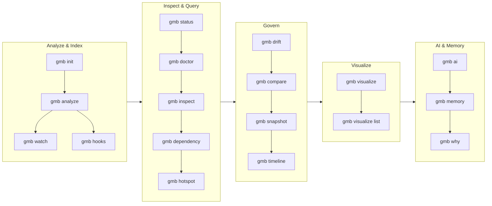

# CLI Overview — `gmb`

> `gmb` is the single binary for the AKG and its 31 diagrams. Every command has `--json` for CI, `--color` for terminals, and `--dir` for any repo path. Full flag tables live in [commands_master_reference.md](commands_master_reference.md).



---

## Global flags

| Flag | Default | What it does |
|---|---|---|
| `--dir` | `.` | Repo root (alias: hidden `--root-dir`) |
| `--color` | `auto` | `auto` · `always` · `never` (honors `NO_COLOR`) |
| `--quiet` / `-q` | `false` | Silence non-error output |
| `--debug` | `false` | Verbose logs |
| `--verbose` / `-v` | `false` | Phase-by-phase progress |
| `--max-json-mb` | `0` (unlimited) | Gate `akg.json` load/commit size (CI budget) |
| `-c, --config` | `""` | *Hidden legacy* — use `--dir`/`GLASSMARBLE_*` env vars and `.glassmarble/config.yaml` |

Precedence: `flag > GLASSMARBLE_* env > .glassmarble/config.yaml > ~/.glassmarble > defaults` — see [configuration.md](configuration.md).

---

## Exit codes — for CI


| Code | Meaning | Example |
|---|---|---|
| `0` | Success | `gmb status`, `gmb analyze` healthy |
| `1` | Failure — the command could not run | Unknown flag, missing file, unreadable config, permission |
| `2` | Entry point missing or not found | `gmb visualize sequence --entry notFound` |
| `3` | Empty subgraph — nothing to report on | `gmb hotspot` before `gmb analyze` |
| `4` | Render limit exceeded | Diagram over `--max-nodes` |
| `5` | **Policy violation — the command ran fine and found problems** | `gmb lint` violations, `gmb drift` over budget, `gmb doctor` integrity failures, `gmb impact --threshold` exceeded, `gmb analyze --bench` over budget |

Code `5` is what CI should gate on: it separates "the gate found issues"
from "the tool crashed or was invoked wrongly", which both used to exit `1`.

```bash
gmb lint; case $? in
  0) echo "clean" ;;
  5) echo "violations found — failing the build" ;;
  *) echo "gmb itself failed" ;;
esac
```

---

## 28 commands in 6 groups

### 1. Analyze & Index

| Command | One-liner |
|---|---|
| `gmb init [--dir]` | Create `.glassmarble/` + `config.yaml` + empty `akg.json` + `.gitignore` |
| `gmb analyze [--full] [--commit] [--workers] [--intelligence] [--include-docs] [--json]` | 4-phase pipeline → MVCC commit → intelligence → memory |
| `gmb watch [--interval 5s] [--json]` | Poll for changes, incremental re-analyze. `--json` streams newline-delimited JSON, one object per lifecycle event |
| `gmb hooks install\|uninstall [--json]` | Git `post-commit` hook. `--json` emits an install/uninstall receipt including whether anything changed |

### 2. Inspect & Query

| Command | One-liner |
|---|---|
| `gmb status [--json]` | Graph + storage (`akg.json`, snapshots, memory, total) + verification |
| `gmb doctor [--json]` | Parse-back, duplicates, dangling (exit 4 on fail) |
| `gmb diff [--json]` | Last two commits delta (nodes/edges) |
| `gmb tree [--depth]` | Symbol hierarchy |
| `gmb dependency [symbol]` | Callers + callees with line numbers |
| `gmb hotspot [--top]` | In-degree centrality ranking |
| `gmb inspect [--list] [--search] [id] [--file --line]` | Lazy node lookup (no full load) |
| `gmb stats [--arch] [--bench] [--json]` | Telemetry + coupling (Ca/Ce) + bench gates |

### 3. Govern

| Command | One-liner |
|---|---|
| `gmb drift [--since <commit\|7d>] [--json]` | Layer + `forbidden_deps` + `cycle_budget` check. `--since` compares against a stored snapshot and reports movement (introduced / resolved / pre-existing), failing only on newly introduced breaches |
| `gmb compare [base.json head.json] [--json]` | Two GraphJSON diffs → structural delta |
| `gmb snapshot --create\|--list\|--at\|--diff\|--replay` | Point-in-time snapshots (see `architecture_intelligence.md`) |
| `gmb timeline [--component] [--format]` | Events timeline (text/json/mermaid) |

### 4. Visualize

| Command | One-liner |
|---|---|
| `gmb visualize <type> [flags]` | 31 types → Mermaid/PlantUML/DOT; `--scope global|folder:|file:` |
| `gmb visualize list` | Catalog (14 UML + 7 C4 + 4 specialized + 6 analysis) |
| `gmb visualize check <type>` | Validate type against live graph |
| `gmb ui [--port] [--host] [--no-open] [--json]` | Local interactive graph server (alias `gmb serve`). `--json` writes one startup document — bound URL, port, pid, graph size — as soon as the listener is up, then keeps serving, so a script can discover a `--port 0` address |

Flags: `--format`, `--scope`, `--entry` (required for `sequence`), `--depth 7`, `--link-level architecture|standard|full`, `--max-nodes`, `--save`, `--render .svg/.png` → [diagrams.md](diagrams.md).

### 5. AI & Memory

| Command | One-liner |
|---|---|
| `gmb ai "<q>" [--save] [--tools]` | One-shot grounded Q&A (32 tools) |
| `gmb ai chat [--new] [--session]` | REPL with persistent sessions |
| `gmb ai configure` | BYOK wizard (10 providers, 0600 perms) |
| `gmb ai doctor / models / sessions` | Config, connectivity, session list |
| `gmb memory [--ask] [--component] [--correct] [--json]` | Developer memory + corrections overlay |
| `gmb why "<q>"` | Fast grounded reasoning |

### 6. Utility

| Command | One-liner |
|---|---|
| `gmb import <graph.json>` | Activate external GraphJSON |
| `gmb export -o <file> [--format graphjson|neo4j]` | Export (see [neo4j.md](neo4j.md)) |
| `gmb housekeeping [--prune] [--prune-snapshots --keep 30] [--json]` | Sizes for `marbles/ai/snapshots/memory/intelligence`; prune |
| `gmb completion bash|zsh|fish|powershell` | Shell completions |
| `gmb version [--json]` | Version + commit + toolchain |

> Every command supports `--help` and `--json` where noted. Master reference with every flag and example → [commands_master_reference.md](commands_master_reference.md).

Man pages for every command live in [`docs/man/`](man/) (`man -l docs/man/gmb-analyze.1`). They are generated from the command tree — regenerate with `go run ./cmd/man -o docs/man` after changing a command's flags or help text; CI runs `go run ./cmd/man -check` and fails if they are out of date.
