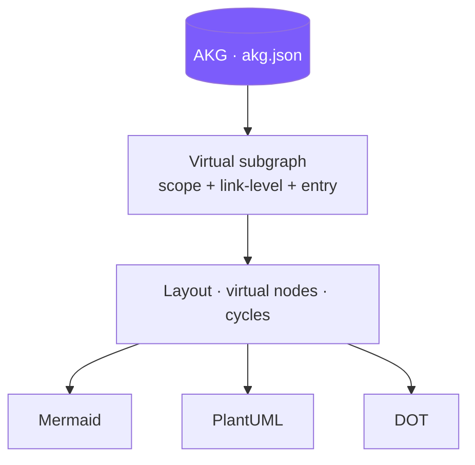
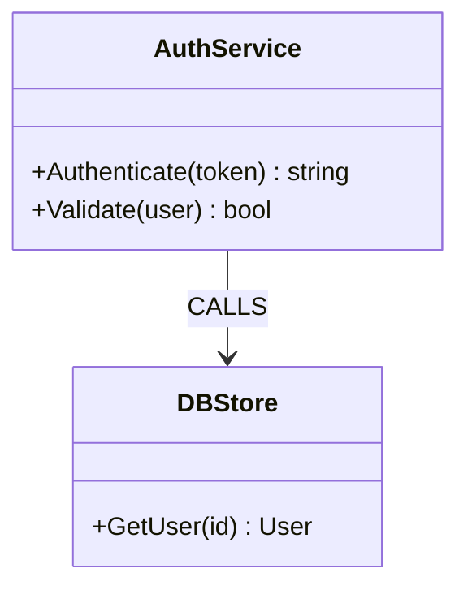
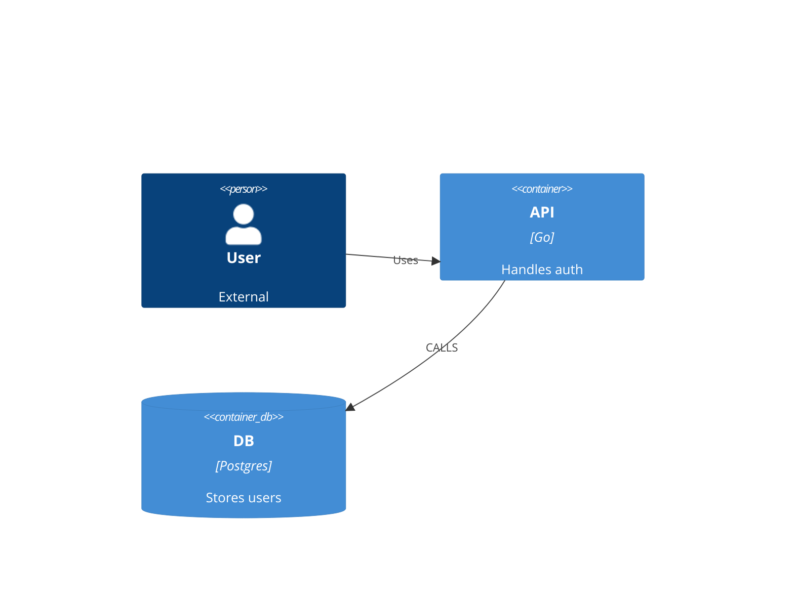
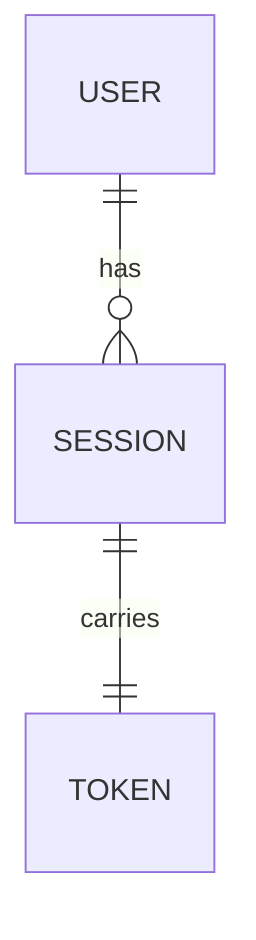
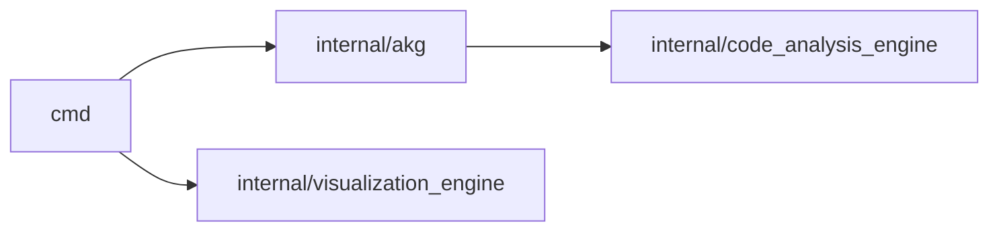
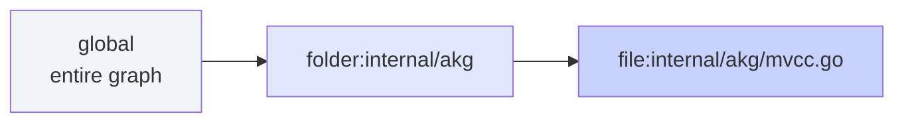

# Diagrams — 31 Types in 3 Formats

> Every diagram is a **projection** of the same AKG. Same source, same truth, 31 lenses. Catalog source: `cmd/visualize.go` (`all31DiagramCatalog`), `gmb visualize list`.



---

## Gallery — one per family

**UML — `class`**


**C4 — `c4container`**


**Specialized — `er`**


**Analysis — `dependency`**


---

## Catalog

### UML (14)

| Type | Entry | What it shows |
|---|---|---|
| `class` | – | Types, fields, methods, inheritance |
| `object` | ● | Instances & composition |
| `component` | – | Module boundaries |
| `deployment` | – | Infra & deployment topology |
| `package` | – | Package/namespace deps |
| `composite` | ● | Internal structure |
| `profile` | – | Stereotypes & constraints |
| `usecase` | – | Actors ↔ features |
| `activity` | ● | Control flow & business process |
| `state` | ● | State machines |
| `sequence` | **● required** | Call trace from `--entry` |
| `communication` | ● | Collaboration links |
| `interaction` | ● | Overview fragments |
| `timing` | ● | Time-constrained states |

### C4 (7)

| Type | Entry | What it shows |
|---|---|---|
| `c4context` | – | System + external actors |
| `c4container` | – | Services, DBs, queues |
| `c4component` | – | Components in a container |
| `c4code` | – | Code in a component |
| `c4landscape` | – | Multi-system landscape |
| `c4dynamic` | ● | Dynamic flows |
| `c4deployment` | – | Env & infra |

### Specialized (4)

| Type | Entry | What it shows |
|---|---|---|
| `er` | – | Entity-relationship |
| `dataflow` | – | Data movement |
| `mindmap` | – | Concept hierarchy |
| `flowchart` | ● | General process |

### Analysis (6)

| Type | Entry | What it shows |
|---|---|---|
| `dependency` | – | Package/import graph |
| `hotspot` | – | Coupling heatmap (PageRank) |
| `callgraph` | – | Call chain from entry |
| `layered` | – | Tier separation |
| `impact` | `changed-files` | Blast radius |
| `infrastructure` | – | External systems |

> **Entry:** `●` = needs `--entry <id>`; `sequence` refuses without it (exit 2). `impact` uses `--changed-files` or `git diff`.

**Render quirks:** `timing` → Mermaid `timeline`; `c4code` → class; `c4dynamic` → `sequenceDiagram`. PlantUML falls back to generic rectangles for most types.

---

## Formats

| Format | Default | For |
|---|---|---|
| **Mermaid** `mermaid` | ● | GitHub, VS Code, web — default |
| **PlantUML** `plantuml` |  | Enterprise, rich UML |
| **DOT** `dot` |  | Graphviz |

```bash
gmb visualize class --format mermaid          # default
gmb visualize class --format plantuml -o out.puml
gmb visualize dependency --format dot -o out.dot
```

All 31 types render in all 3 formats.

---

## Scope & Link Level



| Flag | Values | Effect |
|---|---|---|
| `--scope` | `global` (default) · `folder:<path>` · `file:<path>` | Virtual subgraph boundary; folder shows `[+N external]` ports; `--relative` makes paths folder-relative |
| `--link-level` | `architecture` (default) · `standard` · `full` | `architecture` = module/type/call/deps; `standard` + CFG; `full` + per-branch CFG/DFG |
| `--entry` | symbol ID | BFS/DFS root for `sequence`, `callgraph`, module/file scopes |
| `--depth` | `7` | Traversal depth |
| `--max-nodes` | `0` | Truncate to N highest-degree, marks `Truncated` |

---

## Flags — `gmb visualize <type>`

| Flag | Default | Notes |
|---|---|---|
| `--format` | `mermaid` | `mermaid` · `plantuml` · `dot` |
| `--scope` | `global` | `global` · `folder:` · `file:` |
| `--entry` | `""` | Required for `sequence` |
| `--depth` | `7` | Reachability walk |
| `--unused` | `false` | Include dead nodes |
| `--max-nodes` | `0` | Truncation (0 = unlimited) |
| `--link-level` | `architecture` | Detail |
| `--changed-files` | `""` | For `impact` |
| `--relative` | `false` | Folder-relative paths |
| `--summary` | `false` | Stats header |
| `--pagerank` / `--community` / `--scc` | `false` | Analytics |
| `--save` | `""` | `→ .glassmarble/marbles/<name>.md` |
| `--output` | `""` | Write raw markup to file |
| `--render` | `""` | `.svg`/`.png` via Kroki → mermaid-cli |

```bash
gmb visualize list                         # catalog
gmb visualize check sequence               # validates entry need
gmb visualize class --scope folder:internal/akg --save akg_class
gmb visualize sequence --entry "internal/akg/mvcc.go::MVCCGraphContainer::AllocateShadowSnapshot" --depth 5
gmb visualize dependency --format dot --output deps.dot
```

---

## Projection Rules

- **Determinism:** nodes/edges emitted sorted → byte-equal across runs.
- **Streaming:** `strings.Builder` without copies.
- **Truncation:** at projection layer, before render, with `[+N]` ports.
- **Entry:** unknown entry → exit 2 (not empty diagram).
