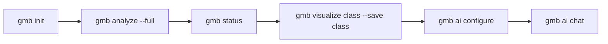

# Getting Started — GlassMarble

> From zero to your first diagram in under a minute. This guide is the detailed companion to the 30-second start in the [README](../README.md).

---

## 1. Install

### Linux & macOS (one-liner)

```bash
curl -fsSL https://raw.githubusercontent.com/Syamchand123/GlassMarble/main/install.sh | sh
# installs to /usr/local/bin (sudo) or ~/.local/bin — both are added to PATH if missing
# verify:
gmb version
```

**Options:**

```bash
INSTALL_DIR=$HOME/bin sh <(curl -fsSL .../install.sh)   # custom dir
VERSION=v1.0.0 sh <(curl -fsSL .../install.sh)           # pin version
```

### Windows (PowerShell 5.1+)

```powershell
irm https://raw.githubusercontent.com/Syamchand123/GlassMarble/main/install.ps1 | iex
# installs to $env:LOCALAPPDATA\Programs\gmb and adds to User PATH
# restart shell, then:
gmb version
```

### Go toolchain (1.25+)

```bash
go install github.com/Syamchand123/GlassMarble@latest
# or pin: go install github.com/Syamchand123/GlassMarble@v1.0.0
```

### Build from source

```bash
git clone https://github.com/Syamchand123/GlassMarble.git
cd GlassMarble
make build   # → ./gmb  (CGO static)
./gmb version
```

---

## 2. Platform matrix

| OS | Arch | Archive | Installer |
|---|---|---|---|
| **macOS 12+** | arm64 (M1–M4) | `gmb_*_darwin_arm64.tar.gz` | `curl \| sh` |
| **macOS 12+** | amd64 (Intel) | `gmb_*_darwin_amd64.tar.gz` | `curl \| sh` |
| **Linux glibc/musl** | amd64 (x86_64) | `gmb_*_linux_amd64.tar.gz` | `curl \| sh` |
| **Linux** | arm64 (aarch64) | `gmb_*_linux_arm64.tar.gz` | `curl \| sh` |
| **Windows 10/11** | amd64 (x64) | `gmb_*_windows_amd64.zip` | `irm \| iex` |
| **Windows 11** | arm64 | `gmb_*_windows_arm64.zip` | `irm \| iex` |

Both binaries `gmb` and `glassmarble` are shipped (alias).

---

## 3. Verify a release (optional, Sigstore)

Installers verify `SHA256` via `checksums.txt` automatically. For supply-chain hardening, also verify the Sigstore Cosign signature:

```bash
VERSION=v1.0.0
ARCH=linux_amd64   # or darwin_arm64, windows_amd64 …
curl -fsSLO "https://github.com/Syamchand123/GlassMarble/releases/download/${VERSION}/gmb_${VERSION#v}_${ARCH}.tar.gz"
curl -fsSLO "https://github.com/Syamchand123/GlassMarble/releases/download/${VERSION}/checksums.txt"
curl -fsSLO "https://github.com/Syamchand123/GlassMarble/releases/download/${VERSION}/checksums.txt.pem"
curl -fsSLO "https://github.com/Syamchand123/GlassMarble/releases/download/${VERSION}/checksums.txt.sig"

sha256sum -c --ignore-missing checksums.txt
cosign verify-blob \
  --certificate-identity-regexp "https://github.com/Syamchand123/GlassMarble/.github/workflows/release.yml@refs/tags/${VERSION}" \
  --certificate-oidc-issuer https://token.actions.githubusercontent.com \
  --signature checksums.txt.sig --certificate checksums.txt.pem checksums.txt
# SLSA provenance + SBOM are attached as release assets (intoto + spdx)
```

---

## 4. First run



```bash
# 1. Initialize workspace (creates .glassmarble/, config, empty akg.json, .gitignore entry)
gmb init --dir .

# 2. Build the graph — full scan first time, incremental thereafter (git diff HEAD)
gmb analyze --full          # or: gmb analyze  (incremental)
# flags: --workers auto  --commit <hash>  --verbose  --store-code  --include-docs

# 3. Health check
gmb status                  # nodes/edges, indexed files, snapshots, memory, total
gmb doctor                  # parse-back, dangling edges, duplicate IDs (exit 4 on fail)
gmb analyze --bench         # budget gate: analyze ≤120s, commit ≤80s, state ≤50MB

# 4. First diagram
gmb visualize list                          # 31 types
gmb visualize class --save class            # → .glassmarble/marbles/class.md (Mermaid)
gmb visualize c4container --save c4
gmb visualize callgraph --entry "pkg/file.go::Type::Method" --save call

# 5. Ask the graph
gmb ai configure                            # pick provider/model, key is 0600
gmb ai "which services depend on payments?"
gmb ai chat                                 # REPL with session memory
```

**Incremental mode:** With an existing `akg.json`, `gmb analyze` diffs `git diff HEAD` and re-parses only changed files. Use `--full` to force a full scan. With `--intelligence` (default on), intelligence → snapshots → memory are run post-commit (non-fatal, idempotent).

---

## 5. Workspace layout

```
your-repo/
└── .glassmarble/
    ├── akg.json                 # GraphJSON v3 — source of truth (never pruned)
    ├── config.yaml              # project config (see docs/configuration.md)
    ├── ai.yaml                  # BYOK AI config (0600)
    ├── marbles/                 # saved diagrams (*.md)
    ├── intelligence/latest.json # last intelligence run
    ├── snapshots/               # snap_<hash>.json (+ .graph.json.gz sidecar) + index.json
    ├── memory/                  # events.jsonl, memory.json, timeline.json, corrections.jsonl
    └── ai/sessions/             # chat sessions (0600)
```

`gmb housekeeping` reports sizes and prunes `marbles/`, `ai/sessions/`, and old `snapshots/` (`--prune-snapshots --keep 30`). `akg.json` is never pruned.

---

## 6. Troubleshooting

| Symptom | Fix |
|---|---|
| `akg.json` too large (`--max-json-mb` refused) | `gmb analyze --link-level architecture` (default) instead of `full`; raise budget: `gmb --max-json-mb 100 analyze` or `snapshot_no_graph: true` in config |
| `gmb doctor` dangling edges | `gmb analyze --full` to rebuild; check for generated/vendor dirs excluded via `arch_excluded_dirs` |
| `gmb visualize sequence` fails `entry missing` | Pass `--entry "<file>::Type::Method"` from `gmb inspect --search` |
| `gmb ai` says not configured | `gmb ai configure` or set `GLASSMARBLE_OPENAI_API_KEY` etc.; run `gmb ai doctor` |
| Colors garbled in CI | `NO_COLOR=1` or `--color never`; `gmb --color never status` |

Need deeper docs? → [Architecture](architecture.md) · [CLI](cli.md) · [AKG Format](akg_format.md) · [Configuration](configuration.md) · [AI](ai.md)
