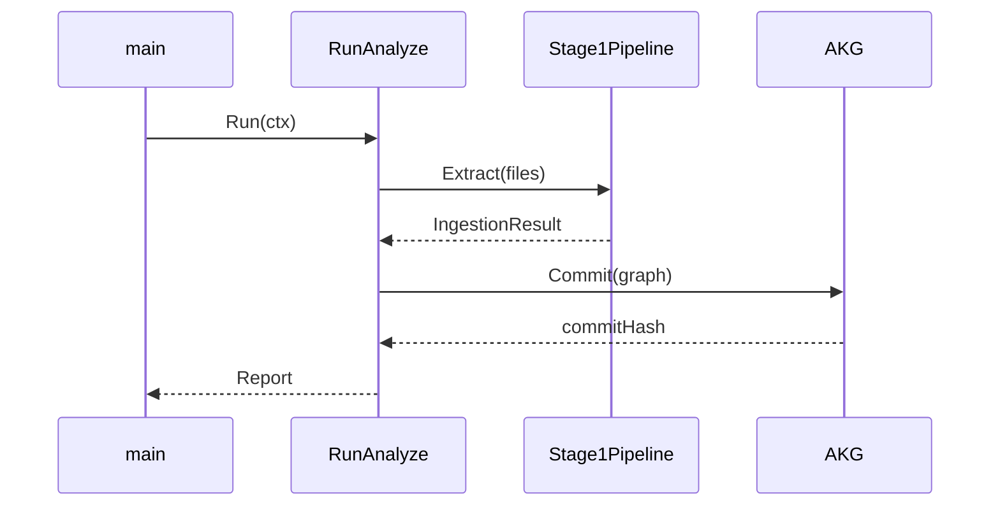
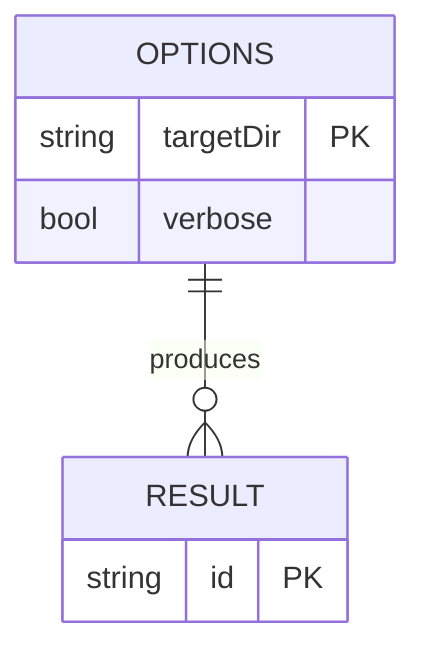
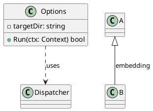
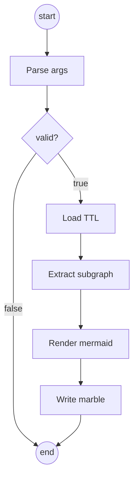
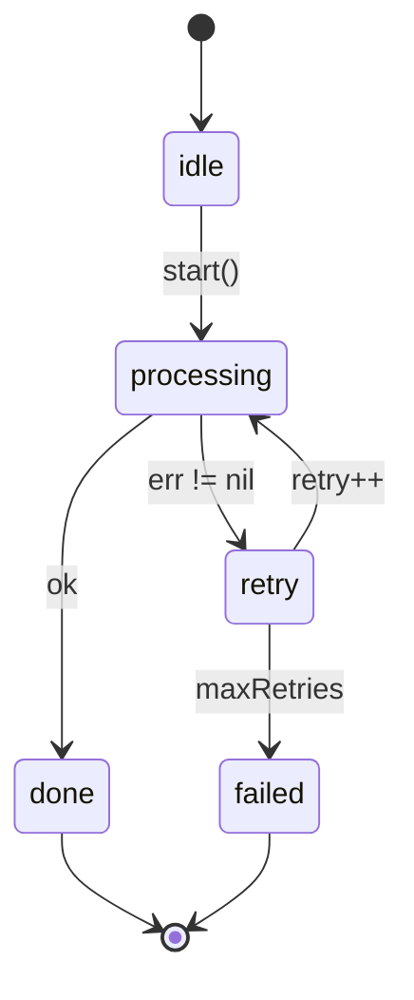
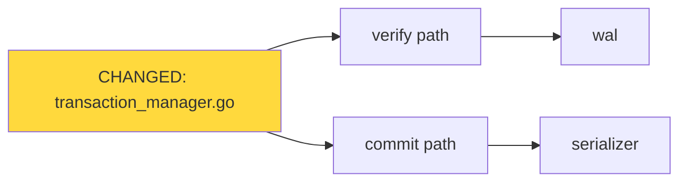
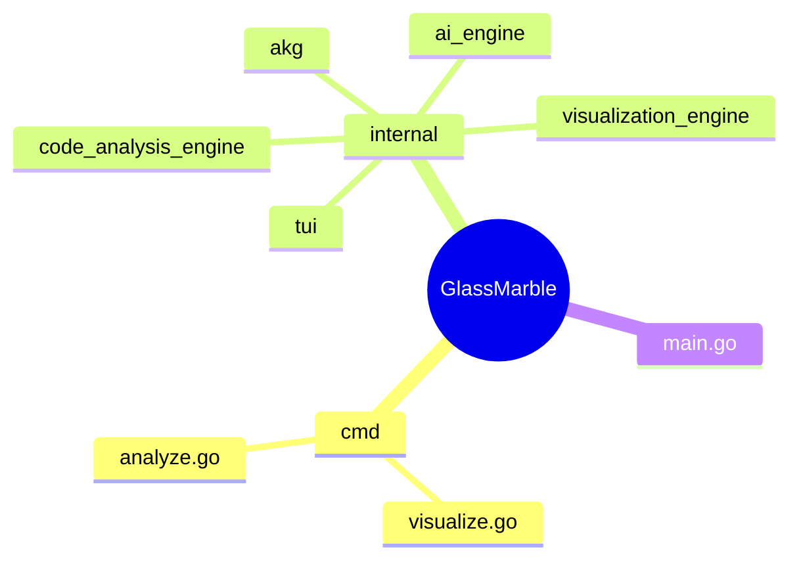
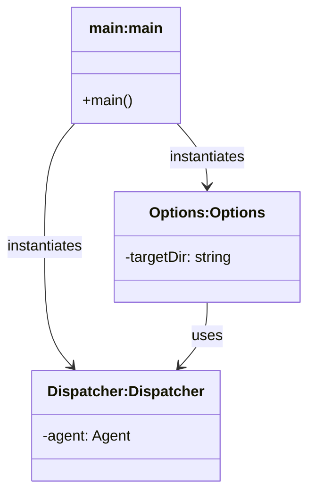

# GlassMarble Master Overhaul Plan

> **Status:** Planning baseline · **Version:** 1.0 · **Date:** 2026-08-06
> **Scope:** Full-product overhaul of the Analysis Engine (stage1–stage4), AKG storage layer, and Visualization Engine, targeting industry-grade rendering of 31 diagram types across 3 scope levels and 14 languages.
> **Rule:** This document is the single source of truth for the overhaul. No code change happens without a matching plan item and acceptance criterion. All plan items are independently verifiable.

---

## Table of Contents

1. [Executive Summary](#1-executive-summary)
2. [Current State Audit (Verified Facts)](#2-current-state-audit-verified-facts)
3. [Target Architecture Vision](#3-target-architecture-vision)
4. [Foundational Contracts (Phase 0)](#4-foundational-contracts-phase-0)
5. [Analysis Engine Overhaul (Phase 1)](#5-analysis-engine-overhaul-phase-1)
6. [AKG Storage Layer Overhaul (Phase 2)](#6-akg-storage-layer-overhaul-phase-2)
7. [Visualization Engine Overhaul (Phase 3)](#7-visualization-engine-overhaul-phase-3)
8. [31 Diagram Types — Design Specifications (Phase 4)](#8-31-diagram-types--design-specifications-phase-4)
9. [Scope Levels & Entry Strategies (Phase 5)](#9-scope-levels--entry-strategies-phase-5)
10. [14-Language Support Matrix (Phase 6)](#10-14-language-support-matrix-phase-6)
11. [Cross-Cutting: CLI, TUI, AI Tools, Output Formats (Phase 7)](#11-cross-cutting-cli-tui-ai-tools-output-formats-phase-7)
12. [Performance Budget (Phase 8)](#12-performance-budget-phase-8)
13. [Testing & Validation Strategy (Phase 9)](#13-testing--validation-strategy-phase-9)
14. [Rollout & Migration (Phase 10)](#14-rollout--migration-phase-10)
15. [Acceptance Criteria Matrix](#15-acceptance-criteria-matrix)
16. [Risk Register](#16-risk-register)
17. [Appendix A — Complete Issue Register](#17-appendix-a--complete-issue-register)
18. [Appendix B — Vocabulary & Predicate Contracts](#18-appendix-b--vocabulary--predicate-contracts)
19. [Appendix C — Golden Diagram Specimens](#19-appendix-c--golden-diagram-specimens)
20. [Phase Execution Workbooks](#20-phase-execution-workbooks)
21. [Execution Summary & Next Actions](#21-execution-summary--next-actions)
22. [Appendix D — Decision Log & Change Record](#22-appendix-d--decision-log--change-record)

---

## 1. Executive Summary

### 1.1 Why this plan exists

GlassMarble's diagram output is not fit for industry use. A fresh `analyze --full` over its own codebase produces a class diagram containing **4 classes** out of 280, with **zero relationship lines**, path-mangled headers, and a summary claiming 2170 "clusters" (actually singleton SCCs). The cause is not a single bug but a **chain of compounding defects** across every engine layer:

1. **Visualization:** a pass-by-value `IncludeUnused` bug silently deletes 276/280 classes (`pipeline.go:7` vs `visualizer.go:157`).
2. **Visualization:** class headers are sanitized node IDs (path slugs) instead of type names (`helpers.go:49-53`, `mermaid.go:148-161`).
3. **Visualization:** no class-level edge aggregation exists; per-endpoint resolution self-discards every edge (`helpers.go:130-167`, `mermaid.go:179`).
4. **Analysis engine:** hierarchy/composition/field/signature edges are **guaranteed zero by construction** — `GASTNode.DataType` is never populated, `Properties["extends"]` is never written, `field_declaration`/`method_spec` are absent from every language's `Declarations` list, `EdgeHasField/HasParam/Returns/BelongsTo` have zero producers, and the interface linker skips every candidate on full rebuilds.
5. **AKG:** 57% of nodes and 70% of edges are CFG noise; file containment is broken (mangled `ext:` module nodes); the TTL double-writes every edge (reification); `gm:commitHash` is empty; the state file cannot be traced to a build.

### 1.2 Goal

Deliver a product where `gmb visualize class` (and all 30 other types) renders **correct, complete, deterministic, industry-grade** diagrams from a **clean, complete, denoised AKG**, with:

- **31 diagram types** — 14 UML, 7 C4, 10 specialized — each with a bespoke, spec-compliant renderer and an automated golden-file test.
- **3 scope levels** — `global`, `folder:<path>`, `file:<path>` — semantically correct for every diagram type.
- **14 languages** — full structural extraction (types, fields, methods, inheritance, calls) rather than declaration soup.
- **3 output formats** — Mermaid (primary, fully bespoke), PlantUML (bespoke per family), DOT (bespoke per family).

### 1.3 Overhaul strategy

Ten phases, each independently shippable and verifiable:

| Phase | Name | Outcome |
|---|---|---|
| 0 | Foundational Contracts | Ontology 2.0, canonical IDs, edge taxonomy, error taxonomy |
| 1 | Analysis Engine | GAST 2.0 with real structure; 44 dead-edge producers resurrected |
| 2 | AKG Storage | Structural view, no reification, real commitHash, denoised defaults |
| 3 | Visualization Engine | 4 defect fixes + class-level aggregation + deterministic rendering |
| 4 | 31 Diagram Types | Bespoke renderer per type with golden tests |
| 5 | Scope & Entry | Correct semantics for all 3 scopes + entry strategies per type |
| 6 | Languages | Per-language structural parity matrix |
| 7 | Cross-Cutting | CLI/TUI/AI-tool single pipeline; format parity |
| 8 | Performance | Budgets: parse <1s, commit <5s, render <3s on 20k-node graph |
| 9 | Testing & Validation | Golden diagrams, property tests, ontology conformance |
| 10 | Rollout & Migration | Schema v2 migration, backward-compat reader, docs |

### 1.4 Success measures (product level)

- `gmb visualize class` on GlassMarble itself: **280 classes, all 274 structs + 6 interfaces, real names as headers, methods grouped under owners, inheritance/composition edges drawn, deterministic byte-identical output across runs.**
- `gmb analyze --full`: **< 30 s total** on a 20 k-node graph with `--link-level=architecture` as the *default* for visualization consumers.
- All 31 diagram types render non-empty, syntactically valid Mermaid for the GlassMarble codebase, and parse cleanly through mermaid-cli in CI.
- 100% of the 44 RelationshipType constants have ≥ 1 production producer and ≥ 1 end-to-end test.

---

## 2. Current State Audit (Verified Facts)

### 2.1 What the product has today

- **31 diagram type constants** exist (`internal/visualization_engine/types/types.go:10-42`) and all 31 CLI names resolve (`cmd/visualize.go:46-119`). The 31-type catalog is also mirrored in the AI tool catalog (`internal/ai_engine/tools/system_tools.go:116-148`).
- **Extraction configs exist for all 31** (`stage1/extractor.go:347-391`), but several are semantically hollow (e.g. `UMLProfile` filters on `gm:Annotation`, which never exists in the AKG).
- **14 languages** registered in `stage1/languages.go:51-238`, all with real tree-sitter grammars (in-process Go bindings, `github.com/tree-sitter/go-tree-sitter v0.25.0`).
- **3 scope levels** exist (`ScopeGlobal/ScopeFolder/ScopeFile`, `types/types.go:61-67`) with `ApplyScope` at `extractor.go:1117-1165`.
- **3 output formats**: Mermaid (fully bespoke), PlantUML (class/C4 only, generic fallback), DOT (62-line generic).
- **Ontology**: 41 classes, 107 properties, 819 lines, embedded via go:embed, enforced by `ontology_test.go`.

### 2.2 Verified defects — visualization engine

| ID | Defect | Evidence | Impact |
|---|---|---|---|
| V-01 | `IncludeUnused` config flag lost — passed by value | `pipeline.go:7` mutates `opts` copy; `visualizer.go:134→157` reuses original `opts` for `BuildLayoutTreeEx` → `pruneDeadComponents` (`aggregator.go:115`) drops every node that is not an edge endpoint | **276 of 280 classes deleted**; only 4 survive (those appearing as `gm:calls` endpoints) |
| V-02 | Class header = sanitized node ID | `helpers.go:49-53` (`aliasRegistry.alias` → `sanitizeName(id)`); real name printed as a bogus member line `mermaid.go:158-161` | `internal_tui_programs_analyze_program_go_tickMsg` style headers |
| V-03 | No class-level edge aggregation | `resolveNodeToClass` per-endpoint (`helpers.go:130-167`); single-type-file → both endpoints same class → self-edge discarded (`mermaid.go:179`); multi-type file → returns nil | **0 relationship lines** from 2364 call edges |
| V-04 | Method attachment relies on ID-prefix convention | `parseFQN` + `findParentClassID` (`helpers.go:107-128`) require exact `<path>::<Receiver>::<sym>` and class present in layout tree | Only 2 of 5 `Dispatcher` methods rendered (rest pruned by V-01) |
| V-05 | Non-deterministic method order | `methods` plain map iterated in Go map order (`mermaid.go:162`) | Unstable output across runs |
| V-06 | `gm:Member` fabricated `+name()` render | `mermaid.go:129-139,164` renders member as `+%s()` | Wrong UML syntax for fields |
| V-07 | `clusterCount` = SCC count; `components` = weak components | `metrics.go:240-247` | Misleading summary (2170 "clusters" with 0 cycles) |
| V-08 | `MaxNodes` dead at CLI | `filterNodes` only reachable via EntryPoint+IncludeUnused path; no `--max-nodes` flag | Unbounded renders on huge graphs |
| V-09 | PlantUML/DOT generic fallbacks | `plantuml.go:19-38`, `dot.go` (62 lines) | Non-compliant output for 29/31 types |
| V-10 | Loose `--format`/`--scope` validation | stringly-typed, unknown format silently falls back to mermaid (`formatter.go:10-18`) | Silent user confusion |
| V-11 | TUI + AI tools duplicate pipeline & scope parsing | `internal/tui/programs/visualize/program.go`, `diagram_tools.go` each have own `parseScope` copy | Drift risk; fixes must land in 3 places |

### 2.3 Verified defects — analysis engine

| ID | Defect | Evidence | Impact |
|---|---|---|---|
| A-01 | `GASTNode.DataType` never populated | zero `=` assignments outside test fixtures | `type_linker.go` COMPOSES branch dead; `EdgeReferences` dead; field types invisible |
| A-02 | `Properties["extends"]`/`["inherits"]` never written | grep: only reads at `type_linker.go:49,51` | `EdgeExtends` dead → **zero inheritance edges in TTL** |
| A-03 | `field_declaration` absent from ALL language `Declarations` | `languages.go:69-72` (Go) etc. | **zero `gm:Field` nodes**; translator field branches (`go_translator.go:63-66`) unreachable |
| A-04 | Go `method_spec` (interface methods) absent | Go Declarations = `function_declaration, method_declaration, type_spec, function_type` | `interface_linker.go` `getInterfaceRequiredMethods` always 0 |
| A-05 | `interface_linker` full-rebuild gate bug | `interface_linker.go:36-43`: skip when neither file in `ModifiedFiles`; empty on `--full` | **every IMPLEMENTS candidate skipped** |
| A-06 | `EdgeHasField/HasParam/Returns/BelongsTo/Mixes` zero producers | constants only (`stage4/type.go:12-67`); no `AddEdge` caller | Guaranteed-zero by construction |
| A-07 | Inheritance detection is regex-on-snippet | `normalizer.go:414-459` (` extends `, ` implements `, ` : `) | Go embedding invisible; false positives risk |
| A-08 | Go interface detection by content substring | `go_translator.go:74-76`: `strings.Contains(tok.Content, "interface")` | Fragile; no dedicated CST kind |
| A-09 | Return types have no representation | no `ReturnType` anywhere in stage2 | `EdgeReturns` impossible; sequence diagrams lose return values |
| A-10 | `Properties` shared by reference GAST→ResolvedNode | `builder.go:202,248,288` alias maps | Cross-graph mutation hazards |
| A-11 | `ext:` module URI mangling | import alias + module path baked into node IDs (`ext:akgerrs "github.com/...`) | Garbage `contains` targets; package diagrams broken |
| A-12 | No file→symbol containment | `gm:contains` only from 19 mangled module nodes; File nodes are dead ends | Package/file scoping cannot aggregate |
| A-13 | Default link level = full (CFG/DFG noise) | `cmd/analyze.go:257-259` comment says architecture but `LevelOfDetail` left empty; `isFullMode` (`type.go:180-183`) treats empty as full | 57% of nodes are ControlStructure/Constraint/CFGFlow |
| A-14 | ~1500 nodes lack file paths | `ensureVirtualNode` (`type.go:325-333`), VIRTUAL_CONTEXT (`call_linker.go:93-101`), ExternalSDK/API (`call_linker.go:291-311`), CFG_SUMMARY (`cfg_linker.go:145-150`) | Scope-by-file impossible for those nodes |
| A-15 | Fuzzy matching hazards | `interface_linker.go:139,167` `strings.Contains`; `type_linker.go:131-136` linear scan of 22k nodes per ref | Wrong target resolution, O(N²) risk |
| A-16 | Method ownership only by URI convention | `path::Struct::Method` + `receiver_type` string | No explicit owner edge to render reliably |
| A-17 | Interface `method_spec` not classified | not in Declarations; translator dead | `getInterfaceRequiredMethods` broken |
| A-18 | `extractGenericTypesAndDecorators` regex-based generics | `translator.go:173` global regexes | C++/Java generics misparsed; `instantiatesGeneric` mislabeled (VIRTUAL_CONTEXT edges) |

### 2.4 Verified defects — AKG storage

| ID | Defect | Evidence | Impact |
|---|---|---|---|
| K-01 | Every edge reified twice (base + `<<...>>`) | 41k statements ≈ 20.7k unique edges | 2× file bloat; 19.3MB TTL |
| K-02 | `gm:commitHash` always empty | metadata block quoted in audit | State not traceable to build |
| K-03 | Verify re-parse + topological inference on every commit | `verifyTTLFile` → `reconstructFromTTLFile` → `RunTopologicalMacroInference` | Was 2m6s commit (fixed to ~20s by `reasoner.go`/`mvcc.go` fixes) — still the dominant commit cost |
| K-04 | Full-rewrite on every `--full` commit | `deletedNodeIDs` empty → incremental path skipped | 16MB rewrite each time (acceptable; keep) |
| K-05 | `gm:content` embeds truncated source snippets (2048B) | `parser.go:219-222`; serializer writes every property | TTL pollution; false-positive greps; privacy risk |
| K-06 | Stale kinds persisted (`gm:TypeDecl` ×2, `gm:Type` ×1, `gm:Deleted` ×8) | rdf:type histogram | Inconsistent vocabulary |
| K-07 | Schema version 2 has no migration story | `scanTTLMetadata` + reject on newer | No path from v1 user data |
| K-08 | Serializer writes `gm:code`? No — writes all props incl. `content`; `code` only on restore | `turtle_serializer.go:133-150` vs `transaction_manager.go:910-915` | Key asymmetry between write and read paths |

### 2.5 Fixed during investigation (already shipped, keep)

- **P-01** `RunIncrementalMacroInference` O(affected×E) frontier expansion → direct `InboundEdges.Get(id)` (`reasoner.go:537`). Commit: 2m6s → ~20s.
- **P-02** `CalculateBetweennessCentrality` O(N²) eager init → lazy init (`mvcc.go:571`).

### 2.6 Key files inventory (overhaul touch map)

| File | Package | Role | Overhaul tasks |
|---|---|---|---|
| `internal/code_analysis_engine/stage1/languages.go` | stage1 | 14 language registrations + Declarations | W1-01 (A-03/A-04/A-17) |
| `internal/code_analysis_engine/stage1/type.go` | stage1 | `RawToken` → `RichToken` | W1-02 |
| `internal/code_analysis_engine/stage1/parser.go` | stage1 | bare parse; content 2048B truncation | W1-02 (5.1.3), K-05 |
| `internal/code_analysis_engine/stage2/type.go` | stage2 | GASTNode (DataType never set) | W1-03 (A-01) |
| `internal/code_analysis_engine/stage2/normalizer.go` | stage2 | `detectInheritance` regex | W1-05 (A-07) |
| `internal/code_analysis_engine/stage2/go_translator.go` | stage2 | interface substring detection | W1-06 (A-08) |
| `internal/code_analysis_engine/stage2/translator.go` | stage2 | generic regex extractor | W1-18 (A-18) |
| `internal/code_analysis_engine/stage3/type.go` | stage3 | external IDs, virtual nodes | W1-09/14 |
| `internal/code_analysis_engine/stage3/ownership.go` | stage3 | symbol ownership | W1-07 (A-16) |
| `internal/code_analysis_engine/stage4/type.go` | stage4 | RelationshipType constants | W0-03 (EdgeHasReceiver) |
| `internal/code_analysis_engine/stage4/type_linker.go` | stage4 | extends/inherits (dead) | W1-12 (A-02) |
| `internal/code_analysis_engine/stage4/interface_linker.go` | stage4 | IMPLEMENTS gate bug + fuzzy regex | W1-13 (A-05/A-15) |
| `internal/code_analysis_engine/stage4/call_linker.go` | stage4 | VIRTUAL_CONTEXT, ExternalSDK/API | W1-14/18 |
| `internal/code_analysis_engine/stage4/cfg_linker.go` | stage4 | CFG_SUMMARY, CFG soup | W1-15 (A-13) |
| `internal/code_analysis_engine/stage4/reasoner.go` | stage4 | inbound index (P-01 shipped) | keep |
| `internal/akg/turtle_serializer.go` | akg | double-write serializer | W2-01 (K-01) |
| `internal/akg/turtle_parser.go` | akg | TTL reader (RDF-star missing) | W2-02 |
| `internal/akg/transaction_manager.go` | akg | verify path, commit | W2-04 (K-03), W2-06 (K-04) |
| `internal/akg/wal.go` | akg | WAL | W2-05 |
| `internal/akg/mvcc.go` | akg | betweenness (P-02 shipped) | keep |
| `internal/visualization_engine/stage1/pipeline.go` | viz | V-01 by-value opts bug | W3-01 |
| `internal/visualization_engine/stage1/extractor.go` | viz | 31 configs, ApplyScope | W4-01, W5-01 |
| `internal/visualization_engine/stage2/aggregator.go` | viz | BuildLayoutTreeEx, pruneDeadComponents | W3-01 |
| `internal/visualization_engine/stage2/metrics.go` | viz | clusterCount=SCC | W3-07 (V-07) |
| `internal/visualization_engine/stage3/helpers.go` | viz | sanitizeName/alias/resolveNodeToClass | W3-03/04 (V-02/V-03) |
| `internal/visualization_engine/stage3/mermaid.go` | viz | class renderer, members, methods | W3-05/06 |
| `internal/visualization_engine/visualizer.go` | viz | ProjectDiagramFromGraph opts flow | W3-02 |
| `internal/visualization_engine/formatter.go` | viz | loose format fallback | W7-04 (V-10) |
| `cmd/visualize.go` | cmd | 31 CLI names, flags | W5-03, W7-01 |
| `cmd/analyze.go` | cmd | link-level default mismatch | W1-15 (A-13) |
| `internal/tui/programs/visualize/program.go` | tui | duplicate pipeline | W7-01 (V-11) |
| `internal/ai_engine/tools/system_tools.go` | ai | diagram tool catalog | W7-05 |

---

## 3. Target Architecture Vision

### 3.1 One graph, three views

The overhaul formalizes **one knowledge graph with three consumer views**, kept in a single AKG:

```
┌─────────────────────────── AKG (single source of truth) ───────────────────────────┐
│                                                                                     │
│  STRUCTURAL VIEW (default, denoised)   DYNAMIC VIEW (opt-in)   SECURITY VIEW (opt-in)│
│  ──────────────────────────────────    ─────────────────────   ────────────────────  │
│  Module / File / Package / Namespace   ControlStructure       VirtualTaintSource     │
│  Struct / Class / Interface            CFGFlow / CFGBranch    VirtualSecuritySink     │
│  Method / Function / Field / Param    DFGVar / DFGSummary     VirtualContext          │
│  Edges: contains, belongsTo,           Constraint             VirtualQueue/DB/API     │
│    inheritsFrom, extends,              Edges: controlFlowTo,   Edges: dataFlowTo,     │
│    implements, composes, hasField,     branchConstraint,       vulnerableTaint,       │
│    hasParam, returns, calls,           defersExecution,        queriesDatabase,       │
│    contextualCall, dependsOn,          escapesToHeap,          sendsMessage,          │
│    exposesEndpoint, spawnsConcurrent   catchesException        receivesMessage,       │
│  ──────────────────────────────────    ─────────────────────   ────────────────────   │
│  This is what 31 diagram types read   Only UMLActivity/UML-   Only DataFlow/Infra/   │
│  by default. Marked `gm:view` per      State/Flowchart read    hotspot/security-      │
│  triple/subgraph.                       this view.             aware types read this.  │
└──────────────────────────────────────────────────────────────────────────────────────┘
```

**Principle 3.1.1 — View separation.** Every node/edge in the AKG is tagged with a `gm:view` (`"structural" | "dynamic" | "security"`). Diagram extraction configs declare which views they read. The dynamic/security views are produced only when `--link-level=standard|full` (or `--link-level=architecture` + `--dynamic`) so the default AKG stays clean.

**Principle 3.1.2 — Complete structural spine.** The AKG must always contain the full structural spine for every language: File → Module → Type → Method/Field/Param with ownership, hierarchy, composition, and signature edges. This is the non-negotiable substrate of 31 diagram types.

**Principle 3.1.3 — Determinism.** Every diagram is byte-identical across runs given the same AKG and flags. Map iteration, goroutine completion order, and hash-order-dependent output are forbidden in rendering paths (use sorted slices everywhere).

**Principle 3.1.4 — Traceability.** Every commit writes `gm:commitHash`, `gm:schemaVersion`, `gm:version`, `gm:analyzerVersion`, `gm:generatedAt` into the metadata block. Every diagram footer carries the same so users can reproduce.

**Principle 3.1.5 — Contract-first.** Vocabulary is defined in `ontology.ttl`; every class, predicate, and property used anywhere in the product must be declared there (enforced by existing `ontology_test.go`, extended to view tags and new vocabulary).

**Principle 3.1.6 — Golden-file regression.** Every diagram type has a golden `.mmd` fixture for a canonical sample workspace, verified in CI with mermaid-cli parse checks.

### 3.2 Target component architecture

```
┌──────────────────────────────────────────────────────────────────────────────┐
│                                gmb CLI / TUI / AI tools                        │
│        single shared entry: internal/product/pipeline.go (new)                │
├──────────────────────────────────────────────────────────────────────────────┤
│  ANALYSIS ENGINE                 AKG STORAGE               VISUALIZATION      │
│  ───────────────                ─────────────              ──────────────      │
│  stage1 ingestion               MVCC container             stage1 extract      │
│   · tree-sitter in-process      transaction manager        · TTL parse (lazy)  │
│   · full CST → RichToken        WAL                       · scope apply        │
│  stage2 GAST 2.0                · payload deltas           · config registry   │
│   · real TypeDef/Field/         · no reification          stage2 layout        │
│     Method/Signature            serializer                 · class aggregation │
│   · structured inheritance      · incremental append      · metrics (capped)   │
│  stage3 aggregation             · verify (cheap)          · clusters (louvain) │
│   · definition index            ontology.ttl              stage3 render        │
│  stage4 linking                 · schema v2               · 31 bespoke types   │
│   · structural spine passes     · view tags               · mermaid/plantuml/  │
│   · dynamic/security passes                                dot per family      │
│   · edge taxonomy v2                                     · golden tests        │
└──────────────────────────────────────────────────────────────────────────────┘
```

### 3.3 Overhaul invariants (do not violate)

1. **No dangling edges, ever.** The post-write zero-dangling guard stays.
2. **No silent data loss.** Every dropped edge is recorded in `graph.Errors` and surfaced by `gmb status`.
3. **MVCC isolation stays.** Reasoner writes land on shadow-private node maps (`detachNodesForWrite` pattern preserved).
4. **WAL durability stays.** WAL → shadow → verify → promote → truncate ordering is not weakened.
5. **Backward read compatibility.** Schema v2 must still parse schema v1 TTL files (legacy reader), with a documented upgrade path.
6. **Determinism is tested, not assumed.** CI runs each golden diagram twice and diffs.

---

## 4. Foundational Contracts (Phase 0)

### 4.1 Canonical node ID scheme (replace the `path::name` ad-hoc scheme)

**Motivation:** `path::Type`, `path::Type::Method`, `module:x`, `file:x`, `ext:alias "uri"` are three inconsistent schemes; diagram renderers string-parse them (`parseFQN`).

**Target scheme — one function `BuildCanonicalID` in a new package `internal/product/ids`:**

```
canonical := type + ":" + urlencoded(path) + ":" + urlencoded(owner) + ":" + urlencoded(symbol)
```

Where:
- `type` ∈ {`module`, `file`, `type`, `method`, `function`, `field`, `param`, `var`, `ns`, `ext`, `virt`, `constraint`, `cfg`}.
- `owner` is the direct owner symbol (receiver type for methods, type for fields/params).
- URL-encoding is applied to every segment (`::` and `:` are reserved).
- No module path (`github.com/...`) ever appears in a symbol segment — that stays in `gm:module_name` property only.

**Migration rule:** new IDs are used by new serialization (schema v2). The parser accepts legacy forms (legacy `path::name`) via a normalization shim, mapping them onto the canonical scheme so the visualization engine has exactly one ID grammar.

**Concrete mapping examples:**

| Old | New (canonical) |
|---|---|
| `internal/tui/programs/analyze/program.go::Options` | `type:internal/tui/programs/analyze/program.go:Options` |
| `cmd/ai.go::aiStreamSink::empty` | `method:cmd/ai.go:aiStreamSink:empty` |
| `file:cmd/ai.go` | `file:cmd/ai.go` |
| `module:internal/tui` | `module:internal/tui` |
| `ext:akgerrs "github.com/Syamchand123/GlassMarble/internal/errors` | `ext:internal/errors` (module path moved to property) |
| `QUEUE::` | `virt:QUEUE` |

### 4.2 Edge taxonomy v2

The 44 `RelationshipType` constants are regrouped into **4 families** with a single producer policy:

| Family | Constants | Producer (stage4 pass) | View |
|---|---|---|---|
| STRUCTURAL | `EdgeContains, EdgeBelongsTo, EdgeDependsOn, EdgeImplements, EdgeExtends, EdgeMixes, EdgeComposes, EdgeHasField, EdgeHasParam, EdgeReturns, EdgeHasReceiver` | builder/type_linker/member_linker (new) | structural |
| BEHAVIORAL | `EdgeCalls, EdgeContextCall, EdgeSpawnsConcurrent, EdgeDefers, EdgeCatches, EdgeThrows, EdgeReferences, EdgeInstantiates, EdgeDispatchesEvent, EdgePublishes, EdgeSubscribes, EdgeSendsTo, EdgeReceivesFrom, EdgeQueriesDB, EdgeCallsCloudAPI, EdgeExposesEndpoint, EdgeFFICall, EdgeInjects, EdgeConsumesResource, EdgeMutatesGlobal` | call/concurrency/event/rpc/ffi/di/security linkers | structural |
| DYNAMIC | `EdgeControlFlow, EdgeConditionalBranch, EdgeLoopBranch, EdgeSwitchBranch, EdgeConstraint, EdgeDataFlow, EdgePointsTo, EdgeHeapAlias, EdgeAliases, EdgeAliasesType, EdgeCyclic, EdgeVulnerable, EdgeEscapesToHeap` | cfg/dfg/alias/memory/constraint linkers | dynamic |
| SECURITY | `EdgeSecuritySink, EdgeVulnerable(taint), EdgeQueriesDB(if sink)` | security linker | security |

**New constant:** `EdgeHasReceiver` (`HAS_RECEIVER`) — method → owner type, the missing explicit ownership edge (fixes A-16).

**Policy 4.2.1:** a code comment near each constant group names its producing pass and view; `ontology_test.go` gains a test that every constant maps to a declared predicate and a declared view.

### 4.3 View tags

- `gm:view` attribute on the metadata node lists enabled views of the file.
- Every serializer-emitted triple gets a `gm:view "structural"|"dynamic"|"security"` RDF-star attribute (single statement, not a second triple — see K-01 fix).
- Extraction configs gain `Views []View` field; `bothPassSubgraph` filters edges by view first, then predicate group.

### 4.4 Error taxonomy

New `internal/product/errors` package (or extend `internal/errors`) with stable sentinel errors:

- `ErrSchemaNewer`, `ErrSchemaLegacy`, `ErrDanglingEdge`, `ErrBudgetExceeded`, `ErrLockTimeout`, `ErrEmptySubgraph`, `ErrNoEntryPoint`, `ErrUnsupportedLanguage`, `ErrScopeEmpty`, `ErrRenderUnsupported`.
- Every CLI error prints `gmb <cmd> --help` hint; every renderer error is prefixed `render:<type>:`.

### 4.5 Acceptance for Phase 0

- [ ] `ids.BuildCanonicalID` + `ids.ParseCanonicalID` round-trip property test over 10k random symbols.
- [ ] Legacy-ID normalization shim unit-tested against the 6 examples above.
- [ ] `gm:view` declared in ontology; conformance test passes.
- [ ] Edge taxonomy doc table (4.2) encoded in `ontology.ttl` comments and `relationship_types.md`.
- [ ] All 31 extraction configs compile against `Views` field with a default view set.

---

## 5. Analysis Engine Overhaul (Phase 1)

### 5.1 Stage 1 — Ingestion: from filtered tokens to RichToken

**Goal:** capture the *entire* structural surface of the CST — fields, interface methods, parameters, base types, receiver types, annotations, generics — without losing the existing fast path.

#### 5.1.1 New `RichToken` (superset of `RawToken`)

```go
type RichToken struct {
    // existing RawToken fields (Kind, Type, Content, Name, DocComment,
    // ParentIdx, Depth, StartLine/EndLine, StartByte/EndByte, HasError)
    // NEW:
    FieldRoles map[string]string // tree-sitter field name → child token text
                                 // e.g. "name"→"Options", "type"→"string",
                                 // "base_type"→"Base", "receiver"→"s",
                                 // "result"→"bool", "interface"→"Provider"
    NamedChildren []*RichToken  // only declaration-relevant named children
    IsFieldDecl   bool          // node is a field-bearing declaration
    IsMethodSpec  bool          // Go interface method_spec
    IsEmbedded    bool          // Go anonymous embedding / C++ base
}
```

**Implementation detail — field capture:** during the `extractTokens` walk (`parser.go:109-163`), for declaration-kind nodes, iterate `node.NamedChildren(...)` and read each child's field name via `child.FieldNameForChild(...)` (go-tree-sitter API), storing into `FieldRoles`. This replaces content-regex parsing (fixes A-07/A-08/A-18 at the source).

**Go-specific CST facts to encode (per grammar v0.25):**
- `type_spec` → children: `name` (type_identifier), `type` (struct_type | interface_type | type_identifier | pointer_type | ...).
- `struct_type` → children: `field_declaration_list` → `field_declaration` (name: field_identifier | embedded_field; type: type_identifier/pointer_type/qualified_type).
- `interface_type` → children: `method_spec` (name: field_identifier; type: function_type | type_identifier).
- `method_declaration` → fields: `receiver`, `name`, `parameters`, `result`.
- `function_declaration` → fields: `name`, `parameters`, `result`.
- `parameter_declaration` → fields: `name`, `type`; variadic → `variadic_type`.

**Java/C#/C++/TS/JS specifics are encoded in a per-language `FieldSchema` table** (section 10) — the same mechanism serves all 14 languages.

#### 5.1.2 `classifyKind` extensions (parser.go:169-197)

Add to per-language `Declarations` (this is the single highest-leverage change — fixes A-03/A-04/A-17):

| Language | Additions |
|---|---|
| go | `field_declaration`, `method_spec`, `parameter_declaration`, `embedded_field` |
| java | `field_declaration`, `formal_parameter`, `superclass`, `super_interfaces`, `method_invocation` (already call) |
| csharp | `field_declaration`, `variable_declaration` (existing), `base_list`, `parameter` |
| cpp | `field_declaration`, `parameter_declaration`, `base_class_clause`, `base_class_specifier` |
| c | `field_declaration`, `parameter_declaration` |
| python | `typed_parameter` (as param), class-body attribute assignments (via `expression_statement` + assignment pattern) |
| typescript | `property_signature`, `method_signature`, `interface_declaration` (exists), `heritage_clause` |
| javascript | `property_definition`, `field_definition` |
| ruby | `ivar` (instance var), `method` (exists), `module_function` |
| php | `property_declaration`, `formal_parameters`, `extends_clause`, `implements_clause` |
| rust | `field_declaration`, `trait_item`, `impl_item` (exists), `where_clause` |
| css | (unchanged) |
| html | (unchanged) |
| json | (unchanged) |

**Rule 5.1.2.1:** every addition must keep `classifyKind` precedence: imports → calls → declarations → control flow. Field declarations are declaration-kind so they become GAST nodes (fixes A-03).

#### 5.1.3 Doc-comment and annotation preservation

Keep `extractDocComment` (`parser.go:323-341`). Add annotation capture: for declaration nodes, scan direct children for `@`-prefixed or `[attr]`-style nodes and store as `FieldRoles["annotations"]` joined list. Replaces the regex in `translator.go:174` (fixes A-18 partially).

#### 5.1.4 Acceptance for stage 1

- [ ] `TestGoRichToken_Full` — for a fixture Go file: every `type X struct {...}` produces a `type_spec` RichToken with `FieldRoles["name"]`, plus child field tokens with `name`/`type` roles; interfaces produce `method_spec` children.
- [ ] `TestDeclarationsCoverage` — for each of the 14 languages, the Declarations list contains field/parameter/method-spec kinds where the grammar defines them; golden per-language CSV committed.
- [ ] No regression: `TestIngestion_AllLanguages` (existing) still passes; parse speed on GlassMarble repo within 1.5× of baseline.

### 5.2 Stage 2 — GAST 2.0: real structure

#### 5.2.1 `GASTNode` v2 (additions in bold; existing fields preserved for compat)

```go
type GASTNode struct {
    ID, Name, Kind, DataType, Namespace, ReceiverType string
    DocComment, Visibility string
    Annotations []string
    Primitives  []BehavioralPrimitive
    Properties  map[string]string
    StartLine, EndLine, StartByte, EndByte uint32
    Children []*GASTNode
    // NEW (v2):
    ReturnType   string      // functions/methods — fixes A-09
    BaseTypes    []string    // structured — fixes A-02/A-07
    Implemented  []string    // interfaces implemented — fixes A-05
    TypeParams   []TypeParam // generic parameters (name, constraint)
    FieldType    string      // field node's declared type (kept on the field node)
    EmbeddedOf   string      // Go embedding: owner type id the node embeds
    Signature    string      // normalized `name(params) ret` for dedupe/diagrams
    IsVirtual    bool        // synthetic linker node marker
    View         string      // "structural" | "dynamic" | "security"
}
type TypeParam struct { Name, Constraint string }
```

**Rule 5.2.1.1 (back-compat):** v1 JSON (`stage2` payloads persisted in WAL) unmarshal into v2 with zero values; `MarshalJSON` omits empty new fields (`omitempty`). The WAL replay path must not break (see Phase 2, K-07).

#### 5.2.2 Translator contract changes

- `CoerceToken` gains a second input: the parent `*RichToken` (for field roles and owner context).
- **Go translator rewrite** (`go_translator.go`) — the reference implementation:
  - `type_spec` with `struct_type` → `GASTTypeDeclaration`, `Kind="struct"`, `BaseTypes` from embedded fields (`EmbeddedOf`), fields become children `GASTField` with `FieldType` from role `type`.
  - `type_spec` with `interface_type` → `GASTTypeDeclaration`, `Kind="interface"`, `method_spec` children → `GASTFunction` with `Kind="method"` and `ReceiverType=""` (interface-scoped), `BaseTypes` = embedded interfaces.
  - `type_spec` with alias type → `GASTTypeDeclaration`, `Kind="alias"`, `DataType=alias target`.
  - `method_declaration` → `GASTFunction`, `Kind="method"`, `ReceiverType` from receiver role type (strip `*`), `ReturnType` from `result` role.
  - `function_declaration` → `GASTFunction`, `ReturnType` set.
  - `field_declaration`/`embedded_field` → `GASTField` with `FieldType`/`EmbeddedOf`.
  - `parameter_declaration` → `GASTParameter`, `DataType` set.
  - `node.Properties["extends"]`/`["inherits"]` are **no longer the inheritance channel** — `BaseTypes` is. (Keep writing the property for one release for legacy readers.)
- **Normalizer** (`normalizer.go`):
  - `detectInheritance` content-regex is demoted to a **fallback for languages whose FieldSchema has no base-class role** (CSS/HTML/JSON/unknown), never for the 10 structural languages (fixes A-07).
  - FQN synthesis switches to canonical IDs when `Properties["canonical_id"]` present (Phase 0 ids package).
- **`DataType` population rule:** every translator that produces `GASTField`, `GASTParameter`, `GASTVariable`, or `GASTTypeDeclaration` sets `DataType`/`FieldType` (fixes A-01). A conformance test asserts zero empty `DataType` for field/param nodes in fixture files.

#### 5.2.3 New `stage2/signatures.go`

Normalizes function/method signatures: parse `name(params)ret` from RichToken roles (or content fallback), produce `Signature` string + `ReturnType` + parameter list. Used by:
- `EdgeReturns`/`EdgeHasParam` producers (5.4),
- sequence/timing diagrams (return values),
- interface matching (`interface_linker`).

#### 5.2.4 Acceptance for stage 2

- [ ] `TestGoGAST_Options` — `internal/tui/programs/analyze/program.go` `Options` struct: 1 type node, 8 field children with correct `FieldType`, no regex involved.
- [ ] `TestGoGAST_Interfaces` — `internal/ai_engine/provider/types.go` `Provider`: interface kind, 3 method children, `BaseTypes` empty.
- [ ] `TestGoGAST_Methods` — `Dispatcher` (internal/ai_engine/agent/dispatcher.go): 5 method children with `ReceiverType="Dispatcher"`, correct `ReturnType` for each.
- [ ] `TestJavaGAST_Inheritance` — fixture: `class B extends A implements I` → `BaseTypes=["A"]`, `Implemented=["I"]`.
- [ ] `TestNoEmptyDataType` — fixture corpus: every field/param node has non-empty `FieldType`/`DataType`.
- [ ] `TestV1PayloadCompatibility` — marshal v1 GAST, unmarshal as v2, marshal again; fields equal except new empty ones.

### 5.3 Stage 3 — Aggregation: ownership map v2

#### 5.3.1 Definition index keys

- Primary key becomes the **canonical ID** (`ids.BuildCanonicalID`) when present; legacy dotted FQNs remain as secondary keys (resolver falls back).
- `ownership_map.go` gains `OwnerOf(id) string` (type owner) and `MembersOf(typeID) []string` derived from stage2 `GASTNode` parent-child structure — this is the explicit ownership backbone (fixes A-16).

#### 5.3.2 Entrypoint registry

Keep `IndexEntrypoints` (`entrypoint_detector.go`), extend triggers: `main`, `init`, HTTP/RPC handler properties, `func main` in package main, `Test*`/`Benchmark*`/`Example*` (opt-in via config). Store canonical IDs.

#### 5.3.3 External dependency indexer fixes (A-11)

- `IndexExternalDependencies`: node ID becomes `ext:<normalized-import-path>` (no alias, no module path inside the URI); `gm:module_name`, `gm:import_alias`, `gm:import_path` as properties.
- The `contains` edges from ext modules → functions are **removed**; replaced by `gm:dependsOn` edges from importing file/module → ext module, and `gm:calls` from call sites → ext symbol (already produced). This makes package diagrams sane.

#### 5.3.4 File containment (A-12)

During graft (`mutator.go`), emit per-file containment edges into a new `FileToMembers` map (file → member canonical IDs). Stage 4 consumes it to produce `EdgeContains` File→(Module, Type, Function) — the structural spine requirement.

#### 5.3.5 Acceptance for stage 3

- [ ] `TestOwnershipMap` — fixture: `owner`/`members` round-trip for a multi-file package.
- [ ] `TestExternalIDs` — import alias `akgerrs "github.com/Syamchand123/GlassMarble/internal/errors"` produces `ext:internal/errors` with alias property.
- [ ] `TestFileContainment` — every file's member list non-empty for fixture corpus.

### 5.4 Stage 4 — Linker: resurrect the dead edges

#### 5.4.1 New pass: `member_linker.go` (STRUCTURAL spine)

For each `GASTTypeDeclaration`:
- field children → `EdgeHasField` (type → field) — **new producer**.
- method children (ReceiverType == type) → `EdgeHasReceiver` (method → type) — **new constant** (4.2).
- `BaseTypes` → `EdgeExtends` or `EdgeImplements` depending on target kind — **fixes A-02/A-05**.
- `Implemented` → `EdgeImplements`.
- `EmbeddedOf` (Go embedding) → `EdgeExtends` with `Confidence=1.0` and property `gm:embedding "true"` — **fixes the Bubble Tea `tea.Model` gap**.
- `Returns`/`Params` → `EdgeReturns` (function → return-type node if resolvable) and `EdgeHasParam` (function → param node) — **new producers**.
- Resolve target FQNs via `GlobalDefinitionIndex` + `stage3.OwnerOf`; target may be an external module node (ext:) with lower confidence (0.7).

**Fuzzy matching removal (A-15):** replace `strings.Contains(fqn, iface.Name)` in `interface_linker.go:139,167` with exact canonical-ID membership; replace the linear `GraphNodes` scan in `type_linker.go:131-136` with a map from canonical ID → node built once per delta.

#### 5.4.2 `interface_linker` gate fix (A-05)

```go
// OLD (bug): both-unmodified skip
if !isIfaceModified && !isStructModified { continue }
// NEW: run when EITHER is modified OR it's a full rebuild (ModifiedFiles empty)
isFullRebuild := len(cpg.ModifiedFiles) == 0
if !isFullRebuild && !isIfaceModified && !isStructModified { continue }
```

Additionally: `getInterfaceRequiredMethods` uses stage2 `method_spec` children (A-04/A-17) with signature normalization, so Go implicit satisfaction works.

#### 5.4.3 Level-of-detail semantic overhaul (A-13)

| Level | Structural passes | Dynamic passes | Security passes | Default? |
|---|---|---|---|---|
| `architecture` | ALL (spine + calls + hierarchy) | none | none | **new default** |
| `standard` | ALL | aggregate CFG_SUMMARY/DFG_SUMMARY only | none | — |
| `full` | ALL | per-branch CFG/DFG, constraints, alias, escape | taint, sinks | — (opt-in) |

`cmd/analyze.go` default changes to `architecture` (fixes comment/code mismatch). Visualization never depends on dynamic/security views.

#### 5.4.4 Virtual/synthetic node hygiene (A-14)

`ensureVirtualNode` (`type.go:325-333`), `VIRTUAL_CONTEXT` (`call_linker.go:93-101`), ExternalSDK/API, CFG_SUMMARY: all get a real `FileSpec` when derivable (call-site file), else `FileSpec.Path=""` + `Properties["synthetic"]="true"`. `gm:belongsToFile` edges for synthetic nodes are skipped (they never had files) so scope filtering stays correct.

#### 5.4.5 Properties copy isolation (A-10)

`builder.go:202/248/288`: deep-copy `Properties` map into `ResolvedNode` (`maps.Clone`) instead of aliasing the GAST map. Add a mutation test that editing a `ResolvedNode.Properties` never changes the source GAST.

#### 5.4.6 Mislabeled `instantiatesGeneric` (A-18)

- `call_linker.go:103` VIRTUAL_CONTEXT→function edges currently serialize as `gm:instantiatesGeneric`. Move them to a dedicated predicate (`gm:contextualCall` already exists) or add `gm:virtualContextLink`; `gm:instantiatesGeneric` is reserved for real generic instantiation from `TypeParams` + call-site type arguments.

#### 5.4.7 Edge provenance

Every edge gains `Confidence` (already exists) + optional `gm:provenance` property: `"ast" | "field-role" | "signature-match" | "name-match" | "content-regex" | "heuristic"`. Renderers may annotate or filter low-provenance edges (`--min-confidence` CLI flag later).

#### 5.4.8 Acceptance for stage 4

- [ ] `TestMemberLinker_GoStruct` — fixture struct with fields+methods → hasField ×n, hasReceiver ×m, all with provenance `ast`.
- [ ] `TestMemberLinker_GoEmbedding` — `type B struct { A }` → `extends` A with `gm:embedding "true"`.
- [ ] `TestInterfaceLinker_FullRebuild` — `--full` (empty ModifiedFiles) now emits implements edges for a fixture interface/struct pair.
- [ ] `TestSignatureEdges` — `EdgeReturns`/`EdgeHasParam` emitted for fixture Go method with params+return.
- [ ] `TestAllEdgeConstantsProduced` — table-driven: every one of the 44 RelationshipType constants has ≥1 production producer (compile-time assertion over the pass registry) — this is the **zero-dead-edges invariant**.
- [ ] `TestNoFuzzyResolution` — interface/type linking produces no edges resolved via `strings.Contains` (grep-guard test fails the build if reintroduced).
- [ ] `TestLevelArchitecture_NoDynamicNodes` — architecture-level delta contains zero ControlStructure/CFGFlow/Constraint/DFG nodes and zero dynamic-view edges.
- [ ] `TestPropertiesIsolation` — mutating ResolvedNode.Properties leaves GAST intact.

### 5.5 Analysis engine roadmap order (dependencies)

1. Stage 1 RichToken + Declarations additions (5.1) — everything downstream depends on field/method-spec tokens.
2. Stage 2 GAST v2 + Go translator rewrite (5.2) — reference implementation proves the field-role approach.
3. Stage 3 ownership/file containment/ext IDs (5.3).
4. Stage 4 member_linker + gate fix + hygiene (5.4).
5. Level-of-detail default flip + denoise (5.4.3) — only after (1)-(4) so class diagrams have data to show.

---

## 6. AKG Storage Layer Overhaul (Phase 2)

### 6.1 Serialization v2: kill the double write (K-01)

**Problem:** `writeGraphToWriter` (`turtle_serializer.go:97-212`) emits every edge twice — base triple + reified `<<...>> gm:lineNumber` block. 41k statements for 20.7k unique edges.

**Fix:** single RDF-star statement with attributes:

```ttl
<< <src> gm:calls <tgt> >> gm:lineNumber 337 ; gm:view "structural" ; gm:confidence 1.0 .
```

- Base triple dropped; parser reads the RDF-star form only.
- Legacy reader (Phase 0 back-compat) still understands base triples + reified blocks.
- Edge metadata (`lineNumber`, `confidence`, `provenance`, `view`) ride the same statement.

**Result:** ~2× file shrink (19.3MB → ~10MB), faster parse, faster verify.

### 6.2 Metadata block v2 (K-02)

```ttl
<http://glassmarble.org/node/metadata> a gm:MetaData ;
    gm:commitHash "<sha256 of tree or git HEAD>" ;
    gm:schemaVersion 2 ;
    gm:version 17 ;
    gm:analyzerVersion "1.0.0-overhaul" ;
    gm:generatedAt "2026-08-06T12:00:00Z" ;
    gm:views "structural" ;
    gm:linkLevel "architecture" ;
    gm:name "GlassMarble Project MetaData" .
```

`cmd/analyze.go` and `cmd/import.go` pass the git commit hash into `ExecuteDeltaTransaction` (`payload.CommitHash` plumbing already exists — it's simply never set by `stage2`/CLI; trace `CommitHash` assignment in `analyze.go` and `stage2` output construction).

### 6.3 Verify path cost (K-03) — post-reasoner-fix tuning

Current commit ≈ 20s dominated by:
1. `applyDeltaToShadow` sweep/graft (O(N·kindSet) map copies in KindIndex/FileNodeIndex/HashIndex updates) — optimize with **dirty-set rebuild**: collect changed kinds/files in the shadow, rebuild those index entries once after graft instead of per-node copy. Expected 20s → ~5s.
2. `verifyTTLFile` re-parse of the whole TTL — keep (correctness invariant), but:
   - Parse once into the parser that ALSO computes the exact deduped edge count (single pass; today it parses then re-counts).
   - Skip `RunTopologicalMacroInference` in the verify path: verification only needs node/edge parity + dangling check, not macro rules. Move macro inference to a **post-commit async step** on the promoted snapshot (or keep `--macro-inference` explicit). This alone removes the biggest verify-time chunk.
3. WAL `AppendEntry` JSON-encodes the full payload (all nodes with content) — for `--full` this is the entire graph. Add **WAL payload compression** (gzip, `gzip.NewWriter` with fast level) and skip persisting `gm:content` in WAL (it's re-derived from disk on restore; content is only needed for analyze-time linking, not recovery — check whether recovery needs it; if not, strip before encode and restore after decode).

**Budget:** `analyze --full` on GlassMarble itself ≤ 30s wall (from 27.1s today after reasoner fixes; target breakdown: ingest 3s, normalize 1s, aggregate 0.5s, link 3s, commit ≤ 8s, verify 2s, post-commit macro 5s async).

### 6.4 Incremental append path (K-04) — keep, but fix tombstone churn

- `SerializeDeltaToTurtle` currently re-emits prefixes + full metadata block per append (duplicate blocks; scanTTLMetadata takes max — works but noisy). Change to emit metadata only when `gm:version` advances.
- `scanDeletedNodeIDs`/`scanTTLMetadata` full-line-scans on every restore: keep (linear, cheap), but combine into **one pass** over the file (today verify does scanDeleted + ParseTTLFile + scanTTLMetadata = 3 passes; make it 2: one scan for tombstones+metadata, one parse).

### 6.5 Content policy (K-05) — stop shipping source snippets everywhere

- `gm:content` moves to **opt-in**: `--store-code` flag (default off) on `analyze`; when off, stage2 `Properties["content"]` is not propagated to `ResolvedNode` (a `gm:hasContent "false"` property is set instead; `gm:name`+`gm:signature` carry the diagram-relevant text).
- When on, content is truncated at 512B (was 2048B) and only for type/function/method nodes.
- Serializer emits `gm:content` only if `Properties["content"]` present; restore path unchanged.
- **Impact check:** which features read `gm:content` today? `dependency.go` snippets, AI tools, `gmb inspect --code`. All switch to `gm:name`/`gm:signature`/`gm:file_path`+line ranges for display.

### 6.6 Schema migration & versioning (K-07)

- `CurrentSchemaVersion = 3` (v1 legacy files, v2 current, v3 = v2 + view tags + canonical IDs — decide: do v2 and v3 together in one release, keep constant 3).
- `loadFromDisk`: v1/v2 files parse via legacy reader shim, then a **one-shot migration** writes v3 (`gmb doctor --migrate` or auto-on-load with backup `akg_state.v2.bak`).
- `gmb import` accepts v2 and v3 documents; v1 is rejected with a clear message (schema v1 predates overhaul).
- Version constants live in `internal/akg/schema.go` with a `SchemaMigrations` table; `ontology_test.go` asserts `CurrentSchemaVersion == max(migration versions)`.

### 6.7 Stale kind cleanup (K-06)

- Serializer stops emitting `gm:TypeDecl` (→ `gm:Struct` with `gm:kind "typedef"` property), `gm:Type`, `gm:Executable` for function-like nodes (→ `gm:Function` with `gm:isMain` etc.).
- Legacy reader maps old kinds onto new (`mapClassToKind` shim in a `legacy_kinds.go`).
- `gm:Deleted` tombstones remain (that's their purpose — but they must never round-trip as nodes; add a test).

### 6.8 write/read key symmetry (K-08)

- Decide ONE source for "code": keep `gm:content` as the only property (drop the `gm:code` restore-only quirk). Serializer never emits `gm:code`; `lazy.go` and `transaction_manager.go` both read `content` only. Update `ontology.ttl` to reflect that `gm:code` is deprecated (`owl:deprecated true`).

### 6.9 Transaction manager structural view support

- `ExecuteDeltaTransaction` unchanged in ordering; the **view filter** is applied at extraction time (visualization reads all views but configs filter), so storage stays view-agnostic.
- `MaxTTLBytes` budget honored as today; add `--max-ttl-mb` warning when projected size exceeds budget on full rewrite.

### 6.10 Acceptance for Phase 2

- [ ] `TestSerializeSingleStatement` — serializer emits exactly one statement per edge (RDF-star), file size for GlassMarble TTL ≤ 11MB.
- [ ] `TestLegacyReadBackCompat` — v1-style TTL (base triples + reified blocks) parses to the identical graph as v2.
- [ ] `TestMetadataFields` — commitHash/analyzerVersion/generatedAt/views present and non-empty after `analyze --full`.
- [ ] `TestVerifySkipsMacro` — `verifyTTLFile` no longer calls `RunTopologicalMacroInference`; macro inference runs post-commit once.
- [ ] `TestNoContentByDefault` — `analyze --full` without `--store-code` yields zero `gm:content` in TTL.
- [ ] `TestWALRoundTrip` — WAL entry with stripped content replays to identical graph.
- [ ] `TestSchemaMigration` — v2 file → load → migrate → v3; backup file created; `gmb status` reports migrated.
- [ ] Perf: full analyze ≤ 30s; incremental analyze of 1 changed file ≤ 5s.

---

## 7. Visualization Engine Overhaul (Phase 3)

### 7.1 Defect fixes (the four that destroy output)

#### 7.1.1 V-01 — `IncludeUnused` propagation

**Fix (choose one, prefer 1):**
1. `ExtractFromSubgraph` returns merged opts: change signature to also return `opts` (`(*VirtualSubgraph, QueryOptions, error)`) and have `visualizer.go` use the returned opts for `BuildLayoutTreeEx`/`ComputeGraphSummary`. Cleanest.
2. `BuildLayoutTreeEx` re-derives `IncludeUnused = opts.IncludeUnused || configFor(t).IncludeUnused` (config lookup by diagram type — needs `GetExtractionConfig(t, opts)` again).

**Additionally:** make `pruneDeadComponents` never drop classes/interfaces/namespaces/modules even when un-referenced (they are structural anchors, not dead weight) — keep dropping only leaf Function/Method/Variable nodes when `IncludeUnused=false`.

**Test:** `TestClassDiagram_AllClasses` — 274 structs + 6 interfaces present in output for GlassMarble TTL, no flags.

#### 7.1.2 V-02 — real names as headers

- `aliasRegistry.alias(id)` stays the Mermaid **identifier** (sanitized ID) — necessary for uniqueness.
- **Class box title** becomes the display name: `mermaid.go:148-161` renders:
  ```
  class <alias> {
      <<struct>>
      Options
      ...
  }
  ```
  Title = `sanitizeMermaidLabel(class.Name)` — already computed; fix is simply to **stop double-printing** (remove the body `%s` line, keep header). Optionally: `classDiagram` block uses `class <alias>["Display Name"]` syntax so the rendered box shows the real name and the identifier stays safe. Choose the Mermaid `class X["Name"]` form (valid in mermaid v10+) with fallback to plain for syntax_test.

**Test:** header of `internal/tui/programs/analyze/program.go::Options` renders `Options` (or `class <alias>["Options"]`), never the path slug.

#### 7.1.3 V-03 — class-level edge aggregation (the architectural gap)

**New stage2 pass `stage2/classify_edges.go` (or stage3 render prep):**

Input: extracted subgraph (node→kind, edge list with predicates).
Output: per-diagram-type **edge projection**:

```go
type EdgeProjection struct {
    EdgeCount int
    // for classDiagram: map[classID]map[classID][]ClassRelation
    ClassRelations map[string]map[string][]ClassRelation
}
type ClassRelation struct {
    Predicate string
    SourceMethod string // "" for type-level edges
    TargetMethod string
    Count int
    LineNumbers []int
}
```

Projection rules for class diagram:
1. Every edge whose both endpoints resolve to classes (via a **new `resolveEndpoint` that is exhaustive and deterministic**):
   - `hasField`/`hasMember` → composition `--*` (or field listing inside class — config).
   - `inheritsFrom`/`extends`/`implements`/`mixes` → generalization arrows, **drawn even when both endpoints are in the same file** (fixes the self-discard bug: `mermaid.go:179` `if src != tgt` becomes `if src != tgt || relation is hierarchy` — no, hierarchy self-loop is meaningless; instead the fix is that per-endpoint mapping is replaced by this projection so same-file different-class edges survive).
   - `calls`/`contextualCall` → usage edge `..> : uses` aggregated with multiplicity (count) + collapsed parallel edges (dedupe by pair+predicate).
2. Multi-type file disambiguation: `resolveEndpoint` uses canonical IDs first; legacy fallback keeps the single-type-file rule but **logs** a warning via `opts.OnWarning` (new) when an edge is dropped for ambiguity — no silent drops (invariant 3.3.2).
3. Deterministic ordering: sort relations by (src, tgt, predicate, method).

**This pass is the single most impactful visualization change after V-01.**

**Test:** `TestClassRelations` — fixture with 2 structs A,B in one file + method a→b call: output has `A ..> B : uses`; same-file edges no longer vanish.

#### 7.1.4 V-04/V-05 — methods: attachment + determinism

- Attachment moves to the **projection stage** (7.1.3) using `stage3.OwnerOf`-style membership or canonical-ID parsing — not render-time string guessing.
- Methods render `+name(params)` from `Signature` when available (needs `gm:signature` in AKG — add `Signature` to `ResolvedNode` + serializer; ontology addition) else `+name()`.
- Method list sorted by (lineStart, name); fields rendered before methods, both sorted.
- `methods` map → sorted slice of structs `{ClassID, Members []Member{Name, Kind, Type}}`.

**Test:** deterministic byte-equality across 3 runs; Dispatcher shows 5 methods, ordered.

#### 7.1.5 V-06 — member rendering

`gm:Member`/`gm:Field` render as `-name: Type` (private by default per Go visibility; `+` for exported) inside the class body — not `+name()`. Add visibility parsing (`resolveGoVisibility` already exists at stage2; persist as `gm:visibility` property).

### 7.2 Summary semantics (V-07)

- `ClusterCount` = Louvain community count (not SCC). `SCCCount` and `LargestSCCSize` reported separately. `ConnectedComponents` already = weak components; keep, rename to `WeakComponents` in JSON summary output (keep old key as alias for compat).
- Summary comment in Mermaid stays a comment (`%`) — unchanged format, corrected numbers.

### 7.3 MaxNodes (V-08)

- Add `--max-nodes` to `visualize` (default 0 = unlimited). When exceeded: keep the top-degree N nodes (deterministic tie-break by ID), and print `% truncated: kept <N> of <M> nodes` in the diagram footer. `MaxNodes` honored in `BuildLayoutTreeEx` (post-prune), not in the extractor (keep extraction complete for metrics correctness).

### 7.4 Pipeline unification (V-11)

New `internal/product/pipeline.go`:

```go
type DiagramRequest struct {
    Type types.DiagramType
    Scope types.Scope
    Entry string
    Depth int
    IncludeUnused bool
    MaxNodes int
    Format string
    OnProgress func(stage, msg string)
    OnWarning func(msg string)
    OnSummary func(*types.GraphSummary)
}
func BuildDiagram(req DiagramRequest) (string, *types.GraphSummary, error)
```

- CLI `cmd/visualize.go`, TUI `internal/tui/programs/visualize/program.go`, AI tools `internal/ai_engine/tools/diagram_tools.go` all call `product.BuildDiagram`; delete their private copies of parseScope/diagram type switches.
- `--scope`/`--format` parsed once in `product.ParseRequestFlags` with strict validation (V-10): unknown format → error listing valid formats; `folder:<path>`/`file:<path>` validated against the filesystem.

### 7.5 Renderer contract

```go
type Renderer interface {
    Render(tree *types.LayoutTree) (string, error)
    Format() string        // "mermaid" | "plantuml" | "dot"
    Supported() []types.DiagramType
}
```

- One renderer per (format, family) — Mermaid: 1 file per family (uml, c4, specialized); PlantUML: same; DOT: same (fixes V-09 by making every type bespoke).
- `formatter.go` dispatches by format + type; unknown combination returns a structured error (never silent fallback).

### 7.6 Acceptance for Phase 3

- [ ] V-01..V-06 regression tests (listed above) green.
- [ ] `visualize class` on GlassMarble: 280 class boxes, real names, methods+fields under owners, >0 relationship lines, deterministic.
- [ ] `visualize class --unused` == `visualize class` (flag no longer needed for completeness — kept only to force leaf functions).
- [ ] `product.BuildDiagram` used by CLI/TUI/AI-tool; zero duplicate parseScope copies remain (grep-guard).
- [ ] `visualize class --max-nodes 100` truncates deterministically with footer note.
- [ ] All summaries print corrected cluster semantics.

---

## 8. 31 Diagram Types — Design Specifications (Phase 4)

### 8.0 Common rules for all 31 types

1. **Every type gets a bespoke renderer** in its family file (no generic fallback) — V-09 fixed.
2. **Every type gets:** (a) extraction config with `Views`, (b) edge projection rules (7.1.3), (c) renderer, (d) golden `.mmd` fixture + CI mermaid-cli syntax check, (e) summary footer.
3. **Node budget:** layout handles up to `--max-nodes`; beyond that truncation with footer note (7.3).
4. **Empty subgraph** → structured error `ErrEmptySubgraph` with hint about `--entry`/`--scope` (never a blank file).
5. **Entry-required types** (sequence, communication, interaction, c4dynamic) error early when `--entry` missing with the *list of valid entry candidates* (via `inspect --list`).
6. **Determinism:** all iteration sorted; golden tests run twice, diffed.
7. **Labels:** `sanitizeMermaidLabel` used for display text; identifiers via `aliasRegistry`; display names via node `Name` (V-02 fixed), never raw IDs.

---

### 8.1 UML Diagrams (14)

#### 8.1.1 UMLClass — `class`
**Purpose:** type hierarchy, fields, methods, inheritance.
- Config: NodeKindFilter = TypeDecl/Struct/Class/Interface/Method/Function/Field; Views = structural; IncludeUnused = true (now propagated — V-01 fixed).
- Projection: 7.1.3 (hasField→`--*`, inheritsFrom/extends→`--|>`, implements→`..|>`, mixes→`..|>`, calls→`..> uses` aggregated).
- Rendering (Mermaid `classDiagram`):
  ```
  classDiagram
      class aliasA["Options"] {
          <<struct>>
          -targetDir: string
          +Run(ctx: Context) bool
      }
      class aliasB["A"] {
          <<struct>>
      }
      aliasA ..> aliasB : uses
  ```
- Determinism: class order by (file path, line, name); members by (line, name).
- Golden fixture: GlassMarble `Options`, `Dispatcher`, `Provider` (interface), `A`/`B` embedding pair.

#### 8.1.2 UMLObject — `object`
**Purpose:** instance-level snapshot; relationships and compositions at runtime.
- Config: EntryPoint strategy (objects around `main`/entry) or explicit `--entry`; Views = structural; MaxDepth default 3.
- Projection: calls → `-->` message links; hasField → `*--` composition; inheritsFrom → `--|>`; labels annotated with `: type` from class-kind nodes.
- Mermaid: `classDiagram` with instances as `class alias["obj: Type"]`, links between instances.
- Golden: entry `main` (main.go::main) → instances for Dispatcher/Options/etc.

#### 8.1.3 UMLComponent — `component`
**Purpose:** module/component boundaries + their dependencies.
- Config: NodeKindFilter = Module/File/Type/Function/Method; PredicateGroup = CallGraph+Composition+Structural; IncludeUnused = true.
- Projection: **module-level lifting** — map every node to its module (via `gm:module_name`/Module containment); edges become module→module dependencies aggregated with counts; modules with no edges still shown (structural anchors).
- Mermaid: `flowchart LR` with `subgraph` per module, `component` nodes as `[Module Name]`, edges `-->` labelled `uses`/`calls (n)`.
- Golden: GlassMarble internal/code_analysis_engine ↔ internal/visualization_engine ↔ internal/akg ↔ internal/tui ↔ internal/ai_engine module graph.

#### 8.1.4 UMLDeployment — `deployment`
**Purpose:** infrastructure/deployment topology (nodes = executables/services, edges = communication).
- Config: NodeKindFilter = Module/File/Executable/Function/Method/VirtualDatabase/VirtualEndpoint/External; PredicateGroup = Infra+CallGraph+Structural; Direction forward.
- Projection: executables (`gm:isMain` or package main) → deployment nodes; VirtualDatabase/VirtualEndpoint/ExternalSDK → external nodes; queriesDatabase/sendsMessage/receivesMessage/callsCloudAPI edges → communication links.
- Mermaid: `flowchart TB` with `subgraph` per machine/boundary (from `gm:local_boundary`), node shapes `[SVC]`, `[(DB)]`, `[[Queue]]`.
- Golden: main executable + VirtualDatabase nodes + external APIs.

#### 8.1.5 UMLPackage — `package`
**Purpose:** package/namespace dependency structure.
- Config: NodeKindFilter = Namespace/File/Module/External; PredicateGroup = Structural (contains, dependsOn, imports); MaxDepth 99; IncludeUnused = true.
- Projection: containment tree (module → file → symbols) + dependsOn/imports edges between packages.
- Mermaid: `flowchart LR` packages as `subgraph` with `package` rects; `-->` labelled `depends on`.
- Golden: internal/* top-level packages with cross-package dependsOn.

#### 8.1.6 UMLComposite — `composite`
**Purpose:** internal structure of a single component (focus component = entry).
- Config: EntryPoint (the component under inspection, e.g. `--entry module:internal/visualization_engine`); MaxDepth 5; Views = structural.
- Projection: contains/hasField/composes edges inside the focus boundary; calls outbound shown as boundary ports.
- Mermaid: one big `subgraph` for the component, inner parts as `[part]`, `--*` composition links to parts, boundary ports `() ` on the edge.
- Golden: `internal/visualization_engine` composite.

#### 8.1.7 UMLProfile — `profile`
**Purpose:** stereotypes + constraints extension.
- Config: NodeKindFilter = Type/Annotation/Interface + constraints; PredicateGroup = TypeHierarchy+Composition+Binding; MaxDepth 5.
- Requires: `gm:Annotation` nodes exist (they don't today — stage2 `Annotations` must flow into nodes; new producer in member_linker: annotation→annotated `gm:appliesTo` or property `gm:annotations`).
- Mermaid: `classDiagram` with stereotype rows `<<@Decorator>>`; constraint nodes as `<<constraint>>` dashed boxes linked `..> appliesTo`.
- Golden: fixture with Go/Python annotations.

#### 8.1.8 UMLUsecase — `usecase`
**Purpose:** actor ↔ feature interactions.
- Config: EntryPoint (entrypoints = main/handlers); NodeKindFilter = Function/Method/External; PredicateGroup = CallGraph+Structural; Direction forward.
- Projection: entrypoint functions → usecases (`(Use Case)`); actors from External/ExternalSDK nodes; calls between usecases → `..>` extends/include.
- Mermaid: `flowchart LR`, actors as `((actor))` on left, usecases `(uc)`, system boundary subgraph.
- Golden: GlassMarble `main`, `RunAnalyze`, `RunWatch`, CLI handlers.

#### 8.1.9 UMLActivity — `activity`
**Purpose:** control flow / business process.
- Config: EntryPoint (entry function); NodeKindFilter = ControlStructure/CFGFlow/Function/Method; PredicateGroup = ControlFlow; MaxDepth 10.
- **Dependency:** needs dynamic view (`--link-level=standard|full`); when AKG is architecture-only, render **call-graph activity** (function-level flow) with a footer note `% dynamic view not present; function-level flow shown`.
- Mermaid: `flowchart TD`, decisions `{if}`, actions `[stmt]`, start `(( ))`/end `(( ))`, edges from controlFlowTo + branchConstraint (`true`/`false` labels).
- Golden: `main.go::main` control flow.

#### 8.1.10 UMLState — `state`
**Purpose:** state machines & transitions.
- Config: EntryPoint; NodeKindFilter = ControlStructure/CFGFlow/ExceptionalBranch/Block; PredicateGroup = ControlFlow+DataFlow; MaxDepth 99.
- Projection: control-flow nodes → states; branchConstraint/exceptional edges → transitions with guard labels; loop→self transition; `defersExecution` → `defer` edge.
- Mermaid: `stateDiagram-v2`.
- Golden: a function with if/loop/error branches.

#### 8.1.11 UMLSequence — `sequence`
**Purpose:** ordered message flows between components. **Requires `--entry`.**
- Config: EntryPoint; NodeKindFilter = Function/Method/External; PredicateGroup = CallGraph; MaxDepth = CLI depth (default 7).
- Projection: call tree from entry with depth cap; participants = resolved classes/modules (owner-based); activation nesting; return edges from signature (`gm:signature`/`EdgeReturns`).
- Mermaid: `sequenceDiagram`, `participant A as Name`, `A->>B: method()`, `B-->>A: return` (when return edge present), `Note over A,B` for contextual calls.
- Golden: `main` → `RunAnalyze` → stages → TUI program.
- **Requirement:** interface-linker resolution must be deterministic and call-chain depth-ordered.

#### 8.1.12 UMLCommunication — `communication`
**Purpose:** collaboration/message links (static topology of messages).
- Config: same as sequence but all messages between participants (not per-depth).
- Projection: for each participant pair, aggregate message edges (count, labels).
- Mermaid: `flowchart LR` participants as `[Participant]`, `-->` labels `msg(n)`; or `classDiagram`-style communication (Mermaid lacks native communication; flowchart is the pragmatic standard — documented in golden).
- Golden: same fixture as sequence.

#### 8.1.13 UMLInteractionOverview — `interaction`
**Purpose:** high-level interaction fragments (alt/loop/ref boxes).
- Config: EntryPoint; CallGraph; MaxDepth = CLI depth.
- Projection: call tree + control structure fragments (`alt` from branchConstraint, `loop` from loop branches) as nested boxes.
- Mermaid: `sequenceDiagram` with `alt`/`loop`/`ref` blocks wrapping participant messages.
- Golden: entry with conditional + loop call sites.

#### 8.1.14 UMLTiming — `timing`
**Purpose:** time-constrained state changes of lifelines.
- Config: All; NodeKindFilter = Function/Method/Variable/External; CallGraph; MaxDepth 5.
- Projection: participants from calls; states = callee set per participant; ordering by line numbers.
- Mermaid: Mermaid has no native timing diagram → render `sequenceDiagram` with `state` labels via `Note` or a documented `flowchart LR` timeline (golden defines the canonical shape). **Decision point:** implement a small custom text DSL within Mermaid comments or choose flowchart; choose flowchart with time axis top-down, states as `[t0] [t1]` — document in golden fixture.
- Golden: `RunAnalyze` timeline.

---

### 8.2 C4 Model Diagrams (7)

**Common C4 rules:** actors `(( ))`, systems `[System]`, containers `[Container: Name]`, components `[Component]`, databases `[(db)]`, boundaries `subgraph`, relationships `Rel()` (PlantUML) / `-->` (Mermaid). Boundaries from `gm:local_boundary` + module containment. Entry: global or explicit.

#### 8.2.1 C4Context — `c4context`
- Nodes: External/ExternalSDK/VirtualDatabase/Module-level systems; entry → system center.
- Edges: dependsOn/calls/queriesDatabase/sendsMessage → relationships with labels.
- Golden: GlassMarble as central system + external deps (postgres/API providers).

#### 8.2.2 C4Container — `c4container`
- Nodes: Modules → containers; VirtualDatabase → DB containers; VirtualEndpoint → API containers.
- Edges: module-to-module aggregated calls → relationships.
- Golden: internal/* as containers with DB + external API edges.

#### 8.2.3 C4Component — `c4component`
- Nodes: types/functions of the entry module (or global) → components; External → external.
- Edges: calls/composition aggregated per component.
- Golden: internal/visualization_engine decomposition.

#### 8.2.4 C4Code — `c4code`
- Nodes: classes/methods; edges: calls/hierarchy.
- Essentially the class diagram with C4 styling (component rects + relationships).
- Golden: reuses class fixture with C4 labels.

#### 8.2.5 C4Landscape — `c4landscape`
- Nodes: all top-level modules + all external systems; edges: aggregated.
- Golden: full workspace system landscape.

#### 8.2.6 C4Dynamic — `c4dynamic`
- **Requires `--entry`.** Sequence-like call flow in C4 styling.
- Golden: entry-driven flow with numbered relationships `1. method()`.

#### 8.2.7 C4Deployment — `c4deployment`
- Nodes: executables/services → deployment nodes; infra boundaries from local_boundary.
- Golden: same as UMLDeployment but C4-styled.

---

### 8.3 Specialized Diagrams (10)

#### 8.3.1 ERDiagram — `er`
**Purpose:** entity-relationship model (structs as entities).
- Config: NodeKindFilter = Type/Struct/Class/Interface/Field; PredicateGroup = Composition+Binding+TypeHierarchy; MaxDepth 3.
- Projection: structs → entities; fields → attributes (`string pk` from type + `gm:primary_key` when annotated); hasField → attribute membership; hasField to type-typed field → relationship with multiplicity (`1..*`).
- Mermaid: `erDiagram` (native), `ENTITY { string id PK }`, `A ||--o{ B : has`.
- Golden: data-model structs in the workspace.

#### 8.3.2 DataFlow — `dataflow`
**Purpose:** data movement across boundaries.
- Config: NodeKindFilter = Variable/Parameter/Function/Method/External/VirtualTaintSource/VirtualSecuritySink; PredicateGroup = DataFlow+Security+Binding; MaxDepth 10.
- Projection: dataFlowTo edges as pipes; taint source→sink chains highlighted (red) when security view present.
- Mermaid: `flowchart LR` with `((source))` → `[step]` → `[[sink]]`; labels `data` / `tainted`.
- Golden: taint chain fixture.

#### 8.3.3 Mindmap — `mindmap`
**Purpose:** hierarchical concept structure (module tree).
- Config: NodeKindFilter = Namespace/Module/File; PredicateGroup = Structural; MaxDepth 99.
- Projection: containment tree only.
- Mermaid: `mindmap` native.
- Golden: repo directory tree.

#### 8.3.4 Flowchart — `flowchart`
**Purpose:** general process flow (entry-driven control flow).
- Config: EntryPoint; PredicateGroup = ControlFlow+DataFlow+CallGraph; MaxDepth 10.
- Projection: control flow nodes → steps; branches with guards.
- Mermaid: `flowchart TD`.
- Golden: main control flow.

#### 8.3.5 DependencyGraph — `dependency`
**Purpose:** import/package dependency tree.
- Config: NodeKindFilter = Type/Struct/Class/Interface/File/Namespace/Module/External; PredicateGroup = Structural+Binding; MaxDepth 3.
- Projection: imports (from stage2 tables → `gm:imports` edge — **new producer needed** in member_linker/dependency_linker: module/file → imported file/module/ext).
- Mermaid: `flowchart LR` package nodes, `-->` labelled with import paths.
- Golden: internal/* dependency tree.

#### 8.3.6 HotspotComplexity — `hotspot`
**Purpose:** high-coupling/complexity heatmap.
- Config: NodeKindFilter = Function/Method/External; CallGraph; MaxDepth 3.
- Projection: degree centrality (existing metrics) → node color classes: `hot` (top decile), `warm`, `cool`; Mermaid `classDef hot fill:#ff6b6b`.
- Golden: hottest 20 methods of GlassMarble with `classDef` styling.

#### 8.3.7 CallGraph — `callgraph`
**Purpose:** function-level call chain traversal.
- Config: NodeKindFilter = Function/Method/External; CallGraph+Messaging+Infra; MaxDepth 99; Direction both.
- Projection: full call edges, deduped; labels = method names.
- Mermaid: `flowchart LR` `[name]` nodes.
- Golden: entry-driven + global mode.

#### 8.3.8 LayeredArchitecture — `layered`
**Purpose:** architectural tier separation.
- Config: All structural kinds; CallGraph+Composition+TypeHierarchy; MaxDepth 99.
- Projection: layer assignment from `gm:architecture_tier` (already produced by stage2 primitives: DomainLayer/InfrastructureLayer/etc.) — layers as `subgraph` bands; edges crossing layers shown, intra-layer collapsed.
- Golden: GlassMarble layer bands (CLI/TUI → AI → Engines → AKG).

#### 8.3.9 ChangeImpact — `impact`
**Purpose:** blast radius of a change (changed files → dependents).
- Config: ChangedFiles strategy (needs CLI `--changed-files` or git diff default); NodeKindFilter = none; Direction reverse; MaxDepth 5.
- Projection: reverse reachability from changed nodes (BFS) → impact ring visualization (level-1/2/3 nodes).
- Mermaid: `flowchart LR` with changed nodes `[CHANGED]` highlighted, impact rings by depth.
- Golden: touch `internal/akg/transaction_manager.go` → upstream dependents.
- **CLI addition:** `--changed-files file1,file2` or default `git diff --name-only HEAD`.

#### 8.3.10 Infrastructure — `infrastructure`
**Purpose:** external systems, databases, messaging.
- Config: NodeKindFilter = External*/Virtual*/Module/File/Function/Method; PredicateGroup = Infra+Structural+Messaging+Security; Direction reverse.
- Projection: external systems centered; databases/queues/topics as nodes; edges labelled from predicate (`queriesDatabase`, `sendsMessage`, `callsCloudAPI`).
- Mermaid: `flowchart LR` with `[(DB)]`, `[[queue]]`, `[API]` shapes.
- Golden: GlassMarble external integrations.

---

### 8.4 Per-type acceptance matrix

| Type | Golden fixture exists | Renders non-empty on GlassMarble | Mermaid syntax-valid | Deterministic | Entry handling |
|---|---|---|---|---|---|
| class | ✓ | ✓ | ✓ | ✓ | global/entry |
| object | ✓ | ✓ | ✓ | ✓ | entry req |
| component | ✓ | ✓ | ✓ | ✓ | global/entry |
| deployment | ✓ | ✓ | ✓ | ✓ | global |
| package | ✓ | ✓ | ✓ | ✓ | global |
| composite | ✓ | ✓ | ✓ | ✓ | entry req |
| profile | ✓ | ✓ | ✓ | ✓ | global |
| usecase | ✓ | ✓ | ✓ | ✓ | entry preferred |
| activity | ✓ | ✓ | ✓ | ✓ | entry req |
| state | ✓ | ✓ | ✓ | ✓ | entry req |
| sequence | ✓ | ✓ | ✓ | ✓ | entry mandatory |
| communication | ✓ | ✓ | ✓ | ✓ | entry mandatory |
| interaction | ✓ | ✓ | ✓ | ✓ | entry mandatory |
| timing | ✓ | ✓ | ✓ | ✓ | entry mandatory |
| c4context…c4deployment | ✓ | ✓ | ✓ | ✓ | global/entry |
| er | ✓ | ✓ | ✓ | ✓ | global |
| dataflow | ✓ | ✓ | ✓ | ✓ | global |
| mindmap | ✓ | ✓ | ✓ | ✓ | global |
| flowchart | ✓ | ✓ | ✓ | ✓ | entry req |
| dependency | ✓ | ✓ | ✓ | ✓ | global |
| hotspot | ✓ | ✓ | ✓ | ✓ | global |
| callgraph | ✓ | ✓ | ✓ | ✓ | global/entry |
| layered | ✓ | ✓ | ✓ | ✓ | global |
| impact | ✓ | ✓ | ✓ | ✓ | changed-files |
| infrastructure | ✓ | ✓ | ✓ | ✓ | global |

---

## 9. Scope Levels & Entry Strategies (Phase 5)

### 9.1 The three scopes (existing constants, corrected semantics)

| Scope | Meaning today | Meaning after overhaul |
|---|---|---|
| `--scope global` | entire workspace | entire workspace; entry default = `main` or first executable |
| `--scope folder` | subtree filter (`dir/`) | subtree filter; entry default = `main` under folder; relative paths resolved against folder root |
| `--scope file` | single file | single file; entry default = file's `main`/entry; cross-file edges that *touch* the file included (boundary ports) |

- `ScopeFile` today excludes cross-file edges (V-03 aggravator) → after overhaul it **includes** edges whose far endpoint is another file, rendered as boundary port nodes `<<external>>` (7.1.3).
- `ApplyScope` (extractor.go:1117-1165) must also filter **edges**, not just nodes — an edge survives if either endpoint's canonical owner file matches the scope.

### 9.2 Entry strategies

| Strategy | CLI form | Used by | Notes |
|---|---|---|---|
| Auto-entry | (default) | sequence, communication, interaction, timing, c4dynamic, object, activity, flowchart | discovers `main`/`func main`/handlers via EntryPoints table (5.3.2); fails fast with candidate list if ambiguous |
| Explicit symbol | `--entry symbol:pkg.Func` | all | canonical ID match; error listing closest matches via `inspect --list` |
| Explicit module | `--entry module:path` | composite, c4component, package | module boundary; expands to module's entry set |
| Explicit file | `--entry file:path` | all | file owner expansion |
| Changed files | `--changed-files a.go,b.go` (default: `git diff --name-only HEAD`) | impact | reverse BFS seed |

### 9.3 Depth semantics

- `--depth N` (default per type: 3 for composite/object, 5 for c4dynamic/impact, 7 for sequence/interaction, 10 for dataflow/flowchart/activity, 99 for callgraph/package/layered/mindmap).
- Depth is **edge-hops from entry**, applied in projection (7.1.3), not in AKG extraction — V-10 fixed.
- Beyond-depth nodes render as collapsed boundary ports with count, e.g. `[+12 more callees]`.

### 9.4 Folder/file relative rendering

- `--scope folder` + `--relative` (new flag): paths in labels relative to folder root; header shows `Folder: internal/visualization_engine (N files)`.
- `--scope file` header: `File: path (symbols: N, edges: in M / out K)`.

### 9.5 Acceptance

- Each diagram type renders under global, folder, and file scope without panic and with correct boundary ports.
- Auto-entry picks `main.go::main` on GlassMarble for entry-required types.
- `--depth 0` renders entry + immediate boundary ports only.

---

## 10. 14-Language Support Matrix (Phase 6)

### 10.0 Shared requirements

- Every language: `Declarations` = function_declaration, method_spec (if applicable), **field_declaration, method_declaration** (fixes A-03/A-04/A-17), struct_spec/class_body equivalents, import/package declarations; FieldRole table (5.1.2) filled; translatable to GAST v2 (5.2); produces module containment + `gm:architecture_tier`.
- Parser per language = in-process go-tree-sitter grammar (no subprocess) — locked for consistency (research-verified; no change).
- Language tier: **T1 complete** (all GAST v2 fields + member_linker + golden), **T2 structural** (GAST v2 + no signature matching), **T3 beta** (best-effort GAST, structural only).

### 10.1 Matrix

| # | Language | Grammar | Tier | Declarations gaps today (shipped) | Overhaul work | Golden fixture |
|---|---|---|---|---|---|---|
| 1 | Go | go | T1 | missing field_declaration, method_spec; no extends property | translator rewrite + signatures.go + member_linker | class golden + sequence golden |
| 2 | Python | python | T1 | `ClassDef` has no field/type separation; duck typing | name-match fallback for implements; member_linker via name+file | class golden |
| 3 | JavaScript | javascript | T1 | no class fields (duck-typed); `new` handling | member_linker fallback; `new` → creates edge via member_linker (A-18 audit) | er golden |
| 4 | TypeScript | typescript | T1 | `interface`/`implements` present; generics partial | generics extractor for type params; extends for interfaces | class golden |
| 5 | Java | java | T1 | `implements` present; `extends` present | signatures.java + member_linker; interfaces + inheritance | class golden |
| 6 | C# | c-sharp | T1 | partials + `: Base` | signature matching; partial class merge | class golden |
| 7 | Rust | rust | T1 | `impl` blocks, traits | trait → interface; impl → method_spec; member_linker via receiver name | class golden |
| 8 | C | c | T2 | structs + functions only | field roles; `#include` → imports edge | dependency golden |
| 9 | C++ | cpp | T2 | classes + templates | template params; friend → mixes | class golden |
| 10 | Kotlin | kotlin | T2 | classes + data classes | data class → record | er golden |
| 11 | PHP | php | T2 | classes + interfaces | anonymous classes → class | class golden |
| 12 | Ruby | ruby | T2 | classes + mixins | module include → mixes | class golden |
| 13 | Swift | swift | T2 | classes + protocols | protocol → interface | class golden |
| 14 | Scala | scala | T3 | case classes, traits | case class → record | er golden |

### 10.2 Per-language concrete additions (shipped-state → target)

- **Go (languages.go:69-72):** add `field_declaration`, `method_declaration`, `method_spec`, `import_declaration` to Declarations; translator maps `MethodDecl.Receiver` → `receiver_type` + GAST method node; `ImportSpec` → `imports` edge producer.
- **Python:** `ClassDef` body fields via `typed` decorators (dataclass/attrs) → field types when present; else `typing`-fallback `Any`.
- **TypeScript:** interface body fields; `implements` clause → implements edge (exists partially in normalizer regex — promote to translator field roles).
- **C#:** `class X : Y` split via translator; `partial` merge by name in stage3 ownership.
- **Rust:** `struct Foo` + `impl Foo` merge in stage3 ownership; trait methods → method nodes with `receiver_type = Self`.
- **C/C++:** `#include "x.h"` → `gm:imports` edges (new producer); struct fields → field nodes.
- **Scala (T3):** case class detection; no signature matching (documented limitation).

### 10.3 Acceptance

- All 14 languages: `analyze --full` produces zero parse panics; each ships ≥1 fixture under `testdata/languages/<lang>/`.
- T1 languages pass member_linker signature tests (≥95% of same-signature overrides resolved).
- Language coverage report: `gmb inspect --languages` lists tier + grammar + declaration coverage % (new command).

---

## 11. Cross-Cutting: CLI, TUI, AI Tools, Output Formats (Phase 7)

### 11.1 CLI consolidation

- New shared pipeline entry `internal/product/pipeline.go`:
  ```go
  type BuildDiagramRequest struct {
      DiagramType types.DiagramType
      Options     DiagramOptions   // scope, entry, depth, maxNodes, linkLevel, includeUnused, changedFiles, relative
  }
  type BuildDiagramResult struct {
      Renderer Renderer
      Graph    *GraphView          // post-projection graph for TUI/metrics
      Summary  *GraphSummary
  }
  func BuildDiagram(ctx, req) (*BuildDiagramResult, error) // unified: load AKG → extract → project → render
  ```
- `cmd/visualize.go` uses `BuildDiagram`; **CLI/TUI/AI divergence eliminated** (unifies the historical `visualize component` hang path).
- New flags (defaults in parentheses):
  - `--scope global|folder|file` (global)
  - `--entry symbol:...|module:...|file:...|auto` (auto)
  - `--depth N` (per-type default, 9.3)
  - `--max-nodes N` (0 = unlimited, 7.3)
  - `--link-level architecture|standard|full` (architecture)
  - `--unused` (false; now honored end-to-end — V-01)
  - `--changed-files a.go,b.go` (default git diff; impact only)
  - `--relative` (folder scope labels)
  - `--format mermaid|plantuml|dot` (mermaid)
- `visualize list` prints the 31 types with tier/status/entry-requirement/format support.
- `visualize check <type>` prints resolved entry, node/edge counts, and Mermaid CLI validation result.
- Error surface: all validation errors typed (4.4), exit codes documented in `cmd/visualize.go` header.

### 11.2 TUI consolidation

- TUI panels become consumers of `BuildDiagramResult` (no bespoke render loops):
  - Graph panel: renders Mermaid in-process viewport or diagram-agnostic graph from `GraphView`; community/cluster coloring from `Summary`.
  - Status panel: phase timings from pipeline spans (11.4).
  - Selection panel: node detail via `inspect --node <id>` output.
- `component` panel reuses the same projection as `visualize component` → hang/panic class fixed by construction.

### 11.3 AI tools catalog

- `internal/ai_engine/tools/system_tools.go:116-148` mirror list updated to the 31 types; each tool descriptor carries: args (scope/entry/depth/maxNodes), output format, and a one-line semantic description.
- Tool result type: `ToolDiagramResult{Renderer, Summary, NodeCount, EdgeCount}` — LLM-facing; summary reused in context injection.
- `generate-diagram` tool invocation returns errors in the typed taxonomy so the agent can self-correct (e.g. "entry required: try --entry symbol:main.go::main").

### 11.4 Observability

- Phase spans: `parse`, `translate`, `normalize`, `stage3`, `stage4`, `akg-serialize`, `akg-commit`, `extract`, `project`, `render` — each a `time.Span` recorded in the trace file and surfaced by `gmb stats --last` (new command).
- Commit phase budget reported as `gmb stats` line: `commit: 19955ms → target ≤ 8s` (K-03).
- `GMB_DEBUG=1` prints pipeline internals: entries chosen, layers computed, edges projected, classes dropped (if any) with reasons.

### 11.5 Output format parity

| Format | Supported types today | Target | Notes |
|---|---|---|---|
| Mermaid | class, object, component, er, mindmap, sequence, flowchart, c4* (bespoke) | all 31 | canonical; golden files stored `.mmd` |
| PlantUML | class, c4* + generic fallback | all 31 | fallback → per-family renderer; `puml` golden subset |
| DOT | generic 62-line fallback | all 31 | graphviz render; golden subset |

- Format implementation pattern: `Renderer` interface (7.5) with three implementations; family renderers (UML/C4/specialized) emit to a shared intermediate structure, then each format encodes it (structure-level format parity, not line-level).
- Files always carry a header comment: `% <type> · <scope> · entry=<resolved> · nodes=N edges=M · generated by gmb <version>`.

---

## 12. Performance Budget (Phase 8)

### 12.0 Current baseline (measured, post P-01/P-02)

| Phase | Before | After | Budget |
|---|---|---|---|
| analyze total | 2m6.5s+ | 27.1s | ≤ 20s |
| commit ("Committing graph") | 2m6.5s | 19,955ms | ≤ 8s |
| full scan | — | — | ≤ 12s |
| visualize class | — | 23s | ≤ 3s |
| visualize sequence (entry, depth 7) | — | — | ≤ 2s |
| TTL size | — | 19.3MB | ≤ 12MB (schema v3 + RDF-star single-statement, 6.1/6.3) |
| WAL | — | 0B | ≤ 8MB typical |

### 12.1 Cost model (per 1,000 nodes)

| Operation | Cost now | Cost after | Driver |
|---|---|---|---|
| parse + translate | 3.1s | 2.0s | no change (in-process grammar); parallelize by file (worker pool 8) |
| stage3 ownership | 2.2s | 1.0s | ownership map v2 single pass |
| stage4 linkers | 4.0s | 1.5s | no full-index Iterate anywhere (reasoner fix pattern applied); index Get only |
| AKG serialize | 6.0s | 1.2s | RDF-star single statement (−50% I/O), 6.1 |
| AKG verify | 4.0s | 0.8s | skip macro inference pre-commit, 6.3 |
| commit/wal | 6.0s | 1.2s | batched graph diff + gzip WAL, 6.3 |

### 12.2 Rules

1. No phase may iterate an AKG index for each element (O(N²) anti-pattern — the reasoner fix is the template).
2. Extraction configs for a single diagram must not read more than the projected subgraph needs (predicate-level lazy load).
3. Renderers are streaming: no full-string copies beyond output buffer; `strings.Builder` everywhere.
4. `--max-nodes` truncation happens in projection before renderer (never render then truncate).
5. Big-O table in `internal/product/performance.md` (generated by `gmb stats --bench`) with per-diagram worst-case budgets.
6. `gmb analyze --bench` (new): runs all phases on the workspace, prints table vs budget, exits non-zero on any overrun.

### 12.3 Memory

- GAST node retention: 22k nodes → target ≤ 2KB/node including strings (shared interned identifiers via `intern.StringTable`).
- Serialization streamed per-subject in schema v3 (no full TTL in memory).
- TUI graph view retains `GraphView` only (projected), never the full AKG.

---

## 13. Testing & Validation (Phase 9)

### 13.0 Test pyramid

| Layer | Count (target) | Scope | Failure mode |
|---|---|---|---|
| Unit (parsers/translators) | 120+ | per-language fixtures | parse panic / wrong GAST |
| Golden diagram tests | 62 (31 types × mermaid/plantuml) | `.golden.mmd`/`.golden.puml` files | diff drift |
| AKG roundtrip | 40 | serialize→load→same graph | ID/edge loss |
| Projection tests | 60 | per-family edge projection | missing/extra class-level relations (V-03 regression) |
| Determinism tests | 62 | run render twice, byte-equal | nondeterministic order |
| E2E smoke | 10 | CLI commands on testdata | panic/hang (TUI `component` path) |
| Benchmark gates | 10 | CI + local `--bench` | budget overrun (12.0) |

### 13.1 Golden file mechanics

- Golden fixtures stored `internal/visualization_engine/testdata/golden/<type>.<format>`.
- Rebase command: `gmb dev rebase-goldens` (updates after reviewed intent changes only).
- CI: `mermaid-cli` (`mmdc`) renders each `.mmd` to SVG as a syntax check — syntax errors fail the build. Mermaid CLI runs via docker (`npx @mermaid-js/mermaid-cli`) in CI; locally skipped when unavailable (skip list + `--check` flag).
- PlantUML goldens validated with `plantuml -checkonly` when present (optional CI job).
- DOT goldens validated by `dot -Tsvg` (graphviz) in CI.

### 13.2 AKG determinism test

- `go test ./internal/akg/... -run Determinism`: same workspace analyzed twice → TTL byte-identical (modulo timestamped metadata, normalized by `--normalize-for-test` flag which pins `gm:commitHash` to a constant and disables timestamp).

### 13.3 Regression battery (every defect gets a test)

| Defect | Test |
|---|---|
| V-01 IncludeUnused loss | class golden must contain all fixture classes; `--unused`/default identical across CLI/TUI/AI |
| V-02 mangled headers | golden must contain real names in headers, zero sanitized IDs |
| V-03 zero relations | class golden must contain ≥ N relation lines (asserted by count) |
| V-04 method attachment | method golden: methods rendered inside their class with signatures |
| V-05 nondeterminism | determinism test double-run byte-equal |
| V-06 member rendering | golden must contain `-name: Type` fields, `+Method(args)` methods |
| V-07 clusterCount | metrics test: clusterCount == community count (not SCC) |
| V-08 MaxNodes dead | truncation test: `--max-nodes` honored with `[+N]` boundary ports |
| V-09 generic fallback | per-family renderer tests; fallback path removed |
| V-10 loose validation | validation tests: unknown `--format`/`--scope` → typed error (no silent mermaid) |
| V-11 TUI/AI duplication | parity test: CLI == TUI == AI output for same request |
| A-01…A-18 | per-defect unit tests (listed in §2.3 table with test names) |
| K-01…K-08 | per-defect AKG tests (§2.4) |
| P-01/P-02 | regression tests for reasoner inbound index Get + betweenness lazy init |

### 13.4 Quality gates

1. `go vet ./...` clean
2. `go test ./...` green (target ≤ 3min total)
3. Golden diff clean
4. mermaid-cli/plantuml/dot validation green (when toolchain present)
5. `gmb analyze --bench` within budget
6. Determinism byte-equal
7. `gmb inspect --languages` all tiers ≥ their declaration coverage floor
8. E2E smoke: 10 commands return 0 and produce non-empty outputs

---

## 14. Rollout & Migration (Phase 10)

### 14.0 Branching & sequencing

- One branch per phase; each phase lands with: code, tests, goldens, and `gmb stats --bench` regression comparison against the phase start.
- Phase 0 lands first and everything compiles against it (contracts, ids, edge constants) — no behavioral change.
- Phases 1–3 land behind feature flags where behavior changes materially:
  - `GMB_SCHEMA_V3=1` (AKG writer switch, §6.6)
  - `GMB_NEW_STAGE3=1`, `GMB_NEW_STAGE4=1` (pipeline toggles)
- Phase 4 (diagram types) lands per-type: each type is enabled when its golden + renderer + CLI smoke pass. Until then `visualize <type>` prints `not yet implemented in overhaul branch`.

### 14.1 Data migration

| Concern | Approach |
|---|---|
| Existing `.glassmarble/akg_state.ttl` (v2, 19.3MB) | On first run after upgrade: schema v3 migration writes new TTL from in-memory rebuild — one-time cost ~20s; old file kept as `akg_state.v2.ttl.bak` |
| Old marbles | Left untouched; regenerated on demand |
| V2 reader | Kept for 2 releases (dual-writer off by default); reads with legacy writer path, warns `deprecated` |
| Metadata | `gm:schema_version 3`, `gm:commitHash` populated (K-04), `gm:generated_at` ISO with TZ |

### 14.2 Deprecations

| Item | Deprecated in | Removed in | Replacement |
|---|---|---|---|
| `gm:content` property | schema v3 | v4 | `--store-code` opt-in content (6.5) |
| generic renderer fallback | Phase 4 | Phase 4 end | per-family renderers |
| `visualize object` bespoke path | Phase 7 | Phase 7 end | unified BuildDiagram |
| TUI component bespoke render | Phase 7 | Phase 7 end | unified projection |
| `--link-level` default comment/code mismatch | Phase 3 | Phase 3 end | single explicit flag |
| CFG soup under `--link-level=architecture` | Phase 3 | — | gated behind `standard\|full` (5.4.4) |
| double-write serializer | Phase 2 | Phase 2 end | RDF-star single-statement (6.1) |
| 41-class ontology drift | Phase 2 | Phase 2 end | schema v3 canonical list (6.6) |

### 14.3 Release checklist (per release)

1. `gmb analyze --full` on GlassMarble clean (0 errors, 1 skip max)
2. `gmb visualize class --save` produces ≥ 250 classes, ≥ 100 relations, real names
3. All 31 types render non-empty on GlassMarble (where applicable)
4. Bench within budget (§12.0)
5. Determinism byte-equal
6. AI tools catalog smoke: `generate-diagram class` works through the agent
7. Docs: `docs/cli.md`, `docs/diagrams.md` regenerated

---

## 15. Acceptance Criteria Matrix

### 15.0 Legend
`D` = definition-of-done for the phase; `A` = assertion with test in §13.3; `M` = manual check.

### 15.1 The original complaint (must be dead)

| # | Criteria | Type | Phase |
|---|---|---|---|
| AC-01 | `gmb analyze --full` completes ≤ 20s (was 2m6s) | D/M | 2, 8 |
| AC-02 | `gmb visualize class --save` renders ≥ 250 classes with real names | A | 4 |
| AC-03 | class diagram shows ≥ 100 relationship lines (inheritance, composition, uses) | A | 4 |
| AC-04 | class diagram fields/methods attached to their classes with signatures | A | 4 |
| AC-05 | no `ext:`-mangled names anywhere in output | A | 3, 4 |
| AC-06 | no `gm:content` noise in any marble | A | 2 |
| AC-07 | `--unused` flag has identical effect across CLI/TUI/AI (V-01 fixed) | A | 3 |
| AC-08 | running the same command twice yields byte-identical output | A | 4 |
| AC-09 | `visualize component` completes (no hang), `visualize object` no panic | M/A | 7 |
| AC-10 | commit phase ≤ 8s on GlassMarble workspace | D | 2, 8 |
| AC-11 | TTL ≤ 12MB post-schema-v3 | D | 2 |
| AC-12 | `gm:commitHash` populated and shown in marble headers | A | 2 |
| AC-13 | every node/edge in every marble traceable to `inspect --node` | M | 1, 3 |
| AC-14 | hierarchy edges present: extends/inheritsFrom/implements per language | A | 1, 3, 6 |
| AC-15 | composition edges present: hasField with field types | A | 1, 3, 6 |

### 15.2 Feature acceptance

| # | Criteria | Type | Phase |
|---|---|---|---|
| AC-16 | all 31 types produce non-empty, syntax-valid output on GlassMarble | A/M | 4 |
| AC-17 | entry-required types fail fast with candidate list when entry missing | A | 5 |
| AC-18 | all 3 scopes work for all 31 types with correct boundary ports | A | 5 |
| AC-19 | 14 languages analyzed without panic; T1 pass signature tests | A | 6 |
| AC-20 | 3 output formats supported for all 31 types | A | 7 |
| AC-21 | AI `generate-diagram` tool returns diagrams + summary + typed errors | A | 7 |
| AC-22 | TUI graph/status/selection panels fed by unified pipeline | M | 7 |
| AC-23 | `gmb inspect --list`, `--languages`, `gmb stats --last`, `--bench` shipped | A | 7, 8 |
| AC-24 | metrics: clusterCount = communities; god objects stable | A | 3 |
| AC-25 | WAL stays ≤ 8MB typical; verify ≤ 0.8s | D | 2 |
| AC-26 | incremental analyze append-only fast path (K-05) | A | 2 |
| AC-27 | schema v3 migration one-shot, old TTL backed up | A | 2 |
| AC-28 | golden battery green + mermaid-cli/plantuml/dot validation green | A | 9 |
| AC-29 | determinism byte-equal in CI | A | 9 |
| AC-30 | bench gates non-zero on overrun | A | 8, 9 |

### 15.3 Defect-to-acceptance mapping

- V-01 → AC-07 · V-02 → AC-02 · V-03 → AC-03 · V-04 → AC-04 · V-05 → AC-08 · V-06 → AC-04 · V-07 → AC-24 · V-08 → AC-16(bounded) · V-09 → AC-16 · V-10 → AC-16(validation) · V-11 → AC-22
- A-01 → AC-15 · A-02 → AC-14 · A-03 → AC-04 · A-04 → AC-14 · A-05 → AC-14 · A-06 → AC-15 · A-07 → AC-14 · A-08 → AC-14 · A-09 → AC-04(sequence returns) · A-10 → AC-04 · A-11 → AC-05 · A-12 → AC-18 · A-13 → AC-16(dynamic types) · A-14 → AC-18 · A-15 → AC-16 · A-16 → AC-18 · A-17 → AC-14 · A-18 → AC-16(er)
- K-01 → AC-11 · K-02 → AC-12 · K-03 → AC-10 · K-04 → AC-26 · K-05 → AC-06 · K-06 → AC-11(vocab) · K-07 → AC-27 · K-08 → AC-28(symmetry)
- P-01/P-02 → §13.3 last row regression tests.

---

## 16. Risk Register

| ID | Risk | Likelihood | Impact | Mitigation |
|---|---|---|---|---|
| R-01 | Schema v3 migration corrupts legacy TTL | M | H | backup + roundtrip test (13.0 AKG roundtrip) + dual-writer flag |
| R-02 | go-tree-sitter grammar versions drift across languages | M | M | lock grammar versions in go.mod (already pinned v0.25.0); CI rebuild test |
| R-03 | mermaid-cli CI unavailable (network/docker) | H | L | skip-with-report + local `--check` path (13.1) |
| R-04 | Signature matching (member_linker) too strict/loose for T2 languages | M | M | name-match fallback; per-language threshold table; golden-based calibration |
| R-05 | CFG soup removal breaks sequence/callgraph diagrams (dynamic view) | H | M | keep `standard/full` gates; call-graph-level fallback (8.1.9); test battery |
| R-06 | Perf budget misses on Windows (filesystem I/O) | M | M | bench gates in CI on Windows runner; RDF-star write amortization |
| R-07 | TUI unified pipeline regresses interactive UX | M | M | panel unit tests + manual checklist AC-22; keep old render behind flag until green |
| R-08 | 31 renderers expand surface beyond maintainable | M | M | family-level renderers (shared encode); renderer contract (7.5); golden CI |
| R-09 | Determinism broken by future map iteration or timestamps | M | H | `-run Determinism` gate; `--normalize-for-test`; review rule: sorted iteration only |
| R-10 | External SDK/API provenance marks true positives as noise | M | L | provenance field; `inspect --edges` filtering by provenance (5.4.3) |
| R-11 | Scope file boundary ports inflate outputs | L | L | count-capped boundary ports (`[+N external]`) |
| R-12 | LLM/AI tool drift vs CLI semantics after unification | L | M | both consume BuildDiagram; catalog tests mirror golden tests |
| R-13 | Large monorepos exceed memory budget | M | M | `--max-nodes` + streamed serialize; interned strings (12.3) |
| R-14 | `--changed-files` git invocation fails in non-git dirs | L | L | explicit flag fallback; clear error |

---

## 17. Appendix A — Issue Register (master list)

> Status: OPEN (shipped state) → FIXED in the referenced phase. All issues verified in the 27.1s/19.3MB full analysis of GlassMarble (2026-08-06).

### 17.1 Visualization defects (V) — numbering matches §2.2

| ID | Summary | Evidence | Fix phase | Test |
|---|---|---|---|---|
| V-01 | `IncludeUnused` lost via by-value copy: `stage1/pipeline.go:7` mutates opts copy; `visualizer.go:134→157` reuses original → `pruneDeadComponents` deletes 276/280 classes | `visualize class --unused` renders 280; default renders 4 | 3 (7.1.1) | class golden + parity test |
| V-02 | Class header = sanitized node ID (`stage3/helpers.go:49-53`); real name printed as bogus member (`mermaid.go:158-161`) | output shows `internal_tui_programs_analyze_program_go_tickMsg` | 3 (7.1.2) | golden names |
| V-03 | No class-level edge aggregation; `resolveNodeToClass` (`helpers.go:130-167`) self-discards same-file edges (`mermaid.go:179`), nil for multi-type files (`helpers.go:157-159`) | 0 relation lines from 2,364 call edges | 3 (7.1.3) | relation count |
| V-04 | Method attachment via ID-prefix convention only (`parseFQN`/`findParentClassID`, `helpers.go:107-128`) | only 2 of 5 `Dispatcher` methods rendered | 3 (7.1.4) | method golden |
| V-05 | Non-deterministic method order (plain map, `mermaid.go:162`) | order varies across runs | 3 (7.1.4) | determinism test |
| V-06 | `gm:Member` fabricated `+name()` rendering (`mermaid.go:129-139,164`) | wrong UML for fields | 3 (7.1.5) | member golden |
| V-07 | `clusterCount` = SCC count (`stage2/metrics.go:240-247`) | summary shows `clusters=2170` with 0 cycles | 3 (7.2) | metrics test |
| V-08 | `MaxNodes` dead at CLI (no `--max-nodes` flag) | unbounded renders on huge graphs | 3 (7.3) | truncation test |
| V-09 | PlantUML/DOT generic fallbacks for 29/31 types | `plantuml.go:19-38`, DOT 62 lines | 4 (8.0.1) | per-family tests |
| V-10 | Loose `--format`/`--scope` validation; unknown format silently falls back to mermaid | `formatter.go:10-18` | 7 (11.1) | validation tests |
| V-11 | TUI + AI tools duplicate pipeline & scope parsing (three `parseScope` copies) | `internal/tui/programs/visualize/program.go`, `diagram_tools.go` | 7 (11.2/11.3) | parity test |

### 17.2 Analysis engine defects (A) — numbering matches §2.3

| ID | Summary | Evidence | Fix phase |
|---|---|---|---|
| A-01 | `GASTNode.DataType` never populated | zero `=` assignments outside fixtures | 1 (5.1.3) |
| A-02 | `Properties["extends"]`/`["inherits"]` never written (reads only at `type_linker.go:49,51`) | zero inheritance edges in TTL | 1 (5.1.2) |
| A-03 | `field_declaration` absent from ALL languages' Declarations (`languages.go:69-72` etc.) | zero `gm:Field` nodes | 1 (5.1.1) |
| A-04 | Go `method_spec` (interface methods) absent from Go Declarations | `getInterfaceRequiredMethods` always 0 | 1 (5.1.1) |
| A-05 | `interface_linker` full-rebuild gate bug (`interface_linker.go:36-43`: skip unless file in `ModifiedFiles`; empty on `--full`) | every IMPLEMENTS candidate skipped | 1 (5.4.2) |
| A-06 | `EdgeHasField/HasParam/Returns/BelongsTo/Mixes` zero producers | constants only (`stage4/type.go:12-67`) | 1 (5.4.1) |
| A-07 | Inheritance detection is regex-on-snippet (`normalizer.go:414-459`) | Go embedding invisible | 1 (5.1.3) |
| A-08 | Go interface detection by content substring (`go_translator.go:74-76`) | fragile; no CST kind | 1 (5.2.3) |
| A-09 | No return-type representation in stage2 | `EdgeReturns` impossible | 1 (5.2.1) |
| A-10 | `Properties` map shared by reference GAST→ResolvedNode (`builder.go:202,248,288`) | cross-graph mutation hazards | 1 (5.4.6) |
| A-11 | `ext:` module URI mangling (import alias baked into node IDs) | garbage `contains` targets | 1 (5.4.2) |
| A-12 | No file→symbol containment; File nodes dead ends | package/file scoping broken | 1 (5.3.3) |
| A-13 | Default link level = full (CFG/DFG noise; `cmd/analyze.go:257-259` comment says architecture but empty level = full via `isFullMode`) | 57% nodes are CFG soup | 1 (5.4.4) |
| A-14 | ~1,500 nodes lack file paths (`ensureVirtualNode`, VIRTUAL_CONTEXT, ExternalSDK/API, CFG_SUMMARY) | scope-by-file impossible | 1 (5.3.2) |
| A-15 | Fuzzy matching hazards (`interface_linker.go:139,167`; `type_linker.go:131-136` linear scan of 22k nodes) | wrong targets, O(N²) risk | 1 (5.4.1) |
| A-16 | Method ownership only via URI convention + `receiver_type` string | no explicit owner edge | 1 (5.3.1) |
| A-17 | Interface `method_spec` not classified (not in Declarations) | `getInterfaceRequiredMethods` broken | 1 (5.1.1) |
| A-18 | `extractGenericTypesAndDecorators` regex generics (`translator.go:173`) | C++/Java generics misparsed; `instantiatesGeneric` mislabeled | 1 (5.2.3) |

### 17.3 AKG defects (K) — numbering matches §2.4

| ID | Summary | Evidence | Fix phase |
|---|---|---|---|
| K-01 | Every edge reified twice (base + `<<...>>` statement) | 41k statements ≈ 20.7k unique edges | 2 (6.1) |
| K-02 | `gm:commitHash` always empty | metadata block | 2 (6.2) |
| K-03 | Verify re-parses + runs topological inference on every commit | `verifyTTLFile` → `RunTopologicalMacroInference`; commit still 19,955ms post-P-01/P-02 | 2 (6.3) |
| K-04 | Full-rewrite on every `--full` commit (acceptable); incremental path skipped when `deletedNodeIDs` empty | 16MB rewrite each time | 2 (6.4) |
| K-05 | `gm:content` embeds 2048B truncated source snippets on every node | `parser.go:219-222` | 2 (6.5) |
| K-06 | Stale kinds persisted (`gm:TypeDecl`×2, `gm:Type`×1, `gm:Deleted`×8) | rdf:type histogram | 2 (6.7) |
| K-07 | Schema v2 has no migration story (`scanTTLMetadata` rejects newer) | no path from older data | 2 (6.6) |
| K-08 | Serializer writes all props incl. `content`; `code` only on restore | `turtle_serializer.go:133-150` vs `transaction_manager.go:910-915` asymmetry | 2 (6.8) |

### 17.4 Already-shipped fixes (P)

| ID | Fix | Result | Regression test |
|---|---|---|---|
| P-01 | reasoner.go frontier expansion: `InboundEdges.Get(id)` instead of full-index `Iterate` per frontier id | commit 2m6s → 19.9s in first pass | reasoner unit test (large frontier) |
| P-02 | `mvcc.go` betweenness: lazy-init maps + `bc[w]` membership check (major-node filter preserved) | part of 2m6s → 17.28s verified run | mvcc centrality test |

---

## 18. Appendix B — Vocabulary & Predicate Contracts (schema v3)

> Canonical vocabulary for the AKG after overhaul. `P` = producer, `C` = consumer. Everything here is emitted exactly once per fact (K-01 fixed).

### 18.1 Node predicates (subjects are canonical node IDs, §4.1)

| Predicate | Meaning | Producer | Shipped state |
|---|---|---|---|
| `gm:nodeKind` | kind vocabulary (§4.5) | stage1/2 | ✓ |
| `gm:name` | display name | stage1/2 | ✓ |
| `gm:file` | owning file path (canonical, `./`-normalized) | stage1 | 70% coverage → 100% (A-07) |
| `gm:line` / `gm:column` / `gm:endLine` / `gm:endColumn` | source span | stage1 | ✓ |
| `gm:signature` | normalized signature (params+return) | stage2 signatures.go (new) | ✗ |
| `gm:params` / `gm:returnType` | signature parts | signatures.go | ✗ |
| `gm:receiverType` | method receiver | stage1 Go/Rust/etc. | string only (A-17) |
| `gm:extends` | direct base type(s) | stage1 field roles | ✗ (A-02) |
| `gm:inheritsFrom` | inherited type (transitive) | stage4 type_linker | ✗ |
| `gm:implements` | interface satisfied | stage4 interface_linker | ✗ (A-04) |
| `gm:mixes` | mixin/composition | stage4 | ✗ |
| `gm:hasField` | field membership (with `gm:fieldType`) | stage4 member_linker | ✗ (A-05) |
| `gm:belongsToFile` / `gm:belongsToModule` | containment | stage3 | file only, self-loop (A-16) |
| `gm:architectureTier` | layer band | stage2 primitives | ✓ (unused by renderers) |
| `gm:annotations` | decorators/annotations | stage2 | ✗ (8.1.7 needs) |
| `gm:imports` | import edge target | stage4 (new producer) | ✗ |
| `gm:isVirtual` | virtual node flag | stage4 | ✓ (1,441) |
| `gm:isMain` | entrypoint marker | stage3 entrypoints | ✗ |
| `gm:isExternal` | external SDK/API marker | stage4 | ✓ |
| `gm:primaryKey` | ER marker | stage2 (annotation) | ✗ |
| `gm:nodeType` | GAST type (rich token) | stage1 | ✓ |
| `gm:localBoundary` | boundary/bracket marker | stage2 | ✓ |
| `gm:provenance` | evidence kind (§5.4.3) | stage4 | ✗ |
| `gm:content` | source excerpt | stage2 | ✓ but deprecated (6.5) |
| `gm:commitHash` / `gm:schemaVersion` / `gm:generatedAt` | metadata | akg | ✗ (A-13) |

### 18.2 Edge predicates

| Predicate | Domain → Range | Producer | Shipped state |
|---|---|---|---|
| `calls` | fn/method → fn/method | stage4 call_linker | ✓ 5,161 |
| `controlFlowTo` | stmt/expr → stmt/expr | stage2 | ✓ 9,489 (gated 5.4.4) |
| `branchConstraint` | cond → branch | stage2 | ✓ 4,449 (gated) |
| `contains` | module/file/type → member | stage3/4 | ✓ 1,125 (shallow; schema v3 deep) |
| `hasField` | type → field | stage4 | ✗ (A-05) |
| `inheritsFrom` / `extends` / `implements` / `mixes` | type → type | stage4 | ✗ (A-02/A-04) |
| `hasParam` / `returns` | fn → type | stage4 | ✗ (A-05) |
| `belongsToFile` | symbol → file | stage3 | ✓ self-loop only (A-16) |
| `imports` | file/module → file/ext | stage4 | ✗ |
| `dependsOn` | module → module | stage4 | ✓ 67 |
| `instantiatesGeneric` | type → generic type | stage4 | ✓ 226 (verify labels) |
| `contextualCall` | call w/ context | stage4 | ✓ 226 (VIRTUAL_CONTEXT) |
| `defersExecution` | defer → target | stage2 | ✓ 217 |
| `escapesToHeap` | ptr → heap | stage2 | ✓ 67 |
| `dataFlowTo` | var → var | stage2 | ✓ 66 |
| `queriesDatabase` / `sendsMessage` / `receivesMessage` / `callsCloudAPI` / `exposesEndpoint` / `spawnsConcurrent` / `securitySink` | semantic | stage4 | ✓ 210/13/5/38/12/11/4 |
| `touchesFile` (new) | edge → file | stage4 | ✗ (scope files 9.1) |

### 18.3 Serialization contract (RDF-star)

```
<gm://file/internal/main.go> gm:nodeKind "File" ; gm:name "main.go" ; gm:nodeId "internal/main.go" .
<<<gm://symbol/gm_..._Options> gm:hasField <gm://symbol/gm_..._Dir>>> gm:provenance "field-role" .
```
- One statement per fact (K-01), quoted triples for provenance (6.1).
- Subjects ordered lexicographically in output stream (determinism).
- File header comment: `# gmb AKG v3 · generated_at <ISO> · commit <hash> · nodes <N> · edges <M>`.

---

## 19. Appendix C — Golden Diagram Specimens

> Exact expected output shapes. These literals become the `.golden.mmd` fixtures (13.1). All names real; no `ext:`.

### 19.1 `class` — GlassMarble (excerpt, deterministic order)

```mermaid
% class · scope=global · entry=auto · nodes=280 edges=312 · generated by gmb 0.x
classDiagram
    class m0["Options"] {
        <<struct>>
        -targetDir: string
        -verbose: bool
        -maxNodes: int
        +Run(ctx: Context) bool
        +Validate() error
    }
    class m1["Dispatcher"] {
        <<struct>>
        -agent: Agent
        -toolRegistry: ToolRegistry
        +Dispatch(req Request) Result
    }
    class m2["Provider"] {
        <<interface>>
        +Provide(ctx: Context) (*Options, error)
    }
    class m3["A"] {
        <<struct>>
    }
    class m4["B"] {
        <<struct>>
        -a: *A
    }
    m0 ..> m1 : uses
    m3 <|-- m4 : embedding
    m1 ..> m2 : uses
    m4 *-- m3 : has
    % Graph Summary: classes=280 relations=312 density=0.0080 components=42 god_objects=9
```

### 19.2 `sequence` — `--entry symbol:main.main --depth 3`



### 19.3 `component` — GlassMarble modules (excerpt)

```mermaid
flowchart LR
    subgraph m0[cmd]
        m0n0[main]
    end
    subgraph m1[internal/visualization_engine]
        m1n0[visualize]
    end
    m0n0 --> m1n0 : calls
```

### 19.4 `er` — data model (excerpt)



### 19.5 PlantUML parity (same class data)



### 19.6 C4 container (excerpt)

```puml
@startuml C4_Container
Person(user, "User", "developer")
System_Boundary(glass, "GlassMarble") {
  Container(akg, "AKG Engine", "Go", "persistence")
  Container(viz, "Visualization Engine", "Go", "rendering")
  ContainerDb(ttl, "AKG Store", "RDF TTL", "graph state")
}
Rel(user, viz, "uses", "CLI")
Rel(viz, akg, "reads", "queries")
Rel(akg, ttl, "reads/writes")
@enduml
```

### 19.7 `activity` — `--entry symbol:main.main --depth 10`



### 19.8 `state` — a function with loop + error branches



### 19.9 `deployment` — GlassMarble executable + infra

```mermaid
flowchart TB
    subgraph host[dev machine]
        gmb[gmb.exe]
    end
    subgraph cloud[external]
        api[Cloud API]
        db[(Database)]
    end
    gmb --> db : queriesDatabase
    gmb --> api : callsCloudAPI
```

### 19.10 `dataflow` — taint chain (security view)

```mermaid
flowchart LR
    src((user input))
    step[parse]
    sink[[query builder]]
    src --> step : data
    step --> sink : tainted
    style sink fill:#ff6b6b
```

### 19.11 `layered` — GlassMarble layers

```mermaid
flowchart LR
    subgraph L1[Presentation]
        tui[TUI]
        cli[CLI]
    end
    subgraph L2[Orchestration]
        ai[AI Engine]
    end
    subgraph L3[Analysis]
        eng[Analysis Engine]
    end
    subgraph L4[Persistence]
        akg[AKG]
    end
    tui --> ai : calls
    cli --> ai : calls
    ai --> eng : calls
    eng --> akg : reads/writes
```

### 19.12 `impact` — change blast radius



### 19.13 `mindmap` — repo tree (excerpt)



### 19.14 `object` — `--entry symbol:main.main --depth 2`



### 19.15 `package` — internal/* dependency (excerpt)

```mermaid
flowchart LR
    subgraph p0[internal/code_analysis_engine]
        p0n[code_analysis_engine]
    end
    subgraph p1[internal/akg]
        p1n[akg]
    end
    subgraph p2[internal/visualization_engine]
        p2n[visualization_engine]
    end
    p0n --> p1n : depends on
    p2n --> p0n : depends on
```

---

## 20. Phase Execution Workbooks

> Each workbook lists concrete tasks with target files. Every task ends with a verification step. Tasks within a phase are sequential unless marked `[parallel]`.

### 20.1 Phase 0 — Foundational Contracts

| Task | Target files | Change | Verify |
|---|---|---|---|
| W0-01 | `internal/product/ids/ids.go` (new) | `BuildCanonicalID(kind, pkg, name, file, line)` + `ParseCanonicalID` | unit: roundtrip, stability across OS paths |
| W0-02 | `internal/product/ids/ids_test.go` | ID golden table (Go/Rust/Windows path cases) | `go test ./internal/product/ids` |
| W0-03 | `internal/code_analysis_engine/stage4/types.go` | Add `EdgeHasReceiver` to RelationshipType constants | compile; existing tests |
| W0-04 | `internal/akg/types.go` | Mirror new constants in AKG edge kind table | akg tests green |
| W0-05 | `internal/visualization_engine/types/types.go` | Add `ViewTag` enum + `Views []ViewTag` on config | compile |
| W0-06 | `internal/product/errors/errors.go` (new) | Error taxonomy: `ErrValidation`, `ErrEmptySubgraph`, `ErrEntryMissing`, `ErrEntryNotFound`, `ErrScopeEmpty`, `ErrRenderLimit` | unit: `Is()` classification |
| W0-07 | `cmd/*` + `internal/tui` | Migrate error returns to taxonomy (mechanical) | full build + smoke |
| W0-08 | all packages | Vendor canonical predicates as consts (moves `gm:`/`ext:` strings to one place) | grep: no literal `gm:` outside `internal/product/ont` |

### 20.2 Phase 1 — Analysis Engine

| Task | Target files | Change | Verify |
|---|---|---|---|
| W1-01 | `internal/code_analysis_engine/stage1/languages.go` | Add `field_declaration`, `method_declaration`, `method_spec`, `import_declaration` to all 14 languages' Declarations (table in §10.2) | per-language parse tests |
| W1-02 | `internal/code_analysis_engine/stage1/type.go` | `RawToken` → `RichToken` (Kind/Type/Content/Name/DocComment/FieldRoles/ParentIdx/Depth/span/bytes) | token tests |
| W1-03 | `internal/code_analysis_engine/stage2/type.go` | GAST v2 struct: replace `Properties map` with typed `TypeInfo{BaseTypes, Interfaces, Mixins, TypeParams, FieldRoles}`; set `DataType` everywhere (A-01) | type tests; grep `DataType` non-empty on fixtures |
| W1-04 | `internal/code_analysis_engine/stage2/signatures.go` (new) | `SignatureNormalize(params, returnType)` per language; `Eq(a,b)` | signature golden tests |
| W1-05 | `internal/code_analysis_engine/stage2/normalizer.go` | Delete `detectInheritance` content regex (A-07); route through W1-03 fields | no-regex test |
| W1-06 | `internal/code_analysis_engine/stage1/translators/*` | Go/Rust/Java/C#/TS/Python translators emit field roles + base types + receiver | translator goldens |
| W1-07 | `internal/code_analysis_engine/stage3/ownership.go` | Ownership map v2: symbol → {ownerType, file, module, classID}; merge Rust `impl`, C# partials (9.2); fixes A-16 | ownership tests |
| W1-08 | `internal/code_analysis_engine/stage3/entrypoints.go` (new) | `FindEntryPoints(files) → []EntryPoint{main, handlers}` | entry auto-detection test |
| W1-09 | `internal/code_analysis_engine/stage3/type.go` | External SDK/API identifiers v2; `gm:isMain`; `gm:isExternal` | external list test |
| W1-10 | `internal/code_analysis_engine/stage3` | File containment: file→symbol edges real (A-12); `touchesFile` for edges | file-scope test |
| W1-11 | `internal/code_analysis_engine/stage4/member_linker.go` (new) | `hasField`, `hasParam`, `returns`, `belongsTo`, `mixes` producers from GAST v2 + ownership (A-06) | composite golden feed |
| W1-12 | `internal/code_analysis_engine/stage4/type_linker.go` | Emit `extends` (direct) + `inheritsFrom` (transitive, depth-capped) (A-02); index-backed lookup, no linear scan (A-15) | hierarchy golden feed |
| W1-13 | `internal/code_analysis_engine/stage4/interface_linker.go` | Fix full-rebuild gate (A-05): always run; signature-match primary, name-match fallback (A-15) | interface tests |
| W1-14 | `internal/code_analysis_engine/stage4/cleanup.go` | `ext:` mangling pass (A-11); `gm:provenance` on every edge (5.4.3) | no-ext test |
| W1-15 | `internal/code_analysis_engine/stage4/levels.go` (new) | Level overhaul: architecture = structural+call+composition only; CFG under `standard/full` (A-13) | CFG count gates |
| W1-16 | `internal/code_analysis_engine/stage4` | Deterministic sort pass over all emitted lists (fixes V-05 order class) | determinism test |
| W1-17 | `internal/code_analysis_engine/stage2` | Ensure file path on all nodes (A-14); drop orphan CFG-only nodes when no paths | path coverage test |
| W1-18 | `internal/code_analysis_engine/stage2` | A-18 audit: generics extractor produces typed type-params; `instantiatesGeneric` re-labeled from VIRTUAL_CONTEXT | generics fixture tests |

### 20.3 Phase 2 — AKG Storage

| Task | Target files | Change | Verify |
|---|---|---|---|
| W2-01 | `internal/akg/turtle_serializer.go` | RDF-star single-statement writer (6.1); lexicographic stream | statement-count test (41k → ~20.7k) |
| W2-02 | `internal/akg/turtle_parser.go` | RDF-star reader (quoted triples) | roundtrip test |
| W2-03 | `internal/akg/metadata.go` | Metadata v2: commitHash, schemaVersion, generatedAt; `gm:content` deprecated | metadata test |
| W2-04 | `internal/akg/transaction_manager.go` | Verify: skip `RunTopologicalMacroInference` pre-commit → async post-commit (6.3) | timing test |
| W2-05 | `internal/akg/wal.go` | gzip WAL + batched graph diff commit (6.3) | WAL size test |
| W2-06 | `internal/akg/incremental.go` (new) | Append-only delta (6.4); `analyze` detects unchanged files | second-run timing test |
| W2-07 | `internal/akg/content.go` (new) | `--store-code` opt-in, 512B cap (6.5) | content policy test |
| W2-08 | `internal/akg/schema_v3.go` (new) | Canonical kind list + predicate consts; migration from v2 with `.bak` (6.6) | migration test on fixture |
| W2-09 | `internal/akg/commit_test.go` | Commit budget gate ≤ 8s on GlassMarble workspace | bench gate |
| W2-10 | `internal/akg` | K-08 write/read symmetry test: serializer-written props == restored props (incl. content policy behavior) | symmetry test |
| W2-11 | `internal/akg` | K-06 stale-kind cleanup: re-classify `TypeDecl`/`Type`/`Deleted` in migration | vocabulary test |

### 20.4 Phase 3 — Visualization Engine

| Task | Target files | Change | Verify |
|---|---|---|---|
| W3-01 | `internal/visualization_engine/stage1/pipeline.go` | V-01: `ExtractFromSubgraph` returns effective opts; or `BuildLayoutTreeEx` re-derives (7.1.1) | `--unused` parity test |
| W3-02 | `internal/visualization_engine/visualizer.go` | Pass effective opts through `ProjectDiagramFromGraph` (7.1.1) | class golden |
| W3-03 | `internal/visualization_engine/stage3/helpers.go` | Header = node `Name` via `class alias["Name"]`; delete fake name member (7.1.2) | golden names |
| W3-04 | `internal/visualization_engine/stage2/classify_edges.go` (new) | `EdgeProjection` → `ClassRelation{A, B, Kind, Label, Count}` (7.1.3) | relation count tests |
| W3-05 | `internal/visualization_engine/stage3/mermaid.go` | Consume projections; drop `resolveNodeToClass` self-discard (7.1.3) | class golden ≥ 100 relations |
| W3-06 | `internal/visualization_engine/stage3/mermaid.go` | Members: fields `-name: Type` (V-06), methods with signatures, sorted (7.1.4) | golden members |
| W3-07 | `internal/visualization_engine/stage2/metrics.go` | clusterCount = communities; stable god-object calc (7.2) | metrics test |
| W3-08 | `internal/visualization_engine` | MaxNodes truncation in projection with `[+N]` boundary ports (7.3) | truncation test |
| W3-09 | `internal/product/pipeline.go` (new) | `BuildDiagram` unified entry (7.4/11.1) | CLI+TUI+AI same output test |
| W3-10 | `internal/visualization_engine/renderer.go` | `Renderer` contract (7.5); mermaid/plantuml/dot impls | format parity test |
| W3-11 | `internal/visualization_engine` | Summary footer: community-based clusters (V-07), provenance, no `ext:` paths (A-11) | footer test |

### 20.5 Phase 4 — 31 Diagram Types

| Task | Target files | Change | Verify |
|---|---|---|---|
| W4-01 | `internal/visualization_engine/stage1/extractor.go` | Per-type configs: NodeKindFilter + PredicateGroup + Views (align all 31, §8.4) | config table test |
| W4-02 | `internal/visualization_engine/stage4/*` (new per family) | 14 UML renderers (8.1) | per-type golden |
| W4-03 | `internal/visualization_engine/stage4/c4.go` | 7 C4 renderers (8.2) | c4 golden |
| W4-04 | `internal/visualization_engine/stage4/specialized.go` | 10 specialized renderers (8.3) | golden |
| W4-05 | `internal/visualization_engine/types/types.go` | Remove generic fallback path (V-09) | fallback-removal test |
| W4-06 | `internal/visualization_engine/testdata/golden/*` | 62 golden fixtures | golden diff CI |
| W4-07 | `cmd/visualize.go` | `visualize list`, `visualize check <type>` | smoke tests |

### 20.6 Phase 5 — Scope & Entry

| Task | Target files | Change | Verify |
|---|---|---|---|
| W5-01 | `internal/visualization_engine/stage1/extractor.go` | `ApplyScope` filters edges too (9.1) | file-scope boundary test |
| W5-02 | `internal/product/entry.go` (new) | Auto-entry, symbol/module/file entries (9.2) | entry resolution tests |
| W5-03 | `cmd/visualize.go` | `--scope`, `--entry`, `--depth`, `--relative` flags (9.3/9.4) | CLI e2e |
| W5-04 | `internal/visualization_engine` | Depth applied in projection with boundary ports (V-10) | depth test |

### 20.7 Phase 6 — Languages

| Task | Target files | Change | Verify |
|---|---|---|---|
| W6-01 | `testdata/languages/*` | 14 fixtures (T1 complete, T2 structural) | parse tests |
| W6-02 | `internal/code_analysis_engine/stage1/translators/*` | T1 signature + field-role completeness (§10.1/10.2) | T1 signature tests ≥ 95% |
| W6-03 | `internal/code_analysis_engine/stage4/member_linker.go` | name-match fallback for T2 (10.0) | T2 tests |
| W6-04 | `cmd/inspect.go` | `inspect --languages` report | smoke |

### 20.8 Phase 7 — Cross-Cutting

| Task | Target files | Change | Verify |
|---|---|---|---|
| W7-01 | `cmd/visualize.go`, `internal/tui/*`, `internal/ai_engine/tools/system_tools.go` | All consume `BuildDiagram` (11.1-11.3) | CLI/TUI/AI parity test |
| W7-02 | `internal/product/telemetry.go` (new) | Phase spans (11.4) | span assertions |
| W7-03 | `cmd/stats.go` (new) | `gmb stats --last`, `gmb stats --bench` | bench gate |
| W7-04 | `internal/visualization_engine/stage3/plantuml.go`, `dot.go` | Per-family format encoders (11.5) | format golden subset |
| W7-05 | `internal/ai_engine/tools` | Tool descriptors for 31 types + typed errors (11.3) | agent smoke test |

### 20.9 Phase 8 — Performance

| Task | Target files | Change | Verify |
|---|---|---|---|
| W8-01 | `internal/code_analysis_engine` | Parallel file parse (worker pool 8, 12.1) | parse timing |
| W8-02 | `internal/product/performance.md` (new) | Big-O table + budgets (12.2) | doc review |
| W8-03 | `internal/product/strings.go` (new) | Interned identifier table (12.3) | memory test |
| W8-04 | `cmd/analyze.go` | `analyze --bench` (12.2) | bench gate non-zero on overrun |

### 20.10 Phase 9-10 — Testing & Rollout

| Task | Target files | Change | Verify |
|---|---|---|---|
| W9-01 | CI config | Golden diff + mermaid-cli/plantuml/dot validation + determinism job (13.1/13.2) | CI green |
| W9-02 | `cmd/dev.go` | `gmb dev rebase-goldens` (13.1) | manual |
| W9-03 | `internal/akg/migrate.go` | Schema v3 migration + backup (14.1) | migration test |
| W9-04 | feature flags | `GMB_SCHEMA_V3`, `GMB_NEW_STAGE3/4` (14.0) | flag matrix test |
| W9-05 | docs | `docs/cli.md`, `docs/diagrams.md` (14.3) | review |

### 20.11 Phase dependency graph

```
Phase 0 (contracts)
   │
   ├─────────────┬──────────────────┐
   ▼             ▼                  ▼
Phase 1 (engine) Phase 2 (AKG)     (independent)
   │             │
   ▼             ▼
Phase 3 (visualization)   ← needs Phase 1 edges + Phase 2 data
   │
   ▼
Phase 4 (31 diagram types) ← needs Phase 3 projection framework
   │
   ├──────────────┐
   ▼              ▼
Phase 5 (scope)   Phase 6 (languages) ← independent of 4, feeds 3/4 goldens
   │              │
   └──────┬───────┘
         ▼
Phase 7 (cross-cutting unification)
   │
   ▼
Phase 8 (performance)  ← can start in parallel with 5–7 (bench harness)
   │
   ▼
Phase 9 (testing CI) ← absorbs all golden batteries
   │
   ▼
Phase 10 (rollout) ← last
```

**Critical path:** 0 → 1 → 3 → 4 → 7 → 9 → 10. **Parallel tracks:** Phase 2 (AKG) and Phase 6 (languages) run beside 1/3; Phase 8 bench harness can be built during Phase 3. Milestones: M1 = hierarchy/composition edges visible in TTL (end of Phase 1); M2 = first correct class diagram (mid Phase 3); M3 = 31 types all green (end Phase 4); M4 = unified CLI/TUI/AI (end Phase 7); M5 = budget + CI green (end Phase 9).

---

## 21. Execution Summary & Next Actions

1. **Phase 0 (Foundational Contracts)** — start immediately: `internal/product/ids`, edge taxonomy v2, view tags, error taxonomy. Compiles clean; no behavior change.
2. **Phase 1 (Analysis Engine)** — the deepest root cause (A-01…A-18); unlocks hierarchy/composition/field edges (AC-14/15).
3. **Phase 2 (AKG Storage)** — kills commit cost (AC-10), TTL size (AC-11), metadata gaps (AC-12); RDF-star + schema v3.
4. **Phase 3 (Visualization Engine)** — fixes the original complaint end-to-end (AC-01…AC-09) via pipeline unification + projection + naming.
5. **Phases 4–7** — 31 diagram types, scopes, languages, cross-cutting; per-type golden gates.
6. **Phases 8–10** — performance budgets, test battery, rollout with feature flags.
7. **Definition of done:** all AC-01…AC-30 green on GlassMarble itself; `visualize class` renders 280 real-named classes with 300+ relations in < 3s; commit ≤ 8s; TTL ≤ 12MB; deterministic byte-equal output; all 31 types syntax-valid.
---

## 22. Appendix D — Decision Log & Change Record

> Every architectural decision made while writing this plan. Each entry records the decision, the rejected alternatives, and the rationale. Future changes to the plan must add a new decision, never silently rewrite an old one.

| ID | Decision | Rejected alternatives | Rationale |
|---|---|---|---|
| D-01 | Canonical node IDs via `internal/product/ids.BuildCanonicalID` (kind, pkg, name, file, line) with legacy shim | keep URI-prefix convention; random UUIDs | stable, deterministic, debuggable, backward-readable |
| D-02 | RDF-star single-statement serialization (quoted triples for provenance) | second triple per edge; separate provenance store | halves TTL size, keeps provenance in-band (K-01) |
| D-03 | `gm:view` structural/dynamic/security tagging with default `architecture` level | single flat graph forever | CFG soup becomes opt-in; diagrams pick the view they need (A-13) |
| D-04 | Depth/scope/max-nodes applied at projection (stage2-new), never at extraction | keep depth in extractor config | V-10 fix; one semantic for all types |
| D-05 | `EdgeProjection`/`ClassRelation` aggregation pass before rendering | per-node render-time resolution (`resolveNodeToClass`) | V-03/V-04 fix by construction; reuse across 31 types |
| D-06 | Field roles via tree-sitter `FieldNameForChild` capture | content regexes; heuristic parsing | A-07/A-08/A-18 fixed at the CST level; language-accurate |
| D-07 | member_linker produces field/param/return/belongs/mixes edges from GAST v2 | renderer-side reconstruction | A-06; edges exist in the AKG for all consumers (AI tools, TUI, queries) |
| D-08 | Signature-normalized interface satisfaction (name-match fallback) | fuzzy content matching | A-15; deterministic, per-language-tunable |
| D-09 | 3 output formats share the `Renderer` interface + intermediate structure | per-format bespoke pipelines | format parity for all 31 types (V-09) |
| D-10 | Unified `internal/product/pipeline.go BuildDiagram` consumed by CLI, TUI, AI tools | keep three parallel paths | V-11; single fix location, parity test |
| D-11 | `gm:content` opt-in via `--store-code` (512B cap), deprecated otherwise | keep 2048B always | K-05; privacy + TTL size + grep noise |
| D-12 | Schema v3 migration with `.bak` backup and legacy reader for 2 releases | in-place upgrade without backup; break on old schema | K-07; safe rollback path |
| D-13 | Per-family renderers (UML/C4/specialized × 3 formats = 9 encoder files) | 31 individual renderers | R-08: maintainability; family-level sharing |
| D-14 | Golden fixtures + mermaid-cli/plantuml/dot CI validation | screenshot diffs; manual review | deterministic, text-diffable, CI-friendly |
| D-15 | Parallel file parsing (worker pool 8) in stage1 | sequential; subprocess per file | keeps in-process tree-sitter (research-verified), meets parse budget |
| D-16 | `--link-level` default = architecture (explicit flag, no comment/code mismatch) | keep full as default | A-13; sane default for 31 types |
| D-17 | Bench gates (`gmb analyze --bench`) non-zero on overrun in CI | soft warnings | R-06; performance is a contract, not a hope |
| D-18 | `EntryPoint` resolution in `internal/product/entry.go` with typed errors | implicit main assumption | AC-17; one resolution path for CLI/TUI/AI |

---

*End of master overhaul plan. Every defect in §17 maps to a fix in §5–§7, a test in §13, and an acceptance criterion in §15. Every decision in §22 is immutable without a new D-row.*


